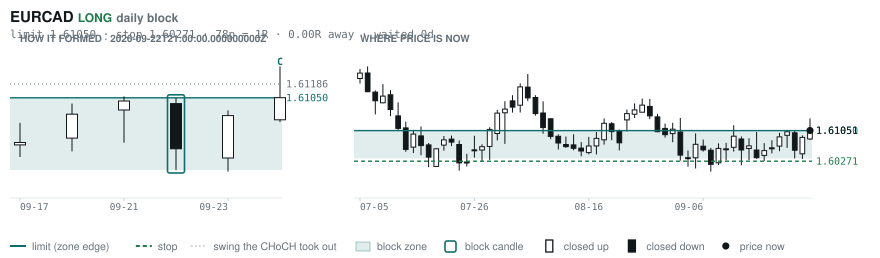
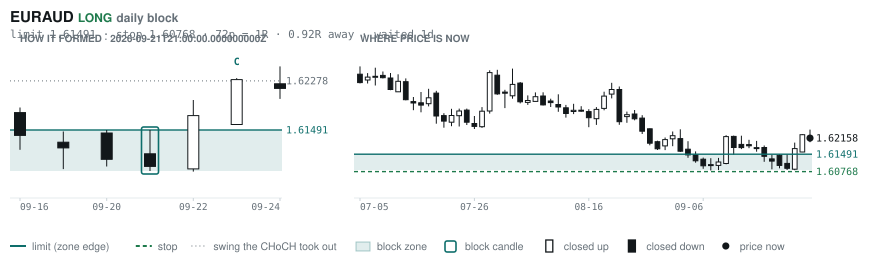
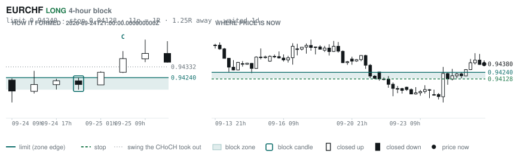
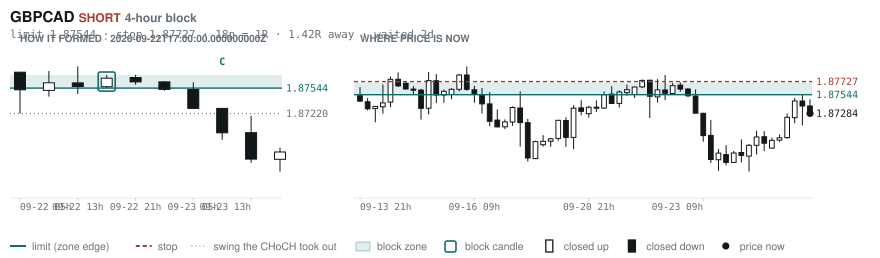
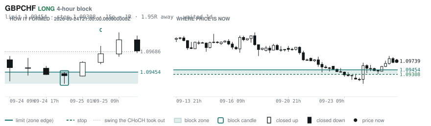
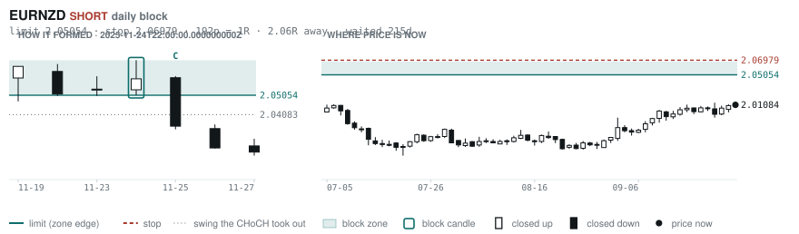

# Scanner Review — 2026-09-27 (weekly)

Generated: 2026-09-27T19:03:44.788Z

```
## Account

NAV **$1069.78**   unrealised $-0.46   margin available $1035.61   1 open

| pair | units | now | P/L | stop | distance | news lean |
|---|---|---|---|---|---|---|
| EURNZD | -1000 | 2.01084 | $-0.46 | 2.02500 | 142p | — |

**What the system reads on each position**

- **EURNZD** SHORT — last REVERSAL SHORT 54h ago at 2.01679 — system stop 2.02909, target **1.97672**; 341p to that target from here

## Order blocks live right now

### Daily

| pair | dir | limit | stop | 1R | spread | away | fills | waited | reaches 1R / 2R |
|---|---|---|---|---|---|---|---|---|---|
| EURCAD | LONG | **1.61050** | 1.60271 | 78p $5.51 | 11% | 0.0R | 94% | 0d | 68% / 39% |
| EURAUD | LONG | **1.61491** | 1.60768 | 72p $5.08 | **22%** | 0.9R | 87% | 1d | 68% / 39% |
| EURNZD | SHORT | **2.05054** | 2.06979 | 192p $10.91 | 11% | 2.1R | 71% | 215d | 75% / 53% |
| GBPCHF | SHORT | **1.10810** | 1.11285 | 48p $5.74 | **25%** | 2.3R | 71% | 334d | 75% / 53% |
| NZDCHF | LONG | **0.45428** | 0.44942 | 49p $5.87 | 18% | 3.1R | 71% | 209d | 75% / 53% |
| NZDCHF | LONG | **0.45968** | 0.45702 | 27p $3.21 | **33%** | 3.6R | 71% | 55d | 78% / 46% |
| EURUSD | SHORT | **1.16202** | 1.16578 | 38p $3.76 | 5% | 6.1R | 50% | 9d | 68% / 39% |
| GBPNZD | LONG | **2.28830** | 2.28082 | 75p $4.24 | **39%** | 6.7R | 50% | 17d | 78% / 46% |
| GBPJPY | LONG | **196.536** | 194.882 | 165p $10.52 | 8% | 7.1R | 50% | 291d | 75% / 53% |
| AUDUSD | LONG | **0.65028** | 0.64297 | 73p $7.31 | 6% | 7.1R | 50% | 210d | 75% / 53% |
| EURCHF | LONG | **0.91346** | 0.90937 | 41p $4.94 | 17% | 7.4R | 50% | 82d | 75% / 53% |
| USDCHF | LONG | **0.78472** | 0.77902 | 57p $6.88 | 8% | 7.7R | 50% | 82d | 75% / 53% |
| GBPCHF | LONG | **1.05438** | 1.04888 | 55p $6.64 | **22%** | 7.8R | 50% | 83d | 75% / 53% |

_Age is a quality signal, not staleness: a daily block filling after 60 days reaches 2R 58% of the time against 34% for one filling the same day. "Fills" comes from distance — 94% under 0.5R, 12% past 8R, which is why nothing past 8R is listed._

### 4-hour

| pair | dir | limit | stop | 1R | spread | away | fills | waited | reaches 1R / 2R |
|---|---|---|---|---|---|---|---|---|---|
| EURCHF | LONG | **0.94240** | 0.94128 | 11p $1.35 | **63%** | 1.2R | 79% | 1d | 70% / 46% |
| GBPCAD | SHORT | **1.87544** | 1.87727 | 18p $1.29 | **64%** | 1.4R | 79% | 2d | 77% / 47% |
| GBPCHF | LONG | **1.09454** | 1.09308 | 15p $1.77 | **81%** | 1.9R | 79% | 1d | 70% / 46% |
| NZDCAD | SHORT | **0.80480** | 0.80620 | 14p $0.99 | **78%** | 2.7R | 66% | 2d | 77% / 47% |
| EURNZD | SHORT | **2.02676** | 2.03177 | 50p $2.84 | **42%** | 3.2R | 66% | 123d | 78% / 51% |
| EURNZD | SHORT | **2.02030** | 2.02312 | 28p $1.60 | **74%** | 3.4R | 66% | 64d | 78% / 51% |
| CADCHF | SHORT | **0.58746** | 0.58789 | 4p $0.52 | **142%** | 3.4R | 66% | 4d | 77% / 47% |
| GBPAUD | LONG | **1.87650** | 1.87401 | 25p $1.75 | **74%** | 3.7R | 66% | 2d | 77% / 47% |
| NZDCAD | LONG | **0.79408** | 0.79222 | 19p $1.31 | **59%** | 3.7R | 66% | 123d | 78% / 51% |
| AUDUSD | LONG | **0.69640** | 0.69479 | 16p $1.61 | **28%** | 3.8R | 66% | 41d | 78% / 51% |
| EURAUD | SHORT | **1.62962** | 1.63164 | 20p $1.42 | **80%** | 4.0R | 66% | 23d | 78% / 51% |
| GBPAUD | SHORT | **1.91288** | 1.91974 | 69p $4.82 | **27%** | 4.0R | 66% | 26d | 78% / 51% |
| CADJPY | LONG | **109.188** | 108.671 | 52p $3.29 | 16% | 4.0R | 66% | 228d | 78% / 51% |
| GBPAUD | LONG | **1.86891** | 1.86511 | 38p $2.67 | **48%** | 4.4R | 51% | 94d | 78% / 51% |
| CADJPY | SHORT | **112.364** | 112.617 | 25p $1.61 | **32%** | 4.4R | 51% | 0d | 70% / 46% |
| CHFJPY | LONG | **189.268** | 189.140 | 13p $0.81 | **123%** | 4.5R | 51% | 6d | 77% / 47% |
| EURCAD | SHORT | **1.61696** | 1.61828 | 13p $0.93 | **64%** | 4.9R | 51% | 21d | 78% / 51% |
| EURCAD | SHORT | **1.62180** | 1.62397 | 22p $1.53 | **39%** | 5.2R | 51% | 36d | 78% / 51% |
| EURJPY | LONG | **176.892** | 176.472 | 42p $2.67 | 17% | 5.4R | 51% | 228d | 78% / 51% |
| NZDCHF | SHORT | **0.47538** | 0.47647 | 11p $1.31 | **82%** | 5.5R | 51% | 14d | 78% / 51% |
| EURGBP | LONG | **0.83879** | 0.83526 | 35p $4.68 | 12% | 6.0R | 51% | 344d | 78% / 51% |
| NZDJPY | LONG | **87.686** | 87.453 | 23p $1.48 | **49%** | 6.1R | 51% | 216d | 78% / 51% |
| EURNZD | SHORT | **2.05666** | 2.06369 | 70p $3.98 | **30%** | 6.5R | 51% | 216d | 78% / 51% |
| GBPCAD | LONG | **1.84426** | 1.84059 | 37p $2.60 | **32%** | 7.8R | 51% | 92d | 78% / 51% |

_Same definition, roughly six times the frequency, split-validated clean (14 pairs fit +0.410R, 14 untouched +0.494R). **Read these net of cost:** an H4 stop is about a third of a daily one, so the same spread takes three times the share. Gross +0.452R against daily +0.413R, but net of one spread +0.231R against +0.303R. Real, and mostly rent._

### In reach, drawn

_6 blocks within 3R of the limit. Blocks further out are in the tables above but not worth a picture yet._

**EURCAD LONG** · daily · 0.00R away · waited 0d



**EURAUD LONG** · daily · 0.92R away · waited 1d



**EURCHF LONG** · 4-hour · 1.25R away · waited 1d



**GBPCAD SHORT** · 4-hour · 1.42R away · waited 2d



**GBPCHF LONG** · 4-hour · 1.95R away · waited 1d



**EURNZD SHORT** · daily · 2.06R away · waited 215d



_Hollow candle closed up, filled closed down. Left panel is the block forming — the ringed candle is the block, **C** is the change of character. Right panel is where price sits now against the zone. Full legend is inside each image._

## Scanner calls, last 7 days

| when | pair | dir | branch | entry | stop | target | outcome |
|---|---|---|---|---|---|---|---|
| 09-20T21:00 | GBPAUD | SHORT | REV | 1.87866 | 1.89035 | 1.84930 | open -0.59R |
| 09-20T21:00 | EURAUD | SHORT | REV | 1.61110 | 1.62171 | 1.59104 | stopped -1.00R |
| 09-20T21:00 | AUDCAD | LONG | REV | 0.99730 | 0.99095 | 1.00808 | stopped -1.00R |
| 09-20T21:00 | AUDCHF | LONG | REV | 0.58612 | 0.58208 | 0.59062 | stopped -1.00R |
| 09-20T21:00 | EURCHF | LONG | REV | 0.94430 | 0.94050 | 0.95637 | stopped -1.00R |
| 09-21T01:00 | NZDCAD | LONG | REV | 0.80156 | 0.79401 | 0.84296 | open -0.07R |
| 09-21T01:00 | USDJPY | LONG | REV | 157.020 | 154.894 | 162.759 | open +0.13R |
| 09-21T01:00 | NZDJPY | LONG | REV | 89.876 | 88.787 | 97.622 | open -0.71R |
| 09-21T01:00 | GBPJPY | LONG | REV | 210.068 | 208.082 | 220.122 | stopped -1.00R |
| 09-21T05:00 | GBPJPY | LONG | REV | 210.445 | 207.954 | 220.122 | open -0.85R |
| 09-21T05:00 | USDCHF | LONG | REV | 0.82336 | 0.81669 | 0.83638 | open +0.77R |
| 09-21T05:00 | AUDJPY | LONG | REV | 112.113 | 110.900 | 117.698 | stopped -1.00R |
| 09-21T05:00 | EURGBP | LONG | REV | 0.85784 | 0.85460 | 0.86293 | open +0.67R |
| 09-21T09:00 | AUDUSD | LONG | REV | 0.71357 | 0.70675 | 0.73544 | stopped -1.00R |
| 09-21T09:00 | GBPCHF | SHORT | REV | 1.10011 | 1.10897 | 1.07842 | open +0.31R |
| 09-21T09:00 | NZDCHF | SHORT | REV | 0.47081 | 0.47475 | 0.46599 | open +0.37R |
| 09-21T09:00 | CADCHF | LONG | REV | 0.58698 | 0.58300 | 0.59854 | stopped -1.00R |
| 09-21T09:00 | AUDCHF | LONG | REV | 0.58621 | 0.58214 | 0.59062 | stopped -1.00R |
| 09-21T09:00 | EURGBP | SHORT | REV | 0.85774 | 0.86042 | 0.85054 | stopped -1.00R |
| 09-21T13:00 | NZDUSD | SHORT | REV | 0.57198 | 0.57857 | 0.56164 | open +0.83R |
| 09-21T13:00 | CADCHF | LONG | REV | 0.58524 | 0.58011 | 0.59854 | open +0.15R |
| 09-21T13:00 | NZDCAD | LONG | REV | 0.80254 | 0.79494 | 0.84296 | open -0.20R |
| 09-21T13:00 | EURUSD | LONG | REV | 1.14694 | 1.13962 | 1.17423 | stopped -1.00R |
| 09-21T13:00 | CADJPY | SHORT | REV | 112.212 | 113.469 | 105.680 | open +0.77R |
| 09-21T17:00 | CADCHF | LONG | REV | 0.58510 | 0.58143 | 0.60456 | open +0.25R |
| 09-21T17:00 | AUDJPY | SHORT | REV | 112.046 | 113.118 | 104.378 | open +1.45R |
| 09-21T17:00 | EURCHF | LONG | REV | 0.94139 | 0.93658 | 0.95637 | open +0.50R |
| 09-21T21:00 | GBPNZD | LONG | REV | 2.34283 | 2.32028 | 2.41950 | open -0.21R |
| 09-21T21:00 | GBPCHF | LONG | REV | 1.09749 | 1.09159 | 1.11038 | stopped -1.00R |
| 09-21T21:00 | AUDCHF | SHORT | WALL | 0.58434 | 0.58658 | 0.55565 | open +1.04R |
| 09-22T01:00 | EURNZD | SHORT | REV | 2.00090 | 2.02913 | 1.92783 | open -0.35R |
| 09-22T01:00 | GBPCAD | SHORT | REV | 1.87743 | 1.88538 | 1.83022 | open +0.58R |
| 09-22T01:00 | AUDUSD | LONG | REV | 0.71209 | 0.70439 | 0.73544 | stopped -1.00R |
| 09-22T01:00 | USDCAD | SHORT | REV | 1.40250 | 1.40866 | 1.35795 | stopped -1.00R |
| 09-22T01:00 | NZDCHF | LONG | REV | 0.47040 | 0.46415 | 0.47771 | open -0.17R |
| 09-22T01:00 | EURUSD | LONG | REV | 1.14780 | 1.13991 | 1.17423 | stopped -1.00R |
| 09-22T01:00 | CADJPY | SHORT | REV | 112.285 | 113.380 | 105.680 | open +0.95R |
| 09-22T01:00 | EURAUD | SHORT | REV | 1.61184 | 1.62081 | 1.59104 | stopped -1.00R |
| 09-22T05:00 | EURCAD | LONG | REV | 1.60848 | 1.60007 | 1.62364 | open +0.24R |
| 09-22T05:00 | NZDCHF | LONG | REV | 0.47114 | 0.46640 | 0.47771 | open -0.38R |
| 09-22T05:00 | GBPUSD | LONG | REV | 1.33572 | 1.32608 | 1.36614 | stopped -1.00R |
| 09-22T05:00 | EURUSD | LONG | REV | 1.14574 | 1.13911 | 1.17423 | stopped -1.00R |
| 09-22T05:00 | GBPCHF | LONG | REV | 1.09630 | 1.08917 | 1.11038 | open +0.15R |
| 09-22T05:00 | GBPAUD | SHORT | REV | 1.87831 | 1.88938 | 1.84930 | open -0.66R |
| 09-22T05:00 | EURAUD | SHORT | REV | 1.61118 | 1.62131 | 1.59104 | stopped -1.00R |
| 09-22T05:00 | EURJPY | SHORT | REV | 180.088 | 182.095 | 176.154 | open +0.46R |
| 09-22T05:00 | AUDCAD | LONG | REV | 0.99836 | 0.99119 | 1.00808 | stopped -1.00R |
| 09-22T09:00 | EURCHF | LONG | REV | 0.93968 | 0.93465 | 0.95637 | open +0.82R |
| 09-22T13:00 | NZDUSD | SHORT | REV | 0.57206 | 0.57916 | 0.54188 | open +0.78R |
| 09-22T13:00 | AUDCAD | LONG | REV | 0.99983 | 0.99386 | 1.00808 | stopped -1.00R |
| 09-22T13:00 | USDCAD | LONG | WALL | 1.40708 | 1.40441 | 1.41480 | target +2.90R |
| 09-22T13:00 | AUDCHF | LONG | REV | 0.58382 | 0.58016 | 0.59062 | stopped -1.00R |
| 09-22T17:00 | NZDCAD | SHORT | REV | 0.80580 | 0.81331 | 0.76838 | open +0.64R |
| 09-22T17:00 | CADCHF | LONG | REV | 0.58346 | 0.57990 | 0.60456 | open +0.71R |
| 09-22T21:00 | EURCHF | LONG | REV | 0.93950 | 0.93485 | 0.96513 | open +0.92R |
| 09-22T21:00 | EURNZD | LONG | REV | 2.00181 | 1.98352 | 2.07061 | open +0.49R |
| 09-22T21:00 | GBPNZD | LONG | REV | 2.33256 | 2.31081 | 2.41950 | open +0.26R |
| 09-22T21:00 | EURGBP | LONG | REV | 0.85822 | 0.85482 | 0.86611 | open +0.53R |
| 09-22T21:00 | AUDCHF | LONG | REV | 0.58406 | 0.58006 | 0.59062 | stopped -1.00R |
| 09-22T21:00 | AUDJPY | LONG | REV | 112.131 | 111.045 | 117.698 | stopped -1.00R |
| 09-22T21:00 | CADJPY | LONG | REV | 112.026 | 111.083 | 116.230 | stopped -1.00R |
| 09-22T21:00 | CHFJPY | LONG | REV | 191.991 | 190.684 | 202.082 | stopped -1.00R |
| 09-23T01:00 | NZDUSD | LONG | REV | 0.57028 | 0.56305 | 0.61544 | open -0.52R |
| 09-23T01:00 | EURUSD | LONG | REV | 1.14268 | 1.13635 | 1.17423 | stopped -1.00R |
| 09-23T05:00 | CADCHF | LONG | REV | 0.58402 | 0.57949 | 0.60456 | open +0.44R |
| 09-23T05:00 | NZDCAD | SHORT | REV | 0.80297 | 0.81031 | 0.76838 | open +0.27R |
| 09-23T05:00 | GBPUSD | LONG | REV | 1.33010 | 1.31825 | 1.36614 | open -0.47R |
| 09-23T05:00 | GBPAUD | SHORT | REV | 1.87666 | 1.88932 | 1.84930 | open -0.71R |
| 09-23T05:00 | GBPCHF | SHORT | REV | 1.09382 | 1.10144 | 1.07842 | open -0.47R |
| 09-23T05:00 | AUDUSD | SHORT | REV | 0.70878 | 0.71546 | 0.69122 | open +0.95R |
| 09-23T05:00 | EURUSD | LONG | REV | 1.14178 | 1.13514 | 1.17423 | open -0.40R |
| 09-23T05:00 | EURAUD | SHORT | REV | 1.61092 | 1.62133 | 1.59104 | stopped -1.00R |
| 09-23T05:00 | CADJPY | LONG | REV | 112.124 | 111.129 | 116.230 | stopped -1.00R |
| 09-23T09:00 | GBPUSD | LONG | REV | 1.32760 | 1.31903 | 1.36614 | open -0.36R |
| 09-23T09:00 | EURCAD | LONG | REV | 1.60674 | 1.60025 | 1.62364 | open +0.58R |
| 09-23T09:00 | EURUSD | LONG | REV | 1.14082 | 1.13104 | 1.17423 | open -0.17R |
| 09-23T09:00 | NZDJPY | SHORT | REV | 89.854 | 90.898 | 82.704 | open +0.72R |
| 09-23T09:00 | EURAUD | SHORT | REV | 1.61457 | 1.62275 | 1.59104 | stopped -1.00R |
| 09-23T09:00 | AUDCAD | LONG | REV | 0.99516 | 0.98995 | 1.00808 | open -0.36R |
| 09-23T13:00 | GBPUSD | LONG | REV | 1.32334 | 1.31193 | 1.36614 | open +0.11R |
| 09-23T13:00 | GBPNZD | LONG | WALL | 2.33629 | 2.32639 | 2.41950 | open +0.19R |
| 09-23T13:00 | GBPAUD | SHORT | REV | 1.88274 | 1.89582 | 1.84930 | open -0.22R |
| 09-23T13:00 | EURJPY | SHORT | REV | 180.188 | 181.911 | 176.154 | open +0.60R |
| 09-23T17:00 | GBPCAD | LONG | REV | 1.86732 | 1.85472 | 1.89799 | open +0.44R |
| 09-23T17:00 | EURCAD | LONG | REV | 1.60550 | 1.59694 | 1.62364 | open +0.59R |
| 09-23T17:00 | GBPCHF | LONG | REV | 1.09275 | 1.08504 | 1.12378 | open +0.60R |
| 09-23T17:00 | EURUSD | LONG | REV | 1.13840 | 1.13121 | 1.17423 | open +0.10R |
| 09-23T17:00 | CADCHF | SHORT | REV | 0.58519 | 0.58958 | 0.56767 | open -0.18R |
| 09-23T17:00 | EURAUD | SHORT | REV | 1.61722 | 1.62807 | 1.59104 | open -0.40R |
| 09-23T17:00 | AUDCHF | LONG | REV | 0.58095 | 0.57693 | 0.59526 | open +0.26R |
| 09-23T17:00 | NZDCHF | LONG | REV | 0.46821 | 0.46433 | 0.47771 | open +0.29R |
| 09-23T21:00 | USDJPY | SHORT | REV | 158.064 | 159.585 | 145.382 | open +0.51R |
| 09-23T21:00 | EURNZD | SHORT | REV | 2.00365 | 2.02131 | 1.92783 | open -0.41R |
| 09-23T21:00 | GBPJPY | SHORT | WALL | 209.108 | 210.405 | 196.722 | open +0.60R |
| 09-23T21:00 | NZDCHF | LONG | REV | 0.46847 | 0.46436 | 0.47771 | open +0.21R |
| 09-23T21:00 | AUDJPY | LONG | REV | 111.179 | 109.993 | 115.582 | open -0.58R |
| 09-23T21:00 | CHFJPY | LONG | REV | 191.570 | 190.159 | 202.082 | stopped -1.00R |
| 09-24T01:00 | GBPUSD | LONG | REV | 1.32418 | 1.31210 | 1.36614 | open +0.03R |
| 09-24T01:00 | GBPAUD | SHORT | REV | 1.88221 | 1.89586 | 1.85168 | open -0.25R |
| 09-24T01:00 | AUDCAD | LONG | REV | 0.99211 | 0.98467 | 1.00808 | open +0.15R |
| 09-24T01:00 | AUDUSD | LONG | REV | 0.70354 | 0.69520 | 0.73544 | open -0.13R |
| 09-24T01:00 | CHFJPY | LONG | REV | 191.557 | 189.927 | 202.082 | stopped -1.00R |
| 09-24T05:00 | EURCAD | SHORT | REV | 1.60518 | 1.61456 | 1.59150 | open -0.57R |
| 09-24T05:00 | GBPCAD | SHORT | REV | 1.86700 | 1.87912 | 1.85290 | open -0.48R |
| 09-24T05:00 | NZDCAD | SHORT | REV | 0.80017 | 0.80726 | 0.76838 | open -0.12R |
| 09-24T05:00 | CADCHF | LONG | REV | 0.58698 | 0.58125 | 0.60456 | open -0.17R |
| 09-24T05:00 | AUDJPY | LONG | REV | 111.424 | 109.971 | 115.582 | open -0.64R |
| 09-24T05:00 | USDCHF | LONG | REV | 0.82790 | 0.81628 | 0.84757 | open +0.05R |
| 09-24T09:00 | NZDUSD | LONG | REV | 0.56728 | 0.56060 | 0.61544 | open -0.12R |
| 09-24T09:00 | USDJPY | SHORT | REV | 158.690 | 159.932 | 145.382 | open +1.12R |
| 09-24T13:00 | AUDJPY | LONG | REV | 111.567 | 110.469 | 115.582 | stopped -1.00R |
| 09-24T13:00 | AUDUSD | LONG | REV | 0.70253 | 0.69525 | 0.73544 | open -0.01R |
| 09-24T13:00 | GBPNZD | SHORT | REV | 2.33394 | 2.35030 | 2.24729 | open -0.26R |
| 09-24T17:00 | GBPCHF | SHORT | REV | 1.09426 | 1.10198 | 1.07842 | open -0.41R |
| 09-24T17:00 | AUDCAD | LONG | REV | 0.99124 | 0.98463 | 1.00808 | open +0.31R |
| 09-24T17:00 | NZDJPY | SHORT | REV | 89.935 | 90.868 | 82.704 | open +0.89R |
| 09-24T17:00 | AUDCHF | SHORT | REV | 0.58046 | 0.58480 | 0.55565 | open -0.36R |
| 09-24T21:00 | EURAUD | SHORT | REV | 1.62269 | 1.63474 | 1.59104 | open +0.09R |
| 09-24T21:00 | GBPJPY | SHORT | REV | 209.646 | 211.525 | 196.722 | open +0.70R |
| 09-24T21:00 | USDJPY | SHORT | REV | 158.652 | 159.905 | 145.382 | open +1.08R |
| 09-24T21:00 | CADJPY | SHORT | REV | 112.165 | 113.274 | 105.680 | open +0.83R |
| 09-24T21:00 | EURJPY | SHORT | REV | 180.470 | 181.716 | 176.154 | open +1.05R |
| 09-24T21:00 | CHFJPY | SHORT | REV | 191.616 | 192.978 | 176.922 | open +1.30R |
| 09-25T01:00 | GBPCAD | LONG | REV | 1.86944 | 1.85959 | 1.89799 | open +0.35R |
| 09-25T01:00 | USDCHF | LONG | REV | 0.82921 | 0.81919 | 0.84757 | open -0.07R |
| 09-25T01:00 | GBPNZD | LONG | REV | 2.33738 | 2.31964 | 2.41950 | open +0.04R |
| 09-25T01:00 | NZDCHF | LONG | REV | 0.46875 | 0.46425 | 0.47771 | open +0.13R |
| 09-25T01:00 | EURJPY | SHORT | REV | 180.126 | 181.936 | 176.154 | open +0.53R |
| 09-25T05:00 | EURCHF | LONG | WALL | 0.94402 | 0.94036 | 0.96513 | open -0.06R |
| 09-25T05:00 | GBPUSD | LONG | REV | 1.32334 | 1.31248 | 1.36614 | open +0.11R |
| 09-25T05:00 | AUDCAD | LONG | REV | 0.99454 | 0.98662 | 1.00808 | open -0.16R |
| 09-25T05:00 | EURUSD | LONG | REV | 1.13920 | 1.13120 | 1.17423 | open -0.01R |
| 09-25T05:00 | AUDUSD | LONG | REV | 0.70294 | 0.69547 | 0.72057 | open -0.07R |
| 09-25T09:00 | NZDCAD | SHORT | REV | 0.80113 | 0.80897 | 0.76838 | open +0.02R |
| 09-25T09:00 | NZDUSD | SHORT | REV | 0.56656 | 0.57364 | 0.54188 | open +0.01R |
| 09-25T09:00 | CADJPY | LONG | REV | 111.391 | 110.273 | 115.322 | open -0.13R |
| 09-25T13:00 | EURNZD | SHORT | REV | 2.01114 | 2.02909 | 1.92783 | open +0.02R |
| 09-25T13:00 | NZDJPY | LONG | REV | 89.050 | 87.926 | 97.622 | open +0.05R |
| 09-25T13:00 | GBPNZD | SHORT | REV | 2.33780 | 2.35629 | 2.24729 | open -0.02R |
| 09-25T13:00 | GBPCAD | SHORT | REV | 1.87388 | 1.88223 | 1.85290 | open +0.12R |
| 09-25T13:00 | USDJPY | LONG | REV | 157.206 | 155.458 | 162.759 | open +0.05R |
| 09-25T13:00 | GBPCHF | SHORT | REV | 1.09694 | 1.10461 | 1.07842 | open -0.06R |
| 09-25T13:00 | AUDNZD | SHORT | REV | 1.24102 | 1.24708 | 1.17940 | open +0.17R |
| 09-25T17:00 | EURCAD | SHORT | REV | 1.61051 | 1.62034 | 1.59150 | open +0.00R |

## Running tally, last 30 days

20 resolved · 2 target / 18 stopped · **-15.0R** · -0.751R per call · 40 still open

```
