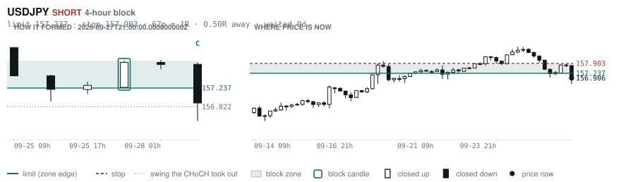
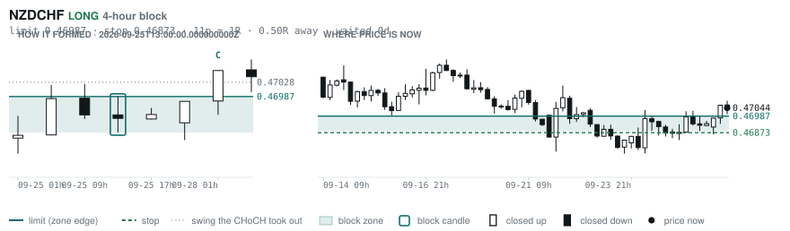
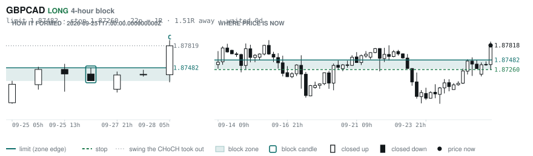

# Scanner Review — 2026-09-28 (daily)

Generated: 2026-09-28T11:03:36.651Z

```
## Account

NAV **$1045.67**   unrealised $-24.57   margin available $448.69   2 open

| pair | units | now | P/L | stop | distance | news lean |
|---|---|---|---|---|---|---|
| EURNZD | -16500 | 2.00963 | $-25.22 | 2.01593 | 63p | 🔴 1 headwind |
| EURNZD | -1000 | 2.00963 | $0.65 | 2.01598 | 63p | 🔴 1 headwind |

**What the system reads on each position**

- **EURNZD** SHORT — last REVERSAL SHORT 70h ago at 2.01679 — system stop 2.02909, target **1.97672**; 329p to that target from here

## What is coming, and which way it leans

**EURNZD SHORT**
- 🔴 10-02T09:00 EUR — Inflation Rate YoY Flash  (fc 3.6 vs prev 3.2)

_Lean is read from forecast vs previous — which way consensus leans, not what will print._

## Order blocks live right now

### Daily

| pair | dir | limit | stop | 1R | spread | away | fills | waited | reaches 1R / 2R |
|---|---|---|---|---|---|---|---|---|---|
| EURCAD | LONG | **1.61050** | 1.60271 | 78p $5.51 | 5% | 0.0R | 94% | 0d | 68% / 39% |
| EURAUD | LONG | **1.61491** | 1.60768 | 72p $5.08 | 5% | 0.9R | 87% | 1d | 68% / 39% |
| EURNZD | SHORT | **2.05054** | 2.06979 | 192p $10.91 | 3% | 2.1R | 71% | 215d | 75% / 53% |
| GBPCHF | SHORT | **1.10810** | 1.11285 | 48p $5.74 | 9% | 2.3R | 71% | 334d | 75% / 53% |
| NZDCHF | LONG | **0.45428** | 0.44942 | 49p $5.87 | 7% | 3.1R | 71% | 209d | 75% / 53% |
| NZDCHF | LONG | **0.45968** | 0.45702 | 27p $3.21 | 14% | 3.6R | 71% | 55d | 78% / 46% |
| EURUSD | SHORT | **1.16202** | 1.16578 | 38p $3.76 | 5% | 6.1R | 50% | 9d | 68% / 39% |
| GBPNZD | LONG | **2.28830** | 2.28082 | 75p $4.24 | 11% | 6.7R | 50% | 17d | 78% / 46% |
| GBPJPY | LONG | **196.536** | 194.882 | 165p $10.52 | 2% | 7.1R | 50% | 291d | 75% / 53% |
| AUDUSD | LONG | **0.65028** | 0.64297 | 73p $7.31 | 2% | 7.1R | 50% | 210d | 75% / 53% |
| EURCHF | LONG | **0.91346** | 0.90937 | 41p $4.94 | 5% | 7.4R | 50% | 82d | 75% / 53% |
| USDCHF | LONG | **0.78472** | 0.77902 | 57p $6.88 | 3% | 7.7R | 50% | 82d | 75% / 53% |
| GBPCHF | LONG | **1.05438** | 1.04888 | 55p $6.64 | 8% | 7.8R | 50% | 83d | 75% / 53% |

_Age is a quality signal, not staleness: a daily block filling after 60 days reaches 2R 58% of the time against 34% for one filling the same day. "Fills" comes from distance — 94% under 0.5R, 12% past 8R, which is why nothing past 8R is listed._

### 4-hour

| pair | dir | limit | stop | 1R | spread | away | fills | waited | reaches 1R / 2R |
|---|---|---|---|---|---|---|---|---|---|
| USDJPY | SHORT | **157.237** | 157.903 | 67p $4.23 | 2% | 0.5R | 87% | 0d | 70% / 46% |
| NZDCHF | LONG | **0.46987** | 0.46873 | 11p $1.38 | **31%** | 0.5R | 87% | 0d | 70% / 46% |
| GBPCAD | LONG | **1.87482** | 1.87260 | 22p $1.57 | **21%** | 1.5R | 79% | 0d | 70% / 46% |
| NZDCAD | SHORT | **0.80480** | 0.80620 | 14p $0.99 | **34%** | 2.5R | 66% | 3d | 77% / 47% |
| EURCHF | LONG | **0.94240** | 0.94128 | 11p $1.35 | 19% | 2.7R | 66% | 1d | 70% / 46% |
| GBPAUD | SHORT | **1.91288** | 1.91974 | 69p $4.82 | 6% | 3.1R | 66% | 26d | 78% / 51% |
| CADJPY | LONG | **109.188** | 108.671 | 52p $3.29 | 7% | 3.2R | 66% | 229d | 78% / 51% |
| AUDUSD | LONG | **0.69640** | 0.69479 | 16p $1.61 | 9% | 3.2R | 66% | 42d | 78% / 51% |
| EURNZD | SHORT | **2.02676** | 2.03177 | 50p $2.84 | 12% | 3.4R | 66% | 123d | 78% / 51% |
| EURJPY | LONG | **176.892** | 176.472 | 42p $2.67 | 6% | 3.8R | 66% | 229d | 78% / 51% |
| EURNZD | SHORT | **2.02030** | 2.02312 | 28p $1.60 | **21%** | 3.8R | 66% | 64d | 78% / 51% |
| NZDCAD | LONG | **0.79408** | 0.79222 | 19p $1.31 | **25%** | 3.9R | 66% | 123d | 78% / 51% |
| EURAUD | SHORT | **1.62962** | 1.63164 | 20p $1.42 | 17% | 4.1R | 51% | 23d | 78% / 51% |
| NZDCHF | SHORT | **0.47538** | 0.47647 | 11p $1.31 | **33%** | 4.5R | 51% | 14d | 78% / 51% |
| NZDJPY | LONG | **87.686** | 87.453 | 23p $1.48 | 14% | 4.8R | 51% | 216d | 78% / 51% |
| EURCAD | SHORT | **1.61696** | 1.61828 | 13p $0.93 | **23%** | 5.0R | 51% | 22d | 78% / 51% |
| EURGBP | LONG | **0.83879** | 0.83526 | 35p $4.68 | 4% | 5.2R | 51% | 345d | 78% / 51% |
| EURCAD | SHORT | **1.62180** | 1.62397 | 22p $1.53 | 14% | 5.3R | 51% | 37d | 78% / 51% |
| GBPCHF | LONG | **1.09454** | 1.09308 | 15p $1.77 | **29%** | 5.6R | 51% | 1d | 70% / 46% |
| GBPAUD | LONG | **1.86891** | 1.86511 | 38p $2.67 | 11% | 5.9R | 51% | 95d | 78% / 51% |
| GBPAUD | LONG | **1.87650** | 1.87401 | 25p $1.75 | 17% | 5.9R | 51% | 3d | 77% / 47% |
| CADJPY | SHORT | **112.364** | 112.617 | 25p $1.61 | 14% | 6.0R | 51% | 1d | 70% / 46% |
| EURNZD | SHORT | **2.05666** | 2.06369 | 70p $3.98 | 8% | 6.7R | 51% | 216d | 78% / 51% |

_Same definition, roughly six times the frequency, split-validated clean (14 pairs fit +0.410R, 14 untouched +0.494R). **Read these net of cost:** an H4 stop is about a third of a daily one, so the same spread takes three times the share. Gross +0.452R against daily +0.413R, but net of one spread +0.231R against +0.303R. Real, and mostly rent._

### In reach, drawn

_6 blocks within 3R of the limit. Blocks further out are in the tables above but not worth a picture yet._

**EURCAD LONG** · daily · 0.00R away · waited 0d


**USDJPY SHORT** · 4-hour · 0.50R away · waited 0d



**NZDCHF LONG** · 4-hour · 0.50R away · waited 0d



**EURAUD LONG** · daily · 0.92R away · waited 1d


**GBPCAD LONG** · 4-hour · 1.51R away · waited 0d



**EURNZD SHORT** · daily · 2.06R away · waited 215d


_Hollow candle closed up, filled closed down. Left panel is the block forming — the ringed candle is the block, **C** is the change of character. Right panel is where price sits now against the zone. Full legend is inside each image._

## Scanner calls, last 1 day

| when | pair | dir | branch | entry | stop | target | outcome |
|---|---|---|---|---|---|---|---|
| 09-27T21:00 | EURCHF | LONG | REV | 0.94454 | 0.93802 | 0.96513 | open +0.14R |
| 09-27T21:00 | EURAUD | SHORT | REV | 1.62226 | 1.63469 | 1.59104 | open +0.07R |
| 09-27T21:00 | GBPUSD | LONG | REV | 1.32369 | 1.31258 | 1.36614 | open +0.28R |
| 09-27T21:00 | EURUSD | LONG | REV | 1.13852 | 1.13125 | 1.17423 | open -0.14R |
| 09-27T21:00 | AUDUSD | SHORT | REV | 0.70182 | 0.70871 | 0.69122 | open +0.04R |
| 09-27T21:00 | USDJPY | LONG | REV | 157.801 | 156.334 | 162.759 | open -0.61R |
| 09-27T21:00 | NZDUSD | LONG | REV | 0.56621 | 0.56092 | 0.61544 | open -0.03R |
| 09-27T21:00 | CADJPY | LONG | REV | 111.468 | 110.271 | 115.322 | open -0.53R |
| 09-27T21:00 | NZDJPY | LONG | REV | 89.346 | 88.480 | 92.130 | open -0.61R |
| 09-27T21:00 | AUDCHF | LONG | WALL | 0.58225 | 0.58055 | 0.59526 | open +0.49R |
| 09-27T21:00 | AUDCAD | SHORT | REV | 0.99342 | 0.99890 | 0.97929 | open +0.07R |
| 09-28T01:00 | EURGBP | SHORT | REV | 0.85979 | 0.86355 | 0.85054 | open +0.66R |
| 09-28T01:00 | NZDUSD | LONG | REV | 0.56728 | 0.56066 | 0.61544 | open -0.19R |
| 09-28T01:00 | GBPCHF | LONG | REV | 1.09875 | 1.09086 | 1.12378 | open +0.51R |
| 09-28T01:00 | GBPCAD | SHORT | REV | 1.87382 | 1.88190 | 1.85290 | open -0.54R |
| 09-28T01:00 | AUDNZD | LONG | REV | 1.23882 | 1.23141 | 1.30342 | open +0.08R |
| 09-28T01:00 | GBPNZD | SHORT | REV | 2.33454 | 2.34959 | 2.29986 | open -0.64R |
| 09-28T01:00 | EURJPY | LONG | REV | 179.636 | 178.437 | 185.266 | stopped -1.00R |
| 09-28T05:00 | NZDCAD | SHORT | REV | 0.80126 | 0.80877 | 0.76838 | open +0.00R |
| 09-28T05:00 | CADJPY | SHORT | REV | 110.838 | 112.384 | 105.680 | open +0.00R |
| 09-28T05:00 | CADCHF | LONG | REV | 0.58709 | 0.58299 | 0.60456 | open +0.00R |
| 09-28T05:00 | NZDCHF | SHORT | REV | 0.47044 | 0.47367 | 0.46599 | open +0.00R |
| 09-28T05:00 | CHFJPY | SHORT | WALL | 188.787 | 190.299 | 176.922 | open +0.00R |
| 09-28T05:00 | CHFJPY | SHORT | REV | 188.787 | 191.942 | 176.922 | open +0.00R |
| 09-28T05:00 | EURJPY | SHORT | WALL | 178.484 | 179.689 | 176.154 | open +0.00R |

## Running tally, last 30 days

6 resolved · 0 target / 6 stopped · **-6.0R** · -1.000R per call · 54 still open

```
