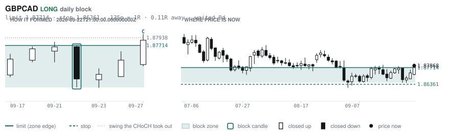
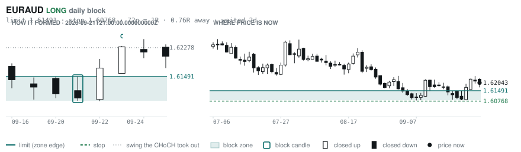
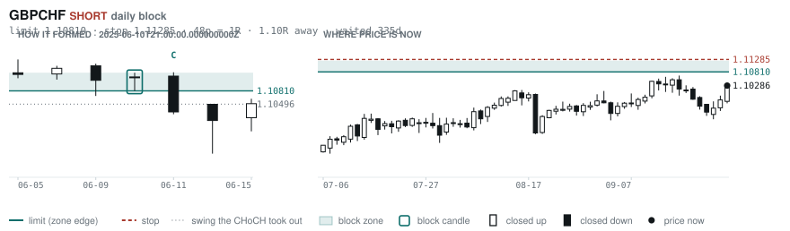
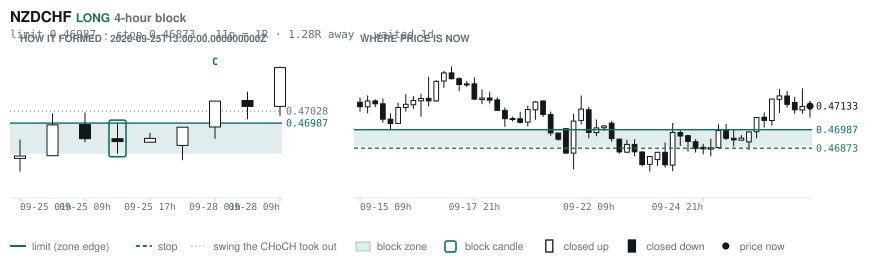
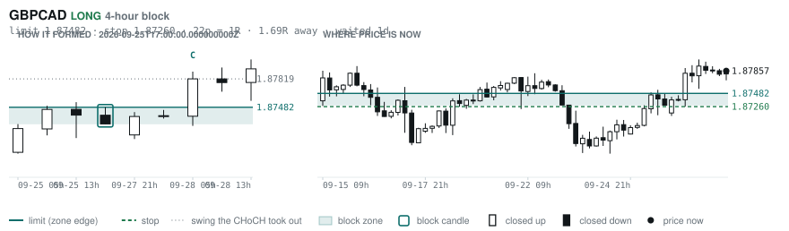
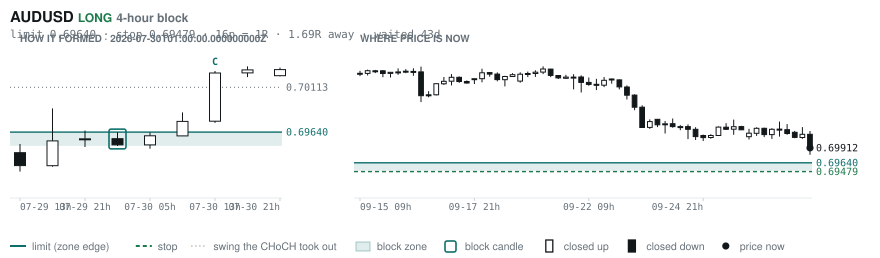

# Scanner Review — 2026-09-29 (daily)

Generated: 2026-09-29T11:03:36.700Z

```
## Account

NAV **$1075.27**   unrealised $5.24   margin available $479.64   2 open

| pair | units | now | P/L | stop | distance | news lean |
|---|---|---|---|---|---|---|
| EURNZD | -16500 | 2.00660 | $2.89 | 2.01593 | 93p | 🔴 1 headwind |
| EURNZD | -1000 | 2.00660 | $2.35 | 2.01598 | 94p | 🔴 1 headwind |

**What the system reads on each position**

- **EURNZD** SHORT — last REVERSAL SHORT 94h ago at 2.01679 — system stop 2.02909, target **1.97672**; 299p to that target from here

## What is coming, and which way it leans

**EURNZD SHORT**
- 🔴 10-02T09:00 EUR — Inflation Rate YoY Flash  (fc 3.6 vs prev 3.2)

_Lean is read from forecast vs previous — which way consensus leans, not what will print._

## Order blocks live right now

### Daily

| pair | dir | limit | stop | 1R | spread | away | fills | waited | reaches 1R / 2R |
|---|---|---|---|---|---|---|---|---|---|
| GBPCAD | LONG | **1.87714** | 1.86361 | 135p $9.54 | 3% | 0.1R | 94% | 0d | 68% / 39% |
| EURAUD | LONG | **1.61491** | 1.60768 | 72p $5.07 | 5% | 0.8R | 87% | 2d | 68% / 39% |
| GBPCHF | SHORT | **1.10810** | 1.11285 | 48p $5.71 | 8% | 1.1R | 81% | 335d | 75% / 53% |
| EURNZD | SHORT | **2.05054** | 2.06979 | 192p $10.91 | 3% | 2.3R | 71% | 216d | 75% / 53% |
| NZDCHF | LONG | **0.45428** | 0.44942 | 49p $5.84 | 7% | 3.5R | 71% | 210d | 75% / 53% |
| NZDCHF | LONG | **0.45968** | 0.45702 | 27p $3.20 | 13% | 4.4R | 50% | 56d | 78% / 46% |
| EURUSD | SHORT | **1.16202** | 1.16578 | 38p $3.76 | 4% | 6.6R | 50% | 10d | 68% / 39% |
| GBPNZD | LONG | **2.28830** | 2.28082 | 75p $4.24 | 13% | 6.8R | 50% | 18d | 78% / 46% |
| AUDUSD | LONG | **0.65028** | 0.64297 | 73p $7.31 | 2% | 7.0R | 50% | 211d | 75% / 53% |
| GBPJPY | LONG | **196.536** | 194.882 | 165p $10.51 | 2% | 7.3R | 50% | 292d | 75% / 53% |
| EURCHF | LONG | **0.91346** | 0.90937 | 41p $4.92 | 5% | 8.0R | 50% | 83d | 75% / 53% |

_Age is a quality signal, not staleness: a daily block filling after 60 days reaches 2R 58% of the time against 34% for one filling the same day. "Fills" comes from distance — 94% under 0.5R, 12% past 8R, which is why nothing past 8R is listed._

### 4-hour

| pair | dir | limit | stop | 1R | spread | away | fills | waited | reaches 1R / 2R |
|---|---|---|---|---|---|---|---|---|---|
| NZDCHF | LONG | **0.46987** | 0.46873 | 11p $1.37 | **31%** | 1.3R | 79% | 1d | 70% / 46% |
| GBPCAD | LONG | **1.87482** | 1.87260 | 22p $1.57 | **21%** | 1.7R | 79% | 1d | 70% / 46% |
| AUDUSD | LONG | **0.69640** | 0.69479 | 16p $1.61 | 8% | 1.7R | 79% | 43d | 78% / 51% |
| GBPAUD | SHORT | **1.91288** | 1.91974 | 69p $4.82 | 8% | 2.8R | 66% | 27d | 78% / 51% |
| EURAUD | SHORT | **1.62962** | 1.63164 | 20p $1.42 | 16% | 3.2R | 66% | 24d | 78% / 51% |
| CADJPY | LONG | **109.188** | 108.671 | 52p $3.29 | 7% | 3.3R | 66% | 230d | 78% / 51% |
| EURCHF | LONG | **0.94240** | 0.94128 | 11p $1.35 | 19% | 3.6R | 66% | 2d | 77% / 47% |
| NZDCHF | SHORT | **0.47538** | 0.47647 | 11p $1.31 | **32%** | 3.7R | 66% | 15d | 78% / 51% |
| EURNZD | SHORT | **2.02676** | 2.03177 | 50p $2.84 | 13% | 3.8R | 66% | 124d | 78% / 51% |
| EURJPY | LONG | **176.892** | 176.472 | 42p $2.67 | 6% | 4.0R | 66% | 230d | 78% / 51% |
| NZDCAD | LONG | **0.79408** | 0.79222 | 19p $1.31 | **23%** | 4.3R | 51% | 124d | 78% / 51% |
| EURNZD | SHORT | **2.02030** | 2.02312 | 28p $1.60 | **23%** | 4.4R | 51% | 65d | 78% / 51% |
| EURCAD | SHORT | **1.61696** | 1.61828 | 13p $0.93 | **23%** | 5.0R | 51% | 23d | 78% / 51% |
| EURGBP | LONG | **0.83879** | 0.83526 | 35p $4.68 | 3% | 5.2R | 51% | 346d | 78% / 51% |
| EURCAD | SHORT | **1.62180** | 1.62397 | 22p $1.53 | 14% | 5.3R | 51% | 38d | 78% / 51% |
| NZDJPY | LONG | **87.686** | 87.453 | 23p $1.48 | 15% | 5.3R | 51% | 217d | 78% / 51% |
| CADJPY | SHORT | **112.364** | 112.617 | 25p $1.61 | 15% | 5.9R | 51% | 2d | 77% / 47% |
| GBPAUD | LONG | **1.86891** | 1.86511 | 38p $2.66 | 14% | 6.4R | 51% | 96d | 78% / 51% |
| GBPCHF | LONG | **1.09454** | 1.09308 | 15p $1.76 | **25%** | 6.5R | 51% | 2d | 77% / 47% |
| GBPAUD | LONG | **1.87650** | 1.87401 | 25p $1.74 | **21%** | 6.8R | 51% | 4d | 77% / 47% |
| EURNZD | SHORT | **2.05666** | 2.06369 | 70p $3.98 | 9% | 6.9R | 51% | 217d | 78% / 51% |

_Same definition, roughly six times the frequency, split-validated clean (14 pairs fit +0.410R, 14 untouched +0.494R). **Read these net of cost:** an H4 stop is about a third of a daily one, so the same spread takes three times the share. Gross +0.452R against daily +0.413R, but net of one spread +0.231R against +0.303R. Real, and mostly rent._

### In reach, drawn

_6 blocks within 3R of the limit. Blocks further out are in the tables above but not worth a picture yet._

**GBPCAD LONG** · daily · 0.11R away · waited 0d



**EURAUD LONG** · daily · 0.76R away · waited 2d



**GBPCHF SHORT** · daily · 1.10R away · waited 335d



**NZDCHF LONG** · 4-hour · 1.28R away · waited 1d



**GBPCAD LONG** · 4-hour · 1.69R away · waited 1d



**AUDUSD LONG** · 4-hour · 1.69R away · waited 43d



_Hollow candle closed up, filled closed down. Left panel is the block forming — the ringed candle is the block, **C** is the change of character. Right panel is where price sits now against the zone. Full legend is inside each image._

## Scanner calls, last 1 day

| when | pair | dir | branch | entry | stop | target | outcome |
|---|---|---|---|---|---|---|---|
| 09-28T13:00 | EURNZD | LONG | REV | 2.00416 | 1.99048 | 2.07061 | open +0.28R |
| 09-28T13:00 | AUDUSD | SHORT | REV | 0.70248 | 0.70975 | 0.69122 | open +0.46R |
| 09-28T13:00 | EURAUD | LONG | REV | 1.61884 | 1.60906 | 1.63743 | open +0.43R |
| 09-28T17:00 | NZDUSD | SHORT | REV | 0.56670 | 0.57370 | 0.54188 | open +0.23R |
| 09-28T17:00 | EURCHF | LONG | WALL | 0.94612 | 0.94317 | 0.96513 | open +0.09R |
| 09-28T17:00 | AUDUSD | SHORT | REV | 0.70176 | 0.70887 | 0.69122 | open +0.37R |
| 09-28T17:00 | USDCAD | SHORT | REV | 1.41750 | 1.42342 | 1.35795 | open -0.30R |
| 09-28T17:00 | USDCHF | LONG | WALL | 0.83204 | 0.82817 | 0.84757 | open +0.52R |
| 09-28T21:00 | NZDCHF | LONG | REV | 0.47110 | 0.46617 | 0.47771 | open +0.05R |
| 09-29T01:00 | NZDUSD | SHORT | REV | 0.56550 | 0.57379 | 0.54188 | open +0.05R |
| 09-29T01:00 | EURCHF | LONG | REV | 0.94676 | 0.94102 | 0.96513 | open -0.06R |
| 09-29T01:00 | EURNZD | LONG | REV | 2.00878 | 1.99008 | 2.07061 | open -0.04R |
| 09-29T01:00 | AUDJPY | SHORT | REV | 110.534 | 111.979 | 104.378 | open +0.36R |
| 09-29T01:00 | GBPAUD | LONG | REV | 1.88650 | 1.87157 | 1.91701 | open +0.46R |
| 09-29T01:00 | CHFJPY | SHORT | REV | 189.026 | 190.422 | 176.922 | open +0.25R |
| 09-29T01:00 | EURAUD | LONG | REV | 1.61913 | 1.60884 | 1.63743 | open +0.38R |
| 09-29T01:00 | AUDNZD | SHORT | REV | 1.24067 | 1.24682 | 1.17940 | open +0.57R |
| 09-29T05:00 | EURCAD | LONG | REV | 1.61042 | 1.60278 | 1.62364 | open +0.00R |
| 09-29T05:00 | NZDCAD | SHORT | REV | 0.80201 | 0.80919 | 0.79015 | open +0.00R |
| 09-29T05:00 | EURGBP | SHORT | REV | 0.85726 | 0.86018 | 0.85054 | open +0.00R |
| 09-29T05:00 | GBPAUD | LONG | REV | 1.89336 | 1.87528 | 1.91701 | open +0.00R |
| 09-29T05:00 | GBPCHF | LONG | REV | 1.10401 | 1.09686 | 1.12378 | open +0.00R |
| 09-29T05:00 | AUDJPY | SHORT | WALL | 110.019 | 110.767 | 104.378 | open +0.00R |
| 09-29T05:00 | AUDCAD | SHORT | REV | 0.99222 | 1.00149 | 0.97929 | open +0.00R |
| 09-29T05:00 | CADJPY | SHORT | REV | 110.882 | 111.782 | 105.680 | open +0.00R |
| 09-29T05:00 | EURJPY | SHORT | REV | 178.570 | 180.375 | 176.154 | open +0.00R |
| 09-29T05:00 | CADCHF | LONG | REV | 0.58768 | 0.58477 | 0.60456 | open +0.00R |

## Running tally, last 30 days

4 resolved · 0 target / 4 stopped · **-4.0R** · -1.000R per call · 56 still open

```
