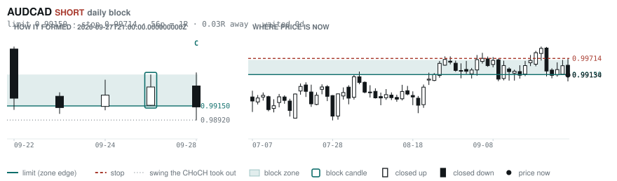
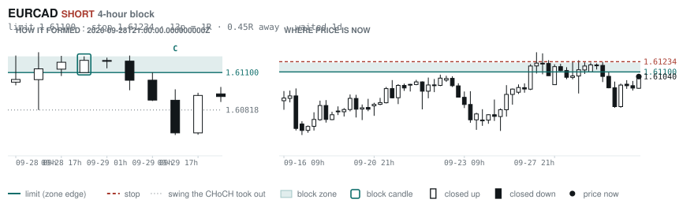
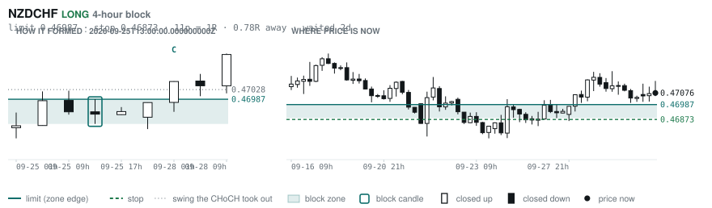
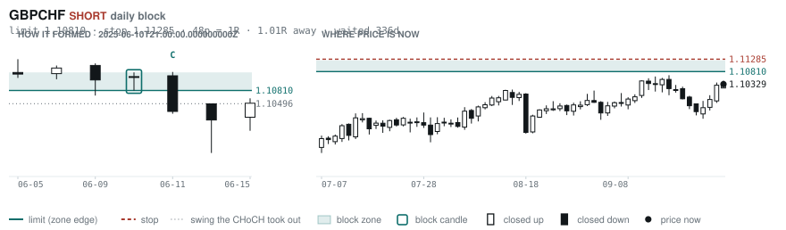
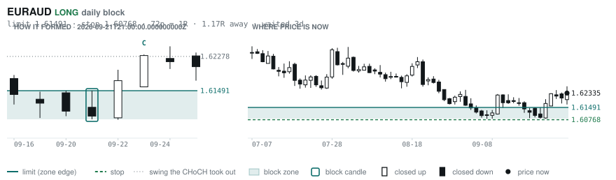
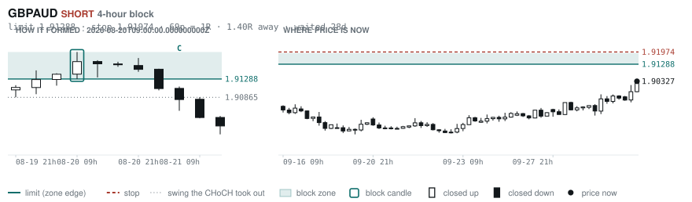

# Scanner Review — 2026-09-30 (daily)

Generated: 2026-09-30T11:03:37.291Z

```
## Account

NAV **$1040.50**   unrealised $-29.09   margin available $377.78   3 open

| pair | units | now | P/L | stop | distance | news lean |
|---|---|---|---|---|---|---|
| GBPCHF | -1000 | 1.10808 | $-0.20 | 1.11553 | 74p | — |
| EURNZD | -16500 | 2.01010 | $-29.19 | **none** | — | 🔴 1 headwind |
| EURNZD | -1000 | 2.01010 | $0.40 | **none** | — | 🔴 1 headwind |

**What the system reads on each position**

- **GBPCHF** SHORT — last CONTINUATION SHORT 118h ago at 1.09938 — system stop 1.10461, target **1.07842** (Grade B); 297p to that target from here
- **EURNZD** SHORT — last REVERSAL SHORT 118h ago at 2.01679 — system stop 2.02909, target **1.97672**; 334p to that target from here

## What is coming, and which way it leans

**EURNZD SHORT**
- 🔴 10-02T09:00 EUR — Inflation Rate YoY Flash  (fc 3.6 vs prev 3.2)

_Lean is read from forecast vs previous — which way consensus leans, not what will print._

## Order blocks live right now

### Daily

| pair | dir | limit | stop | 1R | spread | away | fills | waited | reaches 1R / 2R |
|---|---|---|---|---|---|---|---|---|---|
| AUDCAD | SHORT | **0.99150** | 0.99714 | 56p $3.98 | 5% | 0.0R | 94% | 0d | 68% / 39% |
| GBPCHF | SHORT | **1.10810** | 1.11285 | 48p $5.70 | 8% | 1.0R | 81% | 336d | 75% / 53% |
| EURAUD | LONG | **1.61491** | 1.60768 | 72p $5.05 | 5% | 1.2R | 81% | 3d | 68% / 39% |
| EURNZD | SHORT | **2.05054** | 2.06979 | 192p $10.86 | 3% | 2.1R | 71% | 217d | 75% / 53% |
| NZDCHF | LONG | **0.45428** | 0.44942 | 49p $5.83 | 7% | 3.3R | 71% | 211d | 75% / 53% |
| NZDCHF | LONG | **0.45968** | 0.45702 | 27p $3.19 | 14% | 4.0R | 50% | 57d | 78% / 46% |
| AUDUSD | LONG | **0.65028** | 0.64297 | 73p $7.31 | 2% | 6.6R | 50% | 212d | 75% / 53% |
| GBPJPY | LONG | **196.536** | 194.882 | 165p $10.52 | 2% | 7.0R | 50% | 293d | 75% / 53% |
| EURUSD | SHORT | **1.16202** | 1.16578 | 38p $3.76 | 4% | 7.4R | 50% | 11d | 68% / 39% |
| GBPNZD | LONG | **2.28830** | 2.28082 | 75p $4.22 | 13% | 7.6R | 50% | 19d | 78% / 46% |
| EURCHF | LONG | **0.91346** | 0.90937 | 41p $4.91 | 5% | 7.9R | 50% | 84d | 75% / 53% |

_Age is a quality signal, not staleness: a daily block filling after 60 days reaches 2R 58% of the time against 34% for one filling the same day. "Fills" comes from distance — 94% under 0.5R, 12% past 8R, which is why nothing past 8R is listed._

### 4-hour

| pair | dir | limit | stop | 1R | spread | away | fills | waited | reaches 1R / 2R |
|---|---|---|---|---|---|---|---|---|---|
| EURCAD | SHORT | **1.61100** | 1.61234 | 13p $0.95 | **25%** | 0.4R | 87% | 1d | 70% / 46% |
| NZDCHF | LONG | **0.46987** | 0.46873 | 11p $1.37 | **31%** | 0.8R | 83% | 2d | 77% / 47% |
| GBPAUD | SHORT | **1.91288** | 1.91974 | 69p $4.80 | 6% | 1.4R | 79% | 28d | 78% / 51% |
| EURCHF | LONG | **0.94240** | 0.94128 | 11p $1.35 | 18% | 2.9R | 66% | 3d | 77% / 47% |
| CADJPY | LONG | **109.188** | 108.671 | 52p $3.29 | 7% | 2.9R | 66% | 231d | 78% / 51% |
| EURJPY | LONG | **176.892** | 176.472 | 42p $2.67 | 7% | 3.3R | 66% | 231d | 78% / 51% |
| EURNZD | SHORT | **2.02676** | 2.03177 | 50p $2.82 | 13% | 3.6R | 66% | 125d | 78% / 51% |
| NZDCAD | LONG | **0.79408** | 0.79222 | 19p $1.31 | **24%** | 4.1R | 51% | 125d | 78% / 51% |
| EURNZD | SHORT | **2.02030** | 2.02312 | 28p $1.59 | **22%** | 4.1R | 51% | 66d | 78% / 51% |
| NZDCHF | SHORT | **0.47538** | 0.47647 | 11p $1.31 | **33%** | 4.2R | 51% | 16d | 78% / 51% |
| NZDJPY | LONG | **87.686** | 87.453 | 23p $1.48 | 14% | 4.6R | 51% | 218d | 78% / 51% |
| EURGBP | LONG | **0.83879** | 0.83526 | 35p $4.67 | 3% | 4.8R | 51% | 347d | 78% / 51% |
| EURCAD | SHORT | **1.61696** | 1.61828 | 13p $0.93 | **26%** | 5.0R | 51% | 24d | 78% / 51% |
| EURCAD | SHORT | **1.62180** | 1.62397 | 22p $1.53 | 16% | 5.3R | 51% | 39d | 78% / 51% |
| AUDCAD | LONG | **0.98104** | 0.97983 | 12p $0.85 | **21%** | 6.5R | 51% | 28d | 78% / 51% |
| CADJPY | SHORT | **112.364** | 112.617 | 25p $1.61 | 14% | 6.5R | 51% | 3d | 77% / 47% |
| EURNZD | SHORT | **2.05666** | 2.06369 | 70p $3.97 | 9% | 6.8R | 51% | 218d | 78% / 51% |
| GBPCHF | LONG | **1.09454** | 1.09308 | 15p $1.75 | **27%** | 7.3R | 51% | 3d | 77% / 47% |

_Same definition, roughly six times the frequency, split-validated clean (14 pairs fit +0.410R, 14 untouched +0.494R). **Read these net of cost:** an H4 stop is about a third of a daily one, so the same spread takes three times the share. Gross +0.452R against daily +0.413R, but net of one spread +0.231R against +0.303R. Real, and mostly rent._

### In reach, drawn

_6 blocks within 3R of the limit. Blocks further out are in the tables above but not worth a picture yet._

**AUDCAD SHORT** · daily · 0.03R away · waited 0d



**EURCAD SHORT** · 4-hour · 0.45R away · waited 1d



**NZDCHF LONG** · 4-hour · 0.78R away · waited 2d



**GBPCHF SHORT** · daily · 1.01R away · waited 336d



**EURAUD LONG** · daily · 1.17R away · waited 3d



**GBPAUD SHORT** · 4-hour · 1.40R away · waited 28d



_Hollow candle closed up, filled closed down. Left panel is the block forming — the ringed candle is the block, **C** is the change of character. Right panel is where price sits now against the zone. Full legend is inside each image._

## Scanner calls, last 1 day

| when | pair | dir | branch | entry | stop | target | outcome |
|---|---|---|---|---|---|---|---|
| 09-29T13:00 | NZDUSD | SHORT | WALL | 0.56282 | 0.56795 | 0.54188 | open -0.51R |
| 09-29T13:00 | EURAUD | LONG | REV | 1.62362 | 1.61114 | 1.63743 | open +0.39R |
| 09-29T13:00 | EURJPY | SHORT | WALL | 178.164 | 179.038 | 176.154 | open -0.14R |
| 09-29T17:00 | EURCAD | LONG | REV | 1.60928 | 1.59951 | 1.62364 | open +0.11R |
| 09-29T17:00 | GBPCAD | LONG | REV | 1.87744 | 1.86830 | 1.89024 | open +0.52R |
| 09-29T17:00 | CADJPY | SHORT | REV | 110.848 | 111.749 | 105.680 | open +0.15R |
| 09-29T17:00 | AUDCHF | LONG | REV | 0.58260 | 0.57803 | 0.59526 | open -0.42R |
| 09-29T17:00 | AUDJPY | LONG | REV | 109.888 | 108.727 | 115.582 | open -0.35R |
| 09-29T21:00 | USDJPY | SHORT | REV | 157.120 | 159.049 | 145.382 | open +0.08R |
| 09-29T21:00 | CADCHF | LONG | REV | 0.58781 | 0.58372 | 0.60456 | open -0.15R |
| 09-29T21:00 | GBPUSD | LONG | REV | 1.32290 | 1.31194 | 1.36614 | open +0.42R |
| 09-29T21:00 | GBPCHF | LONG | REV | 1.10358 | 1.09699 | 1.12378 | open +0.25R |
| 09-29T21:00 | AUDNZD | LONG | REV | 1.23912 | 1.23087 | 1.30342 | open -0.68R |
| 09-30T01:00 | NZDCAD | SHORT | REV | 0.80072 | 0.80749 | 0.79015 | open -0.14R |
| 09-30T01:00 | AUDCAD | SHORT | REV | 0.98974 | 0.99919 | 0.97929 | open +0.09R |
| 09-30T01:00 | GBPJPY | LONG | REV | 207.861 | 205.699 | 215.468 | open +0.24R |
| 09-30T01:00 | AUDNZD | LONG | REV | 1.23605 | 1.22625 | 1.30342 | open -0.26R |
| 09-30T01:00 | GBPAUD | LONG | REV | 1.89740 | 1.87925 | 1.91701 | open +0.32R |
| 09-30T01:00 | AUDJPY | LONG | REV | 109.548 | 107.732 | 115.582 | open -0.04R |
| 09-30T05:00 | NZDCAD | SHORT | REV | 0.80170 | 0.80917 | 0.79015 | open +0.00R |
| 09-30T05:00 | GBPCAD | LONG | WALL | 1.88218 | 1.87604 | 1.89024 | open +0.00R |
| 09-30T05:00 | EURGBP | LONG | REV | 0.85560 | 0.85266 | 0.86611 | open +0.00R |
| 09-30T05:00 | EURUSD | LONG | REV | 1.13582 | 1.12672 | 1.17423 | open +0.00R |
| 09-30T05:00 | USDCAD | SHORT | REV | 1.41790 | 1.42448 | 1.35795 | open +0.00R |

## Running tally, last 30 days

8 resolved · 0 target / 8 stopped · **-8.0R** · -1.000R per call · 52 still open

```
