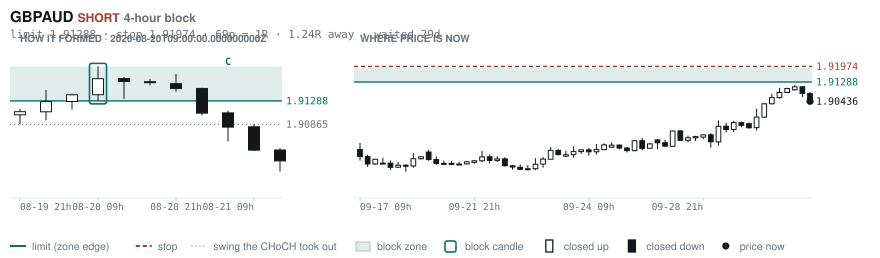
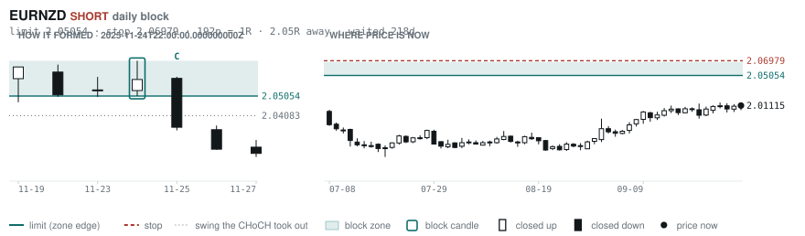
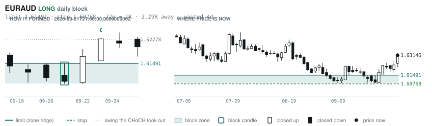
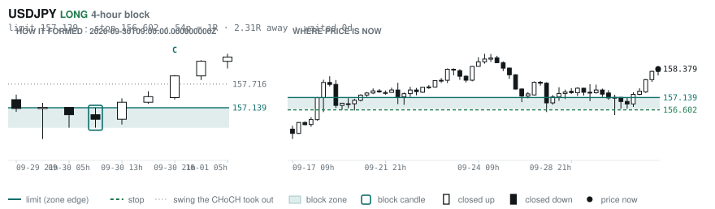
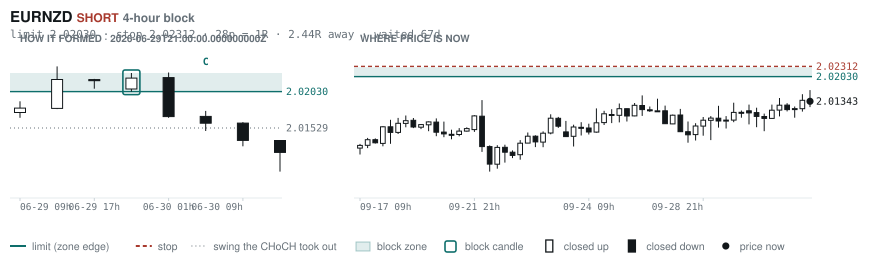
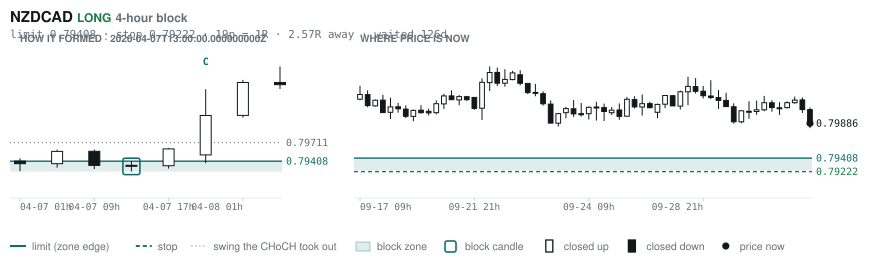

# Scanner Review — 2026-10-01 (daily)

Generated: 2026-10-01T11:03:35.812Z

```
## Account

NAV **$1022.44**   unrealised $-42.31   margin available $12.88   4 open

| pair | units | now | P/L | stop | distance | news lean |
|---|---|---|---|---|---|---|
| GBPCHF | -5300 | 1.10545 | $8.69 | 1.12000 | 146p | — |
| GBPCHF | -1000 | 1.10545 | $2.94 | 1.12000 | 146p | — |
| EURNZD | -16500 | 2.01260 | $-52.89 | **none** | — | 🔴 1 headwind |
| EURNZD | -1000 | 2.01260 | $-1.05 | **none** | — | 🔴 1 headwind |

**What the system reads on each position**

- **GBPCHF** SHORT — last CONTINUATION SHORT 142h ago at 1.09938 — system stop 1.10461, target **1.07842** (Grade B); 270p to that target from here
- **EURNZD** SHORT — last REVERSAL SHORT 82h ago at 2.01630 — system stop 2.02919, target **1.97672**; 359p to that target from here

## What is coming, and which way it leans

**EURNZD SHORT**
- 🔴 10-02T09:00 EUR — Inflation Rate YoY Flash  (fc 3.6 vs prev 3.2)

_Lean is read from forecast vs previous — which way consensus leans, not what will print._

## Order blocks live right now

### Daily

| pair | dir | limit | stop | 1R | spread | away | fills | waited | reaches 1R / 2R |
|---|---|---|---|---|---|---|---|---|---|
| EURNZD | SHORT | **2.05054** | 2.06979 | 192p $10.84 | 3% | 2.0R | 71% | 218d | 75% / 53% |
| EURAUD | LONG | **1.61491** | 1.60768 | 72p $5.02 | 5% | 2.3R | 71% | 4d | 68% / 39% |
| EURGBP | SHORT | **0.85929** | 0.86117 | 19p $2.49 | 6% | 2.7R | 71% | 0d | 68% / 39% |
| NZDCHF | LONG | **0.45428** | 0.44942 | 49p $5.82 | 7% | 3.4R | 71% | 212d | 75% / 53% |
| NZDCHF | LONG | **0.45968** | 0.45702 | 27p $3.19 | 14% | 4.2R | 50% | 58d | 78% / 46% |
| AUDUSD | LONG | **0.65028** | 0.64297 | 73p $7.31 | 2% | 6.0R | 50% | 213d | 75% / 53% |
| GBPJPY | LONG | **196.536** | 194.882 | 165p $10.51 | 2% | 7.4R | 50% | 294d | 75% / 53% |
| EURUSD | SHORT | **1.16202** | 1.16578 | 38p $3.76 | 4% | 7.7R | 50% | 12d | 68% / 39% |

_Age is a quality signal, not staleness: a daily block filling after 60 days reaches 2R 58% of the time against 34% for one filling the same day. "Fills" comes from distance — 94% under 0.5R, 12% past 8R, which is why nothing past 8R is listed._

### 4-hour

| pair | dir | limit | stop | 1R | spread | away | fills | waited | reaches 1R / 2R |
|---|---|---|---|---|---|---|---|---|---|
| GBPAUD | SHORT | **1.91288** | 1.91974 | 69p $4.77 | 7% | 1.2R | 79% | 29d | 78% / 51% |
| USDJPY | LONG | **157.139** | 156.602 | 54p $3.41 | 3% | 2.3R | 66% | 0d | 70% / 46% |
| EURNZD | SHORT | **2.02030** | 2.02312 | 28p $1.59 | **24%** | 2.4R | 66% | 67d | 78% / 51% |
| NZDCAD | LONG | **0.79408** | 0.79222 | 19p $1.31 | **24%** | 2.6R | 66% | 126d | 78% / 51% |
| EURNZD | SHORT | **2.02676** | 2.03177 | 50p $2.82 | 13% | 2.7R | 66% | 126d | 78% / 51% |
| EURCHF | SHORT | **0.94627** | 0.94735 | 11p $1.29 | 19% | 2.9R | 66% | 0d | 70% / 46% |
| CADJPY | LONG | **109.188** | 108.671 | 52p $3.28 | 7% | 3.9R | 66% | 232d | 78% / 51% |
| EURGBP | LONG | **0.83879** | 0.83526 | 35p $4.68 | 4% | 4.5R | 51% | 348d | 78% / 51% |
| EURJPY | LONG | **176.892** | 176.472 | 42p $2.67 | 7% | 4.6R | 51% | 232d | 78% / 51% |
| CADJPY | SHORT | **112.364** | 112.617 | 25p $1.61 | 14% | 4.7R | 51% | 4d | 77% / 47% |
| NZDJPY | LONG | **87.686** | 87.453 | 23p $1.48 | 15% | 4.8R | 51% | 219d | 78% / 51% |
| AUDCAD | LONG | **0.98104** | 0.97983 | 12p $0.85 | 19% | 6.0R | 51% | 29d | 78% / 51% |
| EURNZD | SHORT | **2.05666** | 2.06369 | 70p $3.96 | 10% | 6.2R | 51% | 219d | 78% / 51% |
| EURCAD | SHORT | **1.62180** | 1.62397 | 22p $1.52 | 15% | 6.2R | 51% | 40d | 78% / 51% |
| GBPCHF | LONG | **1.09454** | 1.09308 | 15p $1.75 | **27%** | 6.2R | 51% | 4d | 77% / 47% |
| NZDCHF | SHORT | **0.47538** | 0.47647 | 11p $1.30 | **32%** | 6.4R | 51% | 17d | 78% / 51% |
| EURCAD | SHORT | **1.61696** | 1.61828 | 13p $0.93 | **25%** | 6.4R | 51% | 25d | 78% / 51% |

_Same definition, roughly six times the frequency, split-validated clean (14 pairs fit +0.410R, 14 untouched +0.494R). **Read these net of cost:** an H4 stop is about a third of a daily one, so the same spread takes three times the share. Gross +0.452R against daily +0.413R, but net of one spread +0.231R against +0.303R. Real, and mostly rent._

### In reach, drawn

_6 blocks within 3R of the limit. Blocks further out are in the tables above but not worth a picture yet._

**GBPAUD SHORT** · 4-hour · 1.24R away · waited 29d



**EURNZD SHORT** · daily · 2.05R away · waited 218d



**EURAUD LONG** · daily · 2.29R away · waited 4d



**USDJPY LONG** · 4-hour · 2.31R away · waited 0d



**EURNZD SHORT** · 4-hour · 2.44R away · waited 67d



**NZDCAD LONG** · 4-hour · 2.57R away · waited 126d



_Hollow candle closed up, filled closed down. Left panel is the block forming — the ringed candle is the block, **C** is the change of character. Right panel is where price sits now against the zone. Full legend is inside each image._

## Scanner calls, last 1 day

| when | pair | dir | branch | entry | stop | target | outcome |
|---|---|---|---|---|---|---|---|
| 09-30T13:00 | NZDUSD | SHORT | REV | 0.56348 | 0.57093 | 0.54188 | open +0.36R |
| 09-30T13:00 | USDJPY | LONG | REV | 157.274 | 155.533 | 165.186 | open +0.63R |
| 09-30T13:00 | GBPCAD | LONG | WALL | 1.88559 | 1.88256 | 1.89024 | stopped -1.00R |
| 09-30T13:00 | AUDUSD | SHORT | WALL | 0.69511 | 0.69800 | 0.69122 | open +0.46R |
| 09-30T17:00 | EURGBP | SHORT | WALL | 0.85418 | 0.85611 | 0.85054 | open -0.24R |
| 09-30T17:00 | USDCHF | LONG | REV | 0.83578 | 0.82724 | 0.84757 | open -0.06R |
| 09-30T21:00 | EURCHF | LONG | REV | 0.94654 | 0.94109 | 0.96513 | open -0.62R |
| 09-30T21:00 | NZDUSD | SHORT | REV | 0.56344 | 0.57070 | 0.54188 | open +0.37R |
| 09-30T21:00 | EURAUD | SHORT | REV | 1.63210 | 1.64293 | 1.59370 | open +0.42R |
| 09-30T21:00 | USDCHF | LONG | REV | 0.83520 | 0.82713 | 0.84757 | open +0.01R |
| 10-01T01:00 | NZDCAD | SHORT | REV | 0.80075 | 0.80872 | 0.79015 | open +0.24R |
| 10-01T01:00 | EURNZD | LONG | REV | 2.01372 | 1.99619 | 2.03619 | open -0.02R |
| 10-01T01:00 | NZDCHF | SHORT | REV | 0.47026 | 0.47349 | 0.45920 | open +0.58R |
| 10-01T01:00 | NZDJPY | SHORT | REV | 88.966 | 89.874 | 82.704 | open +0.17R |
| 09-30T17:00 | GBPCHF | LONG | WALL | 1.10860 | 1.10549 | 1.12378 | stopped -1.00R |
| 10-01T01:00 | AUDNZD | LONG | REV | 1.23558 | 1.22515 | 1.30342 | open +0.15R |
| 10-01T01:00 | AUDNZD | LONG | WALL | 1.23558 | 1.23223 | 1.30342 | open +0.45R |
| 10-01T05:00 | EURCAD | SHORT | REV | 1.60845 | 1.62029 | 1.59468 | open +0.00R |
| 10-01T05:00 | AUDCAD | SHORT | REV | 0.98826 | 0.99577 | 0.97929 | open +0.00R |
| 10-01T05:00 | GBPAUD | SHORT | REV | 1.90436 | 1.91782 | 1.85168 | open +0.00R |
| 10-01T05:00 | EURCHF | LONG | REV | 0.94314 | 0.93776 | 0.96513 | open +0.00R |
| 10-01T05:00 | CADJPY | SHORT | REV | 111.180 | 112.293 | 105.680 | open +0.00R |
| 10-01T05:00 | GBPCHF | LONG | REV | 1.10357 | 1.09606 | 1.12378 | open +0.00R |
| 10-01T05:00 | EURGBP | SHORT | WALL | 0.85464 | 0.85609 | 0.85054 | open +0.00R |
| 10-01T05:00 | AUDCHF | SHORT | REV | 0.57944 | 0.58533 | 0.56996 | open +0.00R |
| 10-01T05:00 | AUDJPY | SHORT | REV | 109.870 | 111.197 | 104.378 | open +0.00R |
| 10-01T05:00 | GBPJPY | SHORT | REV | 209.248 | 210.893 | 196.722 | open +0.00R |
| 10-01T05:00 | EURJPY | SHORT | REV | 178.828 | 180.714 | 176.154 | open +0.00R |
| 10-01T05:00 | AUDUSD | SHORT | WALL | 0.69378 | 0.69618 | 0.69122 | open +0.00R |
| 10-01T05:00 | AUDNZD | LONG | WALL | 1.23710 | 1.23371 | 1.30342 | open +0.00R |
| 10-01T05:00 | GBPCAD | SHORT | REV | 1.88205 | 1.89163 | 1.85129 | open +0.00R |

## Running tally, last 30 days

6 resolved · 0 target / 6 stopped · **-6.0R** · -1.000R per call · 54 still open

```
