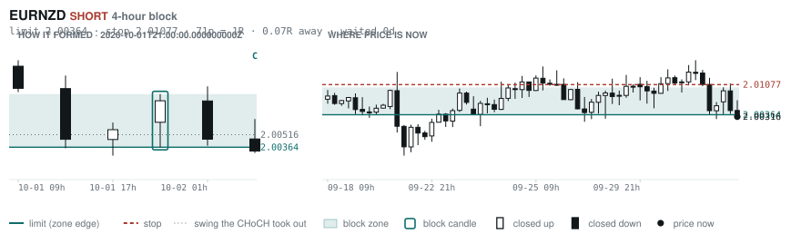
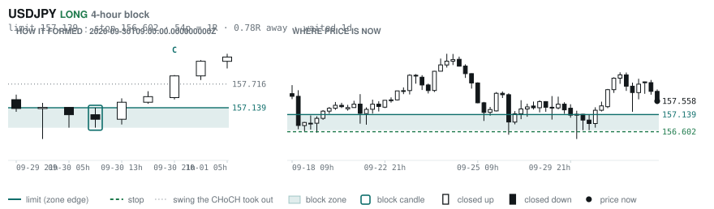
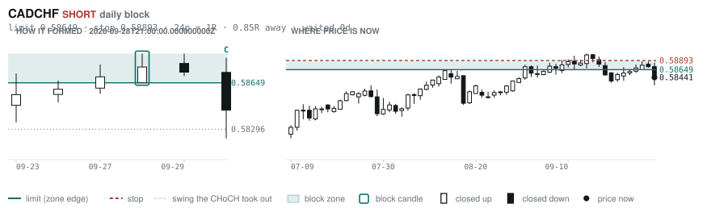
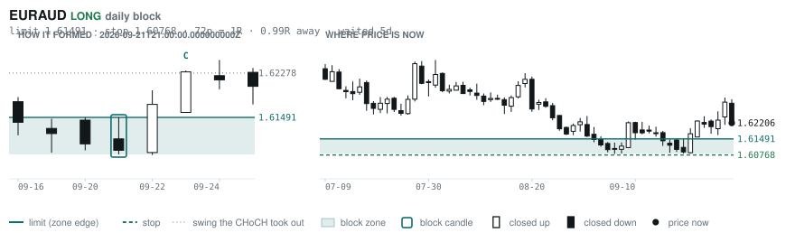
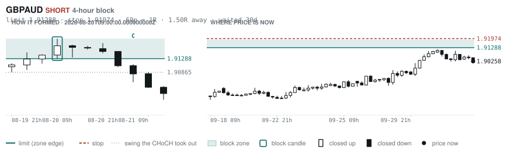
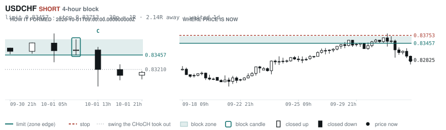

# Scanner Review — 2026-10-02 (daily)

Generated: 2026-10-02T11:03:36.263Z

```
## Account

NAV **$1190.03**   unrealised $126.91   margin available $0.00   5 open

| pair | units | now | P/L | stop | distance | news lean |
|---|---|---|---|---|---|---|
| GBPCHF | -3000 | 1.09441 | $-6.99 | 1.10100 | 66p | — |
| GBPCHF | -5300 | 1.09441 | $79.28 | 1.10100 | 66p | — |
| GBPCHF | -1000 | 1.09441 | $16.27 | 1.10100 | 66p | — |
| EURNZD | -16500 | 2.00319 | $34.12 | 2.01713 | 139p | — |
| EURNZD | -1000 | 2.00319 | $4.22 | 2.01713 | 139p | — |

**What the system reads on each position**

- **GBPCHF** SHORT — last CONTINUATION SHORT 166h ago at 1.09938 — system stop 1.10461, target **1.07842** (Grade B); 160p to that target from here
- **EURNZD** SHORT — last REVERSAL SHORT 166h ago at 2.01679 — system stop 2.02909, target **1.97672**; 265p to that target from here

## Order blocks live right now

### Daily

| pair | dir | limit | stop | 1R | spread | away | fills | waited | reaches 1R / 2R |
|---|---|---|---|---|---|---|---|---|---|
| CADCHF | SHORT | **0.58649** | 0.58893 | 24p $2.94 | 9% | 0.9R | 87% | 0d | 68% / 39% |
| EURAUD | LONG | **1.61491** | 1.60768 | 72p $5.01 | 5% | 1.0R | 87% | 5d | 68% / 39% |
| NZDCHF | LONG | **0.45968** | 0.45702 | 27p $3.20 | 14% | 2.3R | 71% | 59d | 78% / 46% |
| EURNZD | SHORT | **2.05054** | 2.06979 | 192p $10.79 | 4% | 2.3R | 71% | 219d | 75% / 53% |
| NZDCHF | LONG | **0.45428** | 0.44942 | 49p $5.85 | 8% | 2.4R | 71% | 213d | 75% / 53% |
| EURGBP | SHORT | **0.85929** | 0.86117 | 19p $2.48 | 7% | 3.9R | 71% | 1d | 68% / 39% |
| EURCHF | LONG | **0.91346** | 0.90937 | 41p $4.92 | 6% | 5.1R | 50% | 86d | 75% / 53% |
| AUDUSD | LONG | **0.65028** | 0.64297 | 73p $7.31 | 2% | 5.9R | 50% | 214d | 75% / 53% |
| GBPJPY | LONG | **196.536** | 194.882 | 165p $10.47 | 2% | 7.3R | 50% | 295d | 75% / 53% |
| GBPCHF | LONG | **1.05438** | 1.04888 | 55p $6.62 | 7% | 7.7R | 50% | 87d | 75% / 53% |

_Age is a quality signal, not staleness: a daily block filling after 60 days reaches 2R 58% of the time against 34% for one filling the same day. "Fills" comes from distance — 94% under 0.5R, 12% past 8R, which is why nothing past 8R is listed._

### 4-hour

| pair | dir | limit | stop | 1R | spread | away | fills | waited | reaches 1R / 2R |
|---|---|---|---|---|---|---|---|---|---|
| EURNZD | SHORT | **2.00364** | 2.01077 | 71p $4.00 | 10% | 0.1R | 87% | 0d | 70% / 46% |
| USDJPY | LONG | **157.139** | 156.602 | 54p $3.40 | 3% | 0.8R | 83% | 1d | 70% / 46% |
| GBPAUD | SHORT | **1.91288** | 1.91974 | 69p $4.76 | 6% | 1.5R | 79% | 30d | 78% / 51% |
| USDCHF | SHORT | **0.83457** | 0.83753 | 30p $3.56 | 5% | 2.1R | 66% | 1d | 70% / 46% |
| CADCHF | SHORT | **0.58598** | 0.58742 | 14p $1.73 | 15% | 2.8R | 66% | 1d | 70% / 46% |
| NZDCAD | LONG | **0.79408** | 0.79222 | 19p $1.31 | **24%** | 2.9R | 66% | 127d | 78% / 51% |
| CADJPY | LONG | **109.188** | 108.671 | 52p $3.27 | 7% | 2.9R | 66% | 233d | 78% / 51% |
| NZDJPY | LONG | **87.686** | 87.453 | 23p $1.48 | 15% | 3.5R | 66% | 220d | 78% / 51% |
| EURGBP | LONG | **0.83879** | 0.83526 | 35p $4.66 | 4% | 3.7R | 66% | 349d | 78% / 51% |
| EURGBP | LONG | **0.84979** | 0.84930 | 5p $0.65 | **26%** | 4.1R | 51% | 53d | 78% / 51% |
| EURCAD | LONG | **1.59396** | 1.59218 | 18p $1.25 | **20%** | 4.2R | 51% | 107d | 78% / 51% |
| EURNZD | SHORT | **2.02676** | 2.03177 | 50p $2.81 | 14% | 4.7R | 51% | 127d | 78% / 51% |
| AUDCAD | LONG | **0.98104** | 0.97983 | 12p $0.85 | 18% | 5.8R | 51% | 30d | 78% / 51% |
| EURNZD | SHORT | **2.02030** | 2.02312 | 28p $1.58 | **25%** | 6.1R | 51% | 68d | 78% / 51% |
| CADJPY | SHORT | **112.364** | 112.617 | 25p $1.60 | 14% | 6.6R | 51% | 5d | 77% / 47% |
| EURCAD | LONG | **1.56944** | 1.56513 | 43p $3.03 | 8% | 7.4R | 51% | 144d | 78% / 51% |
| EURNZD | SHORT | **2.05666** | 2.06369 | 70p $3.94 | 10% | 7.6R | 51% | 220d | 78% / 51% |
| EURNZD | LONG | **1.93742** | 1.92882 | 86p $4.82 | 8% | 7.6R | 51% | 303d | 78% / 51% |

_Same definition, roughly six times the frequency, split-validated clean (14 pairs fit +0.410R, 14 untouched +0.494R). **Read these net of cost:** an H4 stop is about a third of a daily one, so the same spread takes three times the share. Gross +0.452R against daily +0.413R, but net of one spread +0.231R against +0.303R. Real, and mostly rent._

### In reach, drawn

_6 blocks within 3R of the limit. Blocks further out are in the tables above but not worth a picture yet._

**EURNZD SHORT** · 4-hour · 0.07R away · waited 0d



**USDJPY LONG** · 4-hour · 0.78R away · waited 1d



**CADCHF SHORT** · daily · 0.85R away · waited 0d



**EURAUD LONG** · daily · 0.99R away · waited 5d



**GBPAUD SHORT** · 4-hour · 1.50R away · waited 30d



**USDCHF SHORT** · 4-hour · 2.14R away · waited 1d



_Hollow candle closed up, filled closed down. Left panel is the block forming — the ringed candle is the block, **C** is the change of character. Right panel is where price sits now against the zone. Full legend is inside each image._

## Scanner calls, last 1 day

| when | pair | dir | branch | entry | stop | target | outcome |
|---|---|---|---|---|---|---|---|
| 10-01T13:00 | NZDCAD | SHORT | WALL | 0.79736 | 0.80198 | 0.79015 | open -0.45R |
| 10-01T13:00 | NZDJPY | SHORT | REV | 88.329 | 89.623 | 82.704 | open -0.13R |
| 10-01T13:00 | GBPCHF | LONG | REV | 1.09709 | 1.08693 | 1.12378 | open -0.31R |
| 10-01T13:00 | GBPJPY | SHORT | REV | 208.090 | 211.363 | 196.722 | open -0.00R |
| 10-01T13:00 | USDJPY | SHORT | REV | 157.827 | 159.444 | 145.382 | open +0.17R |
| 10-01T13:00 | AUDJPY | SHORT | REV | 109.064 | 110.988 | 104.378 | open -0.16R |
| 10-01T13:00 | CADJPY | SHORT | REV | 110.777 | 111.812 | 105.680 | open +0.08R |
| 10-01T13:00 | NZDUSD | SHORT | WALL | 0.55965 | 0.56446 | 0.54188 | open -0.42R |
| 10-01T13:00 | CHFJPY | SHORT | REV | 189.676 | 191.941 | 176.922 | open -0.24R |
| 10-01T13:00 | USDCHF | LONG | REV | 0.83209 | 0.82416 | 0.84757 | open -0.48R |
| 10-01T13:00 | AUDNZD | SHORT | REV | 1.23482 | 1.24409 | 1.17940 | open -0.12R |
| 10-01T17:00 | GBPCAD | LONG | REV | 1.87656 | 1.86711 | 1.89024 | open +0.36R |
| 10-01T17:00 | USDCAD | SHORT | REV | 1.42227 | 1.43392 | 1.35795 | open -0.10R |
| 10-01T17:00 | CADJPY | LONG | REV | 111.172 | 109.949 | 114.634 | open -0.39R |
| 10-01T21:00 | NZDUSD | SHORT | REV | 0.55914 | 0.56807 | 0.54188 | open -0.29R |
| 10-01T21:00 | NZDCAD | SHORT | WALL | 0.79557 | 0.79924 | 0.79015 | stopped -1.00R |
| 10-01T21:00 | GBPNZD | LONG | REV | 2.35800 | 2.33656 | 2.41734 | open -0.30R |
| 10-01T21:00 | EURCAD | LONG | REV | 1.59846 | 1.58925 | 1.62389 | open +0.32R |
| 10-02T01:00 | NZDCAD | SHORT | REV | 0.79784 | 0.80526 | 0.79015 | open -0.22R |
| 10-02T01:00 | GBPCHF | LONG | REV | 1.09611 | 1.08723 | 1.12378 | open -0.25R |
| 10-02T05:00 | NZDJPY | SHORT | REV | 88.494 | 89.637 | 82.704 | open +0.00R |
| 10-02T05:00 | EURCAD | LONG | REV | 1.60144 | 1.59165 | 1.62389 | open +0.00R |
| 10-02T05:00 | GBPAUD | SHORT | REV | 1.90258 | 1.91762 | 1.85168 | open +0.00R |
| 10-02T05:00 | CADJPY | SHORT | REV | 110.697 | 111.835 | 105.680 | open +0.00R |
| 10-02T05:00 | CHFJPY | SHORT | REV | 190.228 | 191.839 | 176.922 | open +0.00R |
| 10-02T05:00 | USDCHF | LONG | REV | 0.82825 | 0.82123 | 0.84757 | open +0.00R |

## Running tally, last 30 days

22 resolved · 2 target / 20 stopped · **-17.6R** · -0.799R per call · 38 still open

```
