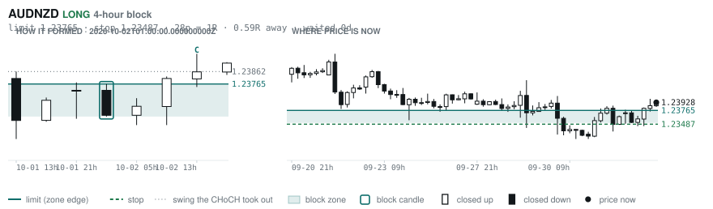
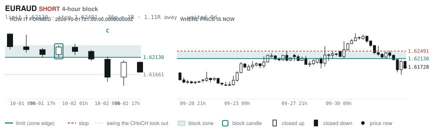
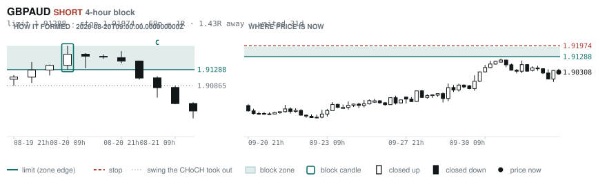
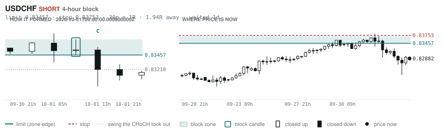
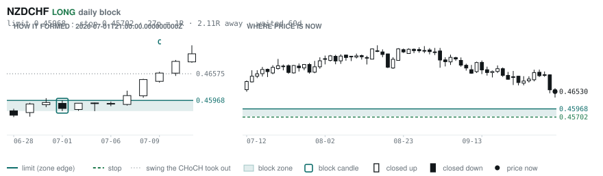

# Scanner Review — 2026-10-04 (weekly)

Generated: 2026-10-04T19:03:49.110Z

```
## Account

NAV **$1128.27**   unrealised $67.35   margin available $0.00   5 open

| pair | units | now | P/L | stop | distance | news lean |
|---|---|---|---|---|---|---|
| GBPCHF | -3000 | 1.09738 | $-19.88 | **none** | — | — |
| GBPCHF | -5300 | 1.09738 | $56.51 | **none** | — | — |
| GBPCHF | -1000 | 1.09738 | $11.98 | **none** | — | — |
| EURNZD | -16500 | 2.00434 | $15.64 | 2.01713 | 128p | — |
| EURNZD | -1000 | 2.00434 | $3.10 | 2.01713 | 128p | — |

**What the system reads on each position**

- **GBPCHF** SHORT — last CONTINUATION SHORT 54h ago at 1.09938 — system stop 1.10724, target **1.07332** (Grade B); 241p to that target from here
- **EURNZD** SHORT — last REVERSAL SHORT 222h ago at 2.01679 — system stop 2.02909, target **1.97672**; 276p to that target from here

## Order blocks live right now

### Daily

| pair | dir | limit | stop | 1R | spread | away | fills | waited | reaches 1R / 2R |
|---|---|---|---|---|---|---|---|---|---|
| CADCHF | SHORT | **0.58649** | 0.58893 | 24p $2.95 | **27%** | 2.0R | 71% | 1d | 68% / 39% |
| NZDCHF | LONG | **0.45968** | 0.45702 | 27p $3.21 | **35%** | 2.1R | 71% | 60d | 75% / 53% |
| NZDCHF | LONG | **0.45428** | 0.44942 | 49p $5.87 | 19% | 2.3R | 71% | 214d | 75% / 53% |
| EURNZD | SHORT | **2.05054** | 2.06979 | 192p $10.81 | 12% | 2.4R | 71% | 220d | 75% / 53% |
| EURCHF | SHORT | **0.94486** | 0.94900 | 41p $4.99 | 17% | 3.0R | 71% | 0d | 68% / 39% |
| EURCHF | LONG | **0.91346** | 0.90937 | 41p $4.94 | 17% | 4.7R | 50% | 87d | 75% / 53% |
| EURGBP | SHORT | **0.85929** | 0.86117 | 19p $2.49 | **33%** | 5.0R | 50% | 2d | 68% / 39% |
| AUDUSD | LONG | **0.65028** | 0.64297 | 73p $7.31 | 5% | 6.2R | 50% | 215d | 75% / 53% |
| GBPJPY | LONG | **196.536** | 194.882 | 165p $10.48 | 12% | 7.6R | 50% | 296d | 75% / 53% |
| USDCHF | LONG | **0.78472** | 0.77902 | 57p $6.87 | 11% | 7.7R | 50% | 87d | 75% / 53% |
| GBPCHF | LONG | **1.05438** | 1.04888 | 55p $6.64 | **29%** | 7.8R | 50% | 88d | 75% / 53% |

_Age is a quality signal, not staleness: a daily block filling after 60 days reaches 2R 58% of the time against 34% for one filling the same day. "Fills" comes from distance — 94% under 0.5R, 12% past 8R, which is why nothing past 8R is listed._

### 4-hour

| pair | dir | limit | stop | 1R | spread | away | fills | waited | reaches 1R / 2R |
|---|---|---|---|---|---|---|---|---|---|
| AUDNZD | LONG | **1.23765** | 1.23487 | 28p $1.56 | **71%** | 0.6R | 83% | 0d | 70% / 46% |
| EURAUD | SHORT | **1.62130** | 1.62491 | 36p $2.51 | **49%** | 1.1R | 79% | 0d | 70% / 46% |
| GBPAUD | SHORT | **1.91288** | 1.91974 | 69p $4.78 | **32%** | 1.4R | 79% | 31d | 78% / 51% |
| USDCHF | SHORT | **0.83457** | 0.83753 | 30p $3.57 | **21%** | 1.9R | 79% | 1d | 70% / 46% |
| AUDCAD | LONG | **0.98592** | 0.98382 | 21p $1.47 | **55%** | 2.6R | 66% | 0d | 70% / 46% |
| CADCHF | SHORT | **0.58598** | 0.58742 | 14p $1.74 | **45%** | 3.0R | 66% | 1d | 70% / 46% |
| CADJPY | LONG | **109.188** | 108.671 | 52p $3.27 | **21%** | 3.1R | 66% | 233d | 78% / 51% |
| EURGBP | LONG | **0.83879** | 0.83526 | 35p $4.68 | 18% | 3.1R | 66% | 349d | 78% / 51% |
| NZDCAD | LONG | **0.79408** | 0.79222 | 19p $1.30 | **70%** | 3.2R | 66% | 128d | 78% / 51% |
| NZDJPY | LONG | **87.686** | 87.453 | 23p $1.48 | **57%** | 4.0R | 51% | 221d | 78% / 51% |
| EURNZD | SHORT | **2.02676** | 2.03177 | 50p $2.81 | **48%** | 4.5R | 51% | 128d | 78% / 51% |
| EURCAD | LONG | **1.59396** | 1.59218 | 18p $1.25 | **67%** | 5.3R | 51% | 107d | 78% / 51% |
| EURNZD | SHORT | **2.02030** | 2.02312 | 28p $1.58 | **85%** | 5.7R | 51% | 69d | 78% / 51% |
| CADJPY | SHORT | **112.364** | 112.617 | 25p $1.60 | **44%** | 6.3R | 51% | 5d | 77% / 47% |
| EURNZD | SHORT | **2.05666** | 2.06369 | 70p $3.95 | **34%** | 7.4R | 51% | 221d | 78% / 51% |
| CADCHF | LONG | **0.57634** | 0.57565 | 7p $0.84 | **94%** | 7.6R | 51% | 41d | 78% / 51% |
| EURNZD | LONG | **1.93742** | 1.92882 | 86p $4.83 | **28%** | 7.8R | 51% | 304d | 78% / 51% |
| EURCAD | LONG | **1.56944** | 1.56513 | 43p $3.03 | **28%** | 7.9R | 51% | 144d | 78% / 51% |

_Same definition, roughly six times the frequency, split-validated clean (14 pairs fit +0.410R, 14 untouched +0.494R). **Read these net of cost:** an H4 stop is about a third of a daily one, so the same spread takes three times the share. Gross +0.452R against daily +0.413R, but net of one spread +0.231R against +0.303R. Real, and mostly rent._

### In reach, drawn

_6 blocks within 3R of the limit. Blocks further out are in the tables above but not worth a picture yet._

**AUDNZD LONG** · 4-hour · 0.59R away · waited 0d



**EURAUD SHORT** · 4-hour · 1.11R away · waited 0d



**GBPAUD SHORT** · 4-hour · 1.43R away · waited 31d



**USDCHF SHORT** · 4-hour · 1.94R away · waited 1d



**CADCHF SHORT** · daily · 2.00R away · waited 1d


**NZDCHF LONG** · daily · 2.11R away · waited 60d



_Hollow candle closed up, filled closed down. Left panel is the block forming — the ringed candle is the block, **C** is the change of character. Right panel is where price sits now against the zone. Full legend is inside each image._

## Scanner calls, last 7 days

| when | pair | dir | branch | entry | stop | target | outcome |
|---|---|---|---|---|---|---|---|
| 09-27T21:00 | EURCHF | LONG | REV | 0.94454 | 0.93802 | 0.96513 | stopped -1.00R |
| 09-27T21:00 | EURAUD | SHORT | REV | 1.62226 | 1.63469 | 1.59104 | open +0.40R |
| 09-27T21:00 | GBPUSD | LONG | REV | 1.32369 | 1.31258 | 1.36614 | open +0.03R |
| 09-27T21:00 | EURUSD | LONG | REV | 1.13852 | 1.13125 | 1.17423 | stopped -1.00R |
| 09-27T21:00 | AUDUSD | SHORT | REV | 0.70182 | 0.70871 | 0.69122 | target +1.54R |
| 09-27T21:00 | USDJPY | LONG | REV | 157.801 | 156.334 | 162.759 | open +0.05R |
| 09-27T21:00 | NZDUSD | LONG | REV | 0.56621 | 0.56092 | 0.61544 | stopped -1.00R |
| 09-27T21:00 | CADJPY | LONG | REV | 111.468 | 110.271 | 115.322 | stopped -1.00R |
| 09-27T21:00 | NZDJPY | LONG | REV | 89.346 | 88.480 | 92.130 | stopped -1.00R |
| 09-27T21:00 | AUDCHF | LONG | WALL | 0.58225 | 0.58055 | 0.59526 | stopped -1.00R |
| 09-27T21:00 | AUDCAD | SHORT | REV | 0.99342 | 0.99890 | 0.97929 | open +0.36R |
| 09-28T01:00 | EURGBP | SHORT | REV | 0.85979 | 0.86355 | 0.85054 | target +2.46R |
| 09-28T01:00 | NZDUSD | LONG | REV | 0.56728 | 0.56066 | 0.61544 | stopped -1.00R |
| 09-28T01:00 | GBPCHF | LONG | REV | 1.09875 | 1.09086 | 1.12378 | stopped -1.00R |
| 09-28T01:00 | GBPCAD | SHORT | REV | 1.87382 | 1.88190 | 1.85290 | stopped -1.00R |
| 09-28T01:00 | AUDNZD | LONG | REV | 1.23882 | 1.23141 | 1.30342 | open +0.06R |
| 09-28T01:00 | GBPNZD | SHORT | REV | 2.33454 | 2.34959 | 2.29986 | stopped -1.00R |
| 09-28T01:00 | EURJPY | LONG | REV | 179.636 | 178.437 | 185.266 | stopped -1.00R |
| 09-28T05:00 | NZDCAD | SHORT | REV | 0.80126 | 0.80877 | 0.76838 | open +0.16R |
| 09-28T05:00 | CADJPY | SHORT | REV | 110.838 | 112.384 | 105.680 | open +0.04R |
| 09-28T05:00 | CADCHF | LONG | REV | 0.58709 | 0.58299 | 0.60456 | stopped -1.00R |
| 09-28T05:00 | NZDCHF | SHORT | REV | 0.47044 | 0.47367 | 0.46599 | target +1.38R |
| 09-28T05:00 | CHFJPY | SHORT | WALL | 188.787 | 190.299 | 176.922 | stopped -1.00R |
| 09-28T05:00 | CHFJPY | SHORT | REV | 188.787 | 191.942 | 176.922 | open -0.54R |
| 09-28T05:00 | EURJPY | SHORT | WALL | 178.484 | 179.689 | 176.154 | open +0.71R |
| 09-28T09:00 | AUDCHF | LONG | WALL | 0.58442 | 0.58212 | 0.59526 | stopped -1.00R |
| 09-28T09:00 | AUDCAD | LONG | REV | 0.99499 | 0.98953 | 1.01338 | stopped -1.00R |
| 09-28T13:00 | EURNZD | LONG | REV | 2.00416 | 1.99048 | 2.07061 | open +0.01R |
| 09-28T13:00 | AUDUSD | SHORT | REV | 0.70248 | 0.70975 | 0.69122 | target +1.55R |
| 09-28T13:00 | EURAUD | LONG | REV | 1.61884 | 1.60906 | 1.63743 | open -0.16R |
| 09-28T17:00 | NZDUSD | SHORT | REV | 0.56670 | 0.57370 | 0.54188 | open +0.76R |
| 09-28T17:00 | EURCHF | LONG | WALL | 0.94612 | 0.94317 | 0.96513 | stopped -1.00R |
| 09-28T17:00 | AUDUSD | SHORT | REV | 0.70176 | 0.70887 | 0.69122 | target +1.48R |
| 09-28T17:00 | USDCAD | SHORT | REV | 1.41750 | 1.42342 | 1.35795 | stopped -1.00R |
| 09-28T17:00 | USDCHF | LONG | WALL | 0.83204 | 0.82817 | 0.84757 | stopped -1.00R |
| 09-28T21:00 | NZDCHF | LONG | REV | 0.47110 | 0.46617 | 0.47771 | stopped -1.00R |
| 09-29T01:00 | NZDUSD | SHORT | REV | 0.56550 | 0.57379 | 0.54188 | open +0.49R |
| 09-29T01:00 | EURCHF | LONG | REV | 0.94676 | 0.94102 | 0.96513 | stopped -1.00R |
| 09-29T01:00 | EURNZD | LONG | REV | 2.00878 | 1.99008 | 2.07061 | open -0.24R |
| 09-29T01:00 | AUDJPY | SHORT | REV | 110.534 | 111.979 | 104.378 | open +0.48R |
| 09-29T01:00 | GBPAUD | LONG | REV | 1.88650 | 1.87157 | 1.91701 | open +1.11R |
| 09-29T01:00 | CHFJPY | SHORT | REV | 189.026 | 190.422 | 176.922 | stopped -1.00R |
| 09-29T01:00 | EURAUD | LONG | REV | 1.61913 | 1.60884 | 1.63743 | open -0.18R |
| 09-29T01:00 | AUDNZD | SHORT | REV | 1.24067 | 1.24682 | 1.17940 | open +0.23R |
| 09-29T05:00 | EURCAD | LONG | REV | 1.61042 | 1.60278 | 1.62364 | stopped -1.00R |
| 09-29T05:00 | NZDCAD | SHORT | REV | 0.80201 | 0.80919 | 0.79015 | open +0.27R |
| 09-29T05:00 | EURGBP | SHORT | REV | 0.85726 | 0.86018 | 0.85054 | target +2.30R |
| 09-29T05:00 | GBPAUD | LONG | REV | 1.89336 | 1.87528 | 1.91701 | open +0.54R |
| 09-29T05:00 | GBPCHF | LONG | REV | 1.10401 | 1.09686 | 1.12378 | stopped -1.00R |
| 09-29T05:00 | AUDJPY | SHORT | WALL | 110.019 | 110.767 | 104.378 | open +0.25R |
| 09-29T05:00 | AUDCAD | SHORT | REV | 0.99222 | 1.00149 | 0.97929 | open +0.08R |
| 09-29T05:00 | CADJPY | SHORT | REV | 110.882 | 111.782 | 105.680 | open +0.11R |
| 09-29T05:00 | EURJPY | SHORT | REV | 178.570 | 180.375 | 176.154 | open +0.52R |
| 09-29T05:00 | CADCHF | LONG | REV | 0.58768 | 0.58477 | 0.60456 | stopped -1.00R |
| 09-29T09:00 | CADCHF | LONG | REV | 0.58786 | 0.58371 | 0.60456 | stopped -1.00R |
| 09-29T09:00 | GBPNZD | LONG | REV | 2.34109 | 2.31942 | 2.41734 | open +0.80R |
| 09-29T09:00 | USDCAD | SHORT | REV | 1.41827 | 1.42446 | 1.35795 | stopped -1.00R |
| 09-29T13:00 | NZDUSD | SHORT | WALL | 0.56282 | 0.56795 | 0.54188 | open +0.28R |
| 09-29T13:00 | EURAUD | LONG | REV | 1.62362 | 1.61114 | 1.63743 | open -0.51R |
| 09-29T13:00 | EURJPY | SHORT | WALL | 178.164 | 179.038 | 176.154 | stopped -1.00R |
| 09-29T17:00 | EURCAD | LONG | REV | 1.60928 | 1.59951 | 1.62364 | stopped -1.00R |
| 09-29T17:00 | GBPCAD | LONG | REV | 1.87744 | 1.86830 | 1.89024 | open +1.02R |
| 09-29T17:00 | CADJPY | SHORT | REV | 110.848 | 111.749 | 105.680 | open +0.07R |
| 09-29T17:00 | AUDCHF | LONG | REV | 0.58260 | 0.57803 | 0.59526 | stopped -1.00R |
| 09-29T17:00 | AUDJPY | LONG | REV | 109.888 | 108.727 | 115.582 | stopped -1.00R |
| 09-29T21:00 | USDJPY | SHORT | REV | 157.120 | 159.049 | 145.382 | open -0.39R |
| 09-29T21:00 | CADCHF | LONG | REV | 0.58781 | 0.58372 | 0.60456 | stopped -1.00R |
| 09-29T21:00 | GBPUSD | LONG | REV | 1.32290 | 1.31194 | 1.36614 | open +0.10R |
| 09-29T21:00 | GBPCHF | LONG | REV | 1.10358 | 1.09699 | 1.12378 | stopped -1.00R |
| 09-29T21:00 | AUDNZD | LONG | REV | 1.23912 | 1.23087 | 1.30342 | open +0.02R |
| 09-30T01:00 | NZDCAD | SHORT | REV | 0.80072 | 0.80749 | 0.79015 | open +0.10R |
| 09-30T01:00 | AUDCAD | SHORT | REV | 0.98974 | 0.99919 | 0.97929 | open -0.18R |
| 09-30T01:00 | GBPJPY | LONG | REV | 207.861 | 205.699 | 215.468 | open +0.54R |
| 09-30T01:00 | AUDNZD | LONG | REV | 1.23605 | 1.22625 | 1.30342 | open +0.33R |
| 09-30T01:00 | GBPAUD | LONG | REV | 1.89740 | 1.87925 | 1.91701 | open +0.31R |
| 09-30T01:00 | AUDJPY | LONG | REV | 109.548 | 107.732 | 115.582 | open +0.16R |
| 09-30T05:00 | NZDCAD | SHORT | REV | 0.80170 | 0.80917 | 0.79015 | open +0.22R |
| 09-30T05:00 | GBPCAD | LONG | WALL | 1.88218 | 1.87604 | 1.89024 | stopped -1.00R |
| 09-30T05:00 | EURGBP | LONG | REV | 0.85560 | 0.85266 | 0.86611 | stopped -1.00R |
| 09-30T05:00 | EURUSD | LONG | REV | 1.13582 | 1.12672 | 1.17423 | stopped -1.00R |
| 09-30T05:00 | USDCAD | SHORT | REV | 1.41790 | 1.42448 | 1.35795 | stopped -1.00R |
| 09-30T09:00 | NZDCHF | LONG | REV | 0.47110 | 0.46629 | 0.47771 | stopped -1.00R |
| 09-30T09:00 | EURCHF | LONG | REV | 0.94736 | 0.94110 | 0.96513 | stopped -1.00R |
| 09-30T09:00 | CADCHF | LONG | REV | 0.58814 | 0.58369 | 0.60456 | stopped -1.00R |
| 09-30T09:00 | CHFJPY | SHORT | REV | 188.154 | 189.805 | 176.922 | stopped -1.00R |
| 09-30T09:00 | EURJPY | SHORT | REV | 178.250 | 179.749 | 176.154 | open +0.41R |
| 09-30T13:00 | NZDUSD | SHORT | REV | 0.56348 | 0.57093 | 0.54188 | open +0.28R |
| 09-30T13:00 | USDJPY | LONG | REV | 157.274 | 155.533 | 165.186 | open +0.34R |
| 09-30T09:00 | NZDJPY | SHORT | REV | 88.638 | 89.770 | 82.704 | open +0.01R |
| 09-30T13:00 | GBPCAD | LONG | WALL | 1.88559 | 1.88256 | 1.89024 | stopped -1.00R |
| 09-30T13:00 | AUDUSD | SHORT | WALL | 0.69511 | 0.69800 | 0.69122 | target +1.35R |
| 09-30T17:00 | EURGBP | SHORT | WALL | 0.85418 | 0.85611 | 0.85054 | target +1.89R |
| 09-30T17:00 | USDCHF | LONG | REV | 0.83578 | 0.82724 | 0.84757 | stopped -1.00R |
| 09-30T21:00 | EURCHF | LONG | REV | 0.94654 | 0.94109 | 0.96513 | stopped -1.00R |
| 09-30T21:00 | NZDUSD | SHORT | REV | 0.56344 | 0.57070 | 0.54188 | open +0.28R |
| 09-30T21:00 | EURAUD | SHORT | REV | 1.63210 | 1.64293 | 1.59370 | open +1.37R |
| 09-30T21:00 | USDCHF | LONG | REV | 0.83520 | 0.82713 | 0.84757 | stopped -1.00R |
| 10-01T01:00 | NZDCAD | SHORT | REV | 0.80075 | 0.80872 | 0.79015 | open +0.09R |
| 10-01T01:00 | EURNZD | LONG | REV | 2.01372 | 1.99619 | 2.03619 | stopped -1.00R |
| 10-01T01:00 | NZDCHF | SHORT | REV | 0.47026 | 0.47349 | 0.45920 | open +1.54R |
| 10-01T01:00 | NZDJPY | SHORT | REV | 88.966 | 89.874 | 82.704 | open +0.37R |
| 09-30T17:00 | GBPCHF | LONG | WALL | 1.10860 | 1.10549 | 1.12378 | stopped -1.00R |
| 10-01T01:00 | AUDNZD | LONG | REV | 1.23558 | 1.22515 | 1.30342 | open +0.35R |
| 10-01T01:00 | AUDNZD | LONG | WALL | 1.23558 | 1.23223 | 1.30342 | open +1.11R |
| 10-01T05:00 | EURCAD | SHORT | REV | 1.60845 | 1.62029 | 1.59468 | open +0.42R |
| 10-01T05:00 | AUDCAD | SHORT | REV | 0.98826 | 0.99577 | 0.97929 | open -0.42R |
| 10-01T05:00 | GBPAUD | SHORT | REV | 1.90436 | 1.91782 | 1.85168 | open +0.10R |
| 10-01T05:00 | EURCHF | LONG | REV | 0.94314 | 0.93776 | 0.96513 | stopped -1.00R |
| 10-01T05:00 | CADJPY | SHORT | REV | 111.180 | 112.293 | 105.680 | open +0.36R |
| 10-01T05:00 | GBPCHF | LONG | REV | 1.10357 | 1.09606 | 1.12378 | stopped -1.00R |
| 10-01T05:00 | EURGBP | SHORT | WALL | 0.85464 | 0.85609 | 0.85054 | target +2.83R |
| 10-01T05:00 | AUDCHF | SHORT | REV | 0.57944 | 0.58533 | 0.56996 | open +0.48R |
| 10-01T05:00 | AUDJPY | SHORT | REV | 109.870 | 111.197 | 104.378 | open +0.03R |
| 10-01T05:00 | GBPJPY | SHORT | REV | 209.248 | 210.893 | 196.722 | open +0.13R |
| 10-01T05:00 | EURJPY | SHORT | REV | 178.828 | 180.714 | 176.154 | open +0.64R |
| 10-01T05:00 | AUDUSD | SHORT | WALL | 0.69378 | 0.69618 | 0.69122 | target +1.07R |
| 10-01T05:00 | AUDNZD | LONG | WALL | 1.23710 | 1.23371 | 1.30342 | stopped -1.00R |
| 10-01T05:00 | GBPCAD | SHORT | REV | 1.88205 | 1.89163 | 1.85129 | open -0.50R |
| 10-01T09:00 | EURGBP | SHORT | WALL | 0.85312 | 0.85510 | 0.85054 | target +1.30R |
| 10-01T09:00 | GBPCAD | SHORT | REV | 1.88426 | 1.89458 | 1.85129 | open -0.25R |
| 10-01T09:00 | NZDJPY | SHORT | REV | 88.695 | 89.743 | 82.704 | open +0.06R |
| 10-01T09:00 | USDJPY | SHORT | REV | 158.025 | 159.597 | 145.382 | open +0.10R |
| 10-01T09:00 | CADCHF | LONG | REV | 0.58658 | 0.58287 | 0.60456 | stopped -1.00R |
| 10-01T09:00 | CHFJPY | SHORT | REV | 189.150 | 191.132 | 176.922 | open -0.67R |
| 10-01T09:00 | USDCHF | LONG | REV | 0.83544 | 0.82662 | 0.84757 | stopped -1.00R |
| 10-01T09:00 | EURJPY | SHORT | REV | 178.352 | 179.785 | 176.154 | open +0.50R |
| 10-01T13:00 | NZDCAD | SHORT | WALL | 0.79736 | 0.80198 | 0.79015 | open -0.58R |
| 10-01T13:00 | NZDJPY | SHORT | REV | 88.329 | 89.623 | 82.704 | open -0.23R |
| 10-01T13:00 | GBPCHF | LONG | REV | 1.09709 | 1.08693 | 1.12378 | open +0.03R |
| 10-01T13:00 | GBPJPY | SHORT | REV | 208.090 | 211.363 | 196.722 | open -0.29R |
| 10-01T13:00 | USDJPY | SHORT | REV | 157.827 | 159.444 | 145.382 | open -0.03R |
| 10-01T13:00 | AUDJPY | SHORT | REV | 109.064 | 110.988 | 104.378 | open -0.40R |
| 10-01T13:00 | CADJPY | SHORT | REV | 110.777 | 111.812 | 105.680 | open -0.00R |
| 10-01T13:00 | NZDUSD | SHORT | WALL | 0.55965 | 0.56446 | 0.54188 | stopped -1.00R |
| 10-01T13:00 | CHFJPY | SHORT | REV | 189.676 | 191.941 | 176.922 | open -0.36R |
| 10-01T13:00 | USDCHF | LONG | REV | 0.83209 | 0.82416 | 0.84757 | stopped -1.00R |
| 10-01T13:00 | AUDNZD | SHORT | REV | 1.23482 | 1.24409 | 1.17940 | open -0.48R |
| 10-01T17:00 | GBPCAD | LONG | REV | 1.87656 | 1.86711 | 1.89024 | open +1.08R |
| 10-01T17:00 | USDCAD | SHORT | REV | 1.42227 | 1.43392 | 1.35795 | open -0.24R |
| 10-01T17:00 | CADJPY | LONG | REV | 111.172 | 109.949 | 114.634 | open -0.32R |
| 10-01T21:00 | NZDUSD | SHORT | REV | 0.55914 | 0.56807 | 0.54188 | open -0.25R |
| 10-01T21:00 | NZDCAD | SHORT | WALL | 0.79557 | 0.79924 | 0.79015 | stopped -1.00R |
| 10-01T21:00 | GBPNZD | LONG | REV | 2.35800 | 2.33656 | 2.41734 | open +0.02R |
| 10-01T21:00 | EURCAD | LONG | REV | 1.59846 | 1.58925 | 1.62389 | open +0.54R |
| 10-02T01:00 | NZDCAD | SHORT | REV | 0.79784 | 0.80526 | 0.79015 | open -0.30R |
| 10-02T01:00 | GBPCHF | LONG | REV | 1.09611 | 1.08723 | 1.12378 | open +0.14R |
| 10-02T05:00 | NZDJPY | SHORT | REV | 88.494 | 89.637 | 82.704 | open -0.12R |
| 10-02T05:00 | EURCAD | LONG | REV | 1.60144 | 1.59165 | 1.62389 | open +0.21R |
| 10-02T05:00 | GBPAUD | SHORT | REV | 1.90258 | 1.91762 | 1.85168 | open -0.03R |
| 10-02T05:00 | CADJPY | SHORT | REV | 110.697 | 111.835 | 105.680 | open -0.07R |
| 10-02T05:00 | CHFJPY | SHORT | REV | 190.228 | 191.839 | 176.922 | open -0.16R |
| 10-02T05:00 | USDCHF | LONG | REV | 0.82825 | 0.82123 | 0.84757 | open +0.08R |
| 10-02T09:00 | NZDCAD | SHORT | REV | 0.80028 | 0.80767 | 0.79015 | open +0.03R |
| 10-02T09:00 | AUDCAD | LONG | WALL | 0.99080 | 0.98494 | 1.01338 | open +0.11R |
| 10-02T09:00 | NZDUSD | SHORT | REV | 0.56285 | 0.57125 | 0.54188 | open +0.17R |
| 10-02T09:00 | GBPNZD | LONG | REV | 2.35084 | 2.32905 | 2.41734 | open +0.35R |
| 10-02T09:00 | CHFJPY | SHORT | REV | 190.010 | 192.008 | 176.922 | open -0.24R |
| 10-02T13:00 | EURCHF | LONG | REV | 0.93358 | 0.92590 | 0.96513 | open -0.14R |
| 10-02T13:00 | GBPNZD | LONG | REV | 2.35853 | 2.33513 | 2.41734 | open -0.00R |
| 10-02T13:00 | AUDNZD | LONG | WALL | 1.23860 | 1.23568 | 1.30342 | open +0.23R |
| 10-02T13:00 | AUDCHF | SHORT | REV | 0.57624 | 0.58226 | 0.56996 | open -0.07R |
| 10-02T17:00 | EURAUD | SHORT | WALL | 1.61728 | 1.62457 | 1.59370 | open +0.00R |
| 10-02T17:00 | GBPAUD | SHORT | REV | 1.90308 | 1.91800 | 1.85168 | open +0.00R |

## Running tally, last 30 days

31 resolved · 0 target / 31 stopped · **-31.0R** · -1.000R per call · 29 still open

```
