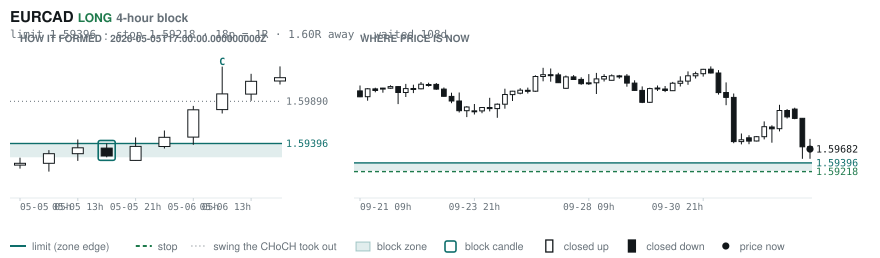
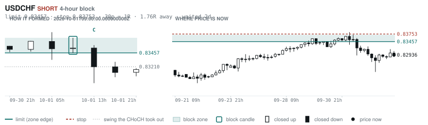
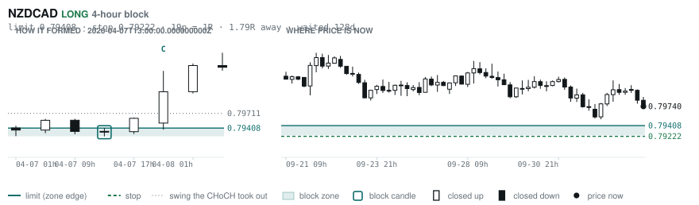
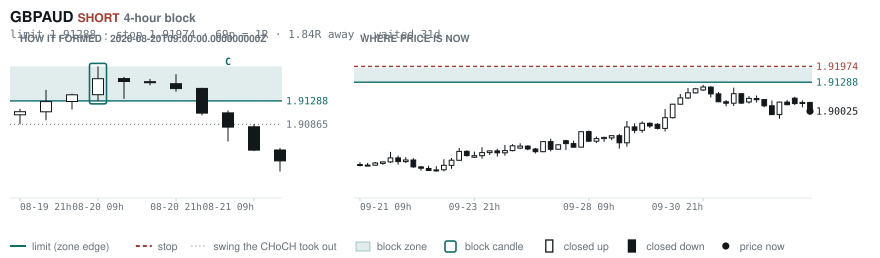
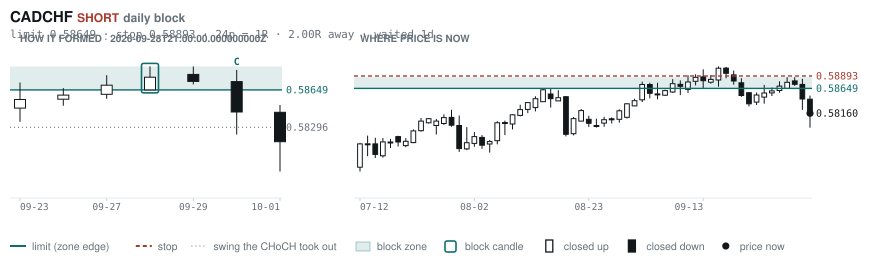

# Scanner Review — 2026-10-05 (daily)

Generated: 2026-10-05T11:03:35.287Z

```
## Account

NAV **$1157.25**   unrealised $96.33   margin available $0.00   5 open

| pair | units | now | P/L | stop | distance | news lean |
|---|---|---|---|---|---|---|
| GBPCHF | -3000 | 1.09746 | $-18.00 | **none** | — | — |
| GBPCHF | -5300 | 1.09746 | $59.69 | **none** | — | — |
| GBPCHF | -1000 | 1.09746 | $12.58 | **none** | — | — |
| EURNZD | -16500 | 2.00284 | $37.64 | 2.01713 | 143p | — |
| EURNZD | -1000 | 2.00284 | $4.43 | 2.01713 | 143p | — |

**What the system reads on each position**

- **GBPCHF** SHORT — last CONTINUATION SHORT 70h ago at 1.09938 — system stop 1.10724, target **1.07332** (Grade B); 241p to that target from here
- **EURNZD** SHORT — last CONTINUATION SHORT 14h ago at 2.00928 — system stop 2.02310, target **1.97672** (Grade C); 261p to that target from here

## Order blocks live right now

### Daily

| pair | dir | limit | stop | 1R | spread | away | fills | waited | reaches 1R / 2R |
|---|---|---|---|---|---|---|---|---|---|
| CADCHF | SHORT | **0.58649** | 0.58893 | 24p $2.95 | 9% | 2.0R | 71% | 1d | 68% / 39% |
| NZDCHF | LONG | **0.45968** | 0.45702 | 27p $3.21 | 13% | 2.1R | 71% | 60d | 75% / 53% |
| NZDCHF | LONG | **0.45428** | 0.44942 | 49p $5.87 | 7% | 2.3R | 71% | 214d | 75% / 53% |
| EURNZD | SHORT | **2.05054** | 2.06979 | 192p $10.81 | 3% | 2.4R | 71% | 220d | 75% / 53% |
| EURCHF | SHORT | **0.94486** | 0.94900 | 41p $4.99 | 6% | 3.0R | 71% | 0d | 68% / 39% |
| EURCHF | LONG | **0.91346** | 0.90937 | 41p $4.94 | 6% | 4.7R | 50% | 87d | 75% / 53% |
| EURGBP | SHORT | **0.85929** | 0.86117 | 19p $2.49 | 6% | 5.0R | 50% | 2d | 68% / 39% |
| AUDUSD | LONG | **0.65028** | 0.64297 | 73p $7.31 | 2% | 6.2R | 50% | 215d | 75% / 53% |
| GBPJPY | LONG | **196.536** | 194.882 | 165p $10.48 | 2% | 7.6R | 50% | 296d | 75% / 53% |
| USDCHF | LONG | **0.78472** | 0.77902 | 57p $6.87 | 3% | 7.7R | 50% | 87d | 75% / 53% |
| GBPCHF | LONG | **1.05438** | 1.04888 | 55p $6.64 | 7% | 7.8R | 50% | 88d | 75% / 53% |

_Age is a quality signal, not staleness: a daily block filling after 60 days reaches 2R 58% of the time against 34% for one filling the same day. "Fills" comes from distance — 94% under 0.5R, 12% past 8R, which is why nothing past 8R is listed._

### 4-hour

| pair | dir | limit | stop | 1R | spread | away | fills | waited | reaches 1R / 2R |
|---|---|---|---|---|---|---|---|---|---|
| EURCAD | LONG | **1.59396** | 1.59218 | 18p $1.25 | 19% | 1.6R | 79% | 108d | 78% / 51% |
| USDCHF | SHORT | **0.83457** | 0.83753 | 30p $3.57 | 5% | 1.8R | 79% | 2d | 77% / 47% |
| NZDCAD | LONG | **0.79408** | 0.79222 | 19p $1.30 | **24%** | 1.8R | 79% | 128d | 78% / 51% |
| GBPAUD | SHORT | **1.91288** | 1.91974 | 69p $4.78 | 7% | 1.8R | 79% | 31d | 78% / 51% |
| EURGBP | LONG | **0.83879** | 0.83526 | 35p $4.68 | 4% | 2.4R | 66% | 350d | 78% / 51% |
| CADCHF | SHORT | **0.58598** | 0.58742 | 14p $1.74 | 16% | 2.6R | 66% | 2d | 77% / 47% |
| AUDCAD | LONG | **0.98592** | 0.98382 | 21p $1.47 | 12% | 2.8R | 66% | 1d | 70% / 46% |
| NZDJPY | LONG | **87.686** | 87.453 | 23p $1.48 | 14% | 2.9R | 66% | 221d | 78% / 51% |
| EURAUD | SHORT | **1.62130** | 1.62491 | 36p $2.51 | 10% | 3.1R | 66% | 1d | 70% / 46% |
| CADJPY | LONG | **109.188** | 108.671 | 52p $3.27 | 7% | 3.2R | 66% | 234d | 78% / 51% |
| EURNZD | SHORT | **2.02676** | 2.03177 | 50p $2.81 | 13% | 4.8R | 51% | 128d | 78% / 51% |
| CADJPY | SHORT | **112.364** | 112.617 | 25p $1.60 | 15% | 6.1R | 51% | 6d | 77% / 47% |
| EURNZD | SHORT | **2.02030** | 2.02312 | 28p $1.58 | **22%** | 6.3R | 51% | 69d | 78% / 51% |
| EURCAD | LONG | **1.56944** | 1.56513 | 43p $3.03 | 8% | 6.3R | 51% | 145d | 78% / 51% |
| NZDCHF | LONG | **0.45693** | 0.45591 | 10p $1.23 | **34%** | 7.2R | 51% | 69d | 78% / 51% |
| EURNZD | LONG | **1.93742** | 1.92882 | 86p $4.83 | 7% | 7.6R | 51% | 304d | 78% / 51% |
| EURNZD | SHORT | **2.05666** | 2.06369 | 70p $3.95 | 9% | 7.7R | 51% | 221d | 78% / 51% |

_Same definition, roughly six times the frequency, split-validated clean (14 pairs fit +0.410R, 14 untouched +0.494R). **Read these net of cost:** an H4 stop is about a third of a daily one, so the same spread takes three times the share. Gross +0.452R against daily +0.413R, but net of one spread +0.231R against +0.303R. Real, and mostly rent._

### In reach, drawn

_6 blocks within 3R of the limit. Blocks further out are in the tables above but not worth a picture yet._

**EURCAD LONG** · 4-hour · 1.60R away · waited 108d



**USDCHF SHORT** · 4-hour · 1.76R away · waited 2d



**NZDCAD LONG** · 4-hour · 1.79R away · waited 128d



**GBPAUD SHORT** · 4-hour · 1.84R away · waited 31d



**CADCHF SHORT** · daily · 2.00R away · waited 1d



**NZDCHF LONG** · daily · 2.11R away · waited 60d


_Hollow candle closed up, filled closed down. Left panel is the block forming — the ringed candle is the block, **C** is the change of character. Right panel is where price sits now against the zone. Full legend is inside each image._

## Scanner calls, last 1 day

| when | pair | dir | branch | entry | stop | target | outcome |
|---|---|---|---|---|---|---|---|
| 10-04T21:00 | NZDJPY | SHORT | REV | 88.517 | 89.613 | 82.704 | open +0.13R |
| 10-04T21:00 | EURAUD | SHORT | REV | 1.61666 | 1.63426 | 1.59370 | open +0.37R |
| 10-04T21:00 | EURNZD | SHORT | REV | 2.00348 | 2.02310 | 1.97672 | open +0.05R |
| 10-04T21:00 | USDCHF | SHORT | REV | 0.82856 | 0.83728 | 0.81028 | open -0.09R |
| 10-05T01:00 | CADCHF | SHORT | REV | 0.58120 | 0.58635 | 0.57511 | open -0.21R |
| 10-05T01:00 | NZDUSD | SHORT | REV | 0.55902 | 0.56830 | 0.54188 | open -0.09R |
| 10-05T01:00 | NZDCHF | SHORT | REV | 0.46406 | 0.46883 | 0.45920 | open -0.05R |
| 10-05T01:00 | EURJPY | LONG | REV | 176.807 | 174.977 | 183.868 | open +0.09R |
| 10-05T01:00 | EURAUD | SHORT | WALL | 1.61192 | 1.61957 | 1.59370 | open +0.24R |
| 10-05T01:00 | CHFJPY | LONG | REV | 190.452 | 188.207 | 197.119 | open -0.06R |
| 10-05T05:00 | AUDCAD | LONG | REV | 0.99175 | 0.98429 | 1.00472 | open +0.00R |
| 10-05T05:00 | AUDUSD | LONG | REV | 0.69631 | 0.68744 | 0.72057 | open +0.00R |

## Running tally, last 30 days

11 resolved · 3 target / 8 stopped · **-2.8R** · -0.255R per call · 49 still open

```
