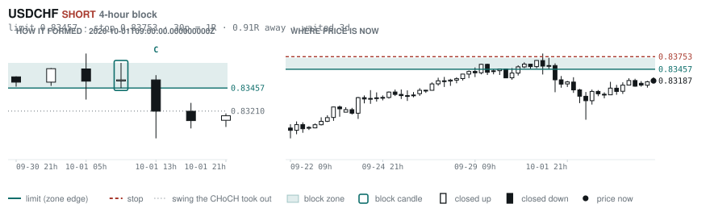
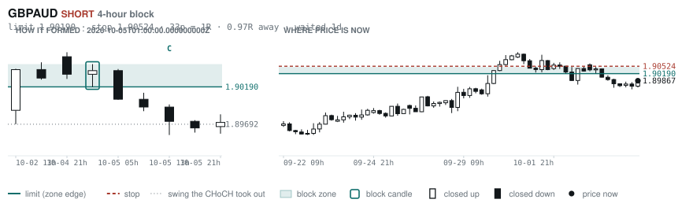
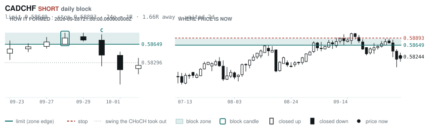
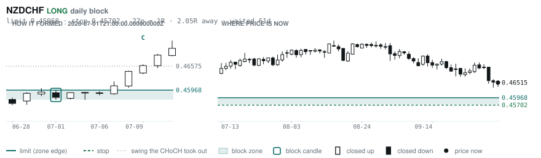
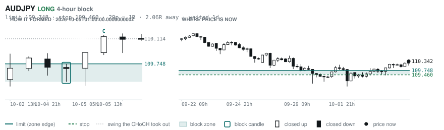
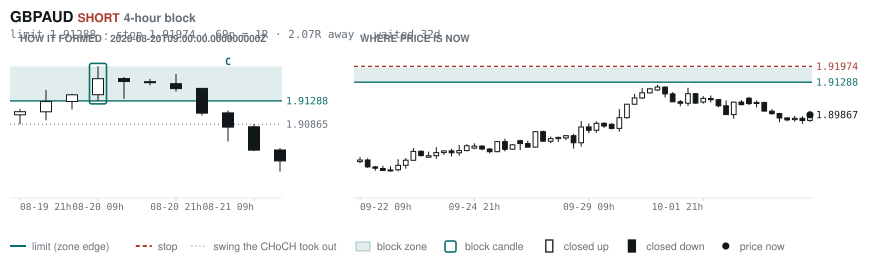

# Scanner Review — 2026-10-06 (daily)

Generated: 2026-10-06T11:03:36.840Z

```
## Account

NAV **$1076.03**   unrealised $17.29   margin available $0.00   5 open

| pair | units | now | P/L | stop | distance | news lean |
|---|---|---|---|---|---|---|
| GBPCHF | -3000 | 1.10139 | $-32.11 | **none** | — | 1 neutral |
| GBPCHF | -5300 | 1.10139 | $34.61 | **none** | — | 1 neutral |
| GBPCHF | -1000 | 1.10139 | $7.84 | **none** | — | 1 neutral |
| EURNZD | -16500 | 2.00640 | $4.53 | 2.01713 | 107p | — |
| EURNZD | -1000 | 2.00640 | $2.43 | 2.01713 | 107p | — |

**What the system reads on each position**

- **GBPCHF** SHORT — last CONTINUATION SHORT 26h ago at 1.09938 — system stop 1.10650, target **1.07332** (Grade B); 281p to that target from here
- **EURNZD** SHORT — last CONTINUATION SHORT 22h ago at 2.00928 — system stop 2.02354, target **1.97672** (Grade C); 297p to that target from here

## What is coming, and which way it leans

**GBPCHF SHORT**
- ⚪ 10-08T08:15 GBP — BOE Gov Bailey Speaks

_Lean is read from forecast vs previous — which way consensus leans, not what will print._

## Order blocks live right now

### Daily

| pair | dir | limit | stop | 1R | spread | away | fills | waited | reaches 1R / 2R |
|---|---|---|---|---|---|---|---|---|---|
| CADCHF | SHORT | **0.58649** | 0.58893 | 24p $2.94 | 9% | 1.7R | 81% | 2d | 68% / 39% |
| NZDCHF | LONG | **0.45968** | 0.45702 | 27p $3.20 | 14% | 2.1R | 71% | 61d | 75% / 53% |
| NZDCHF | LONG | **0.45428** | 0.44942 | 49p $5.85 | 8% | 2.2R | 71% | 215d | 75% / 53% |
| EURNZD | SHORT | **2.05054** | 2.06979 | 192p $10.78 | 3% | 2.4R | 71% | 221d | 75% / 53% |
| EURCHF | SHORT | **0.94486** | 0.94900 | 41p $4.98 | 6% | 3.1R | 71% | 1d | 68% / 39% |
| EURCHF | LONG | **0.91346** | 0.90937 | 41p $4.93 | 6% | 4.6R | 50% | 88d | 75% / 53% |
| EURGBP | SHORT | **0.85929** | 0.86117 | 19p $2.49 | 7% | 5.6R | 50% | 3d | 68% / 39% |
| AUDUSD | LONG | **0.65028** | 0.64297 | 73p $7.31 | 2% | 6.4R | 50% | 216d | 75% / 53% |
| GBPJPY | LONG | **196.536** | 194.882 | 165p $10.48 | 2% | 7.4R | 50% | 297d | 75% / 53% |
| GBPCHF | LONG | **1.05438** | 1.04888 | 55p $6.62 | 7% | 8.0R | 50% | 89d | 75% / 53% |

_Age is a quality signal, not staleness: a daily block filling after 60 days reaches 2R 58% of the time against 34% for one filling the same day. "Fills" comes from distance — 94% under 0.5R, 12% past 8R, which is why nothing past 8R is listed._

### 4-hour

| pair | dir | limit | stop | 1R | spread | away | fills | waited | reaches 1R / 2R |
|---|---|---|---|---|---|---|---|---|---|
| USDCHF | SHORT | **0.83457** | 0.83753 | 30p $3.56 | 6% | 0.9R | 83% | 3d | 77% / 47% |
| GBPAUD | SHORT | **1.90190** | 1.90524 | 33p $2.33 | 14% | 1.0R | 83% | 1d | 70% / 46% |
| AUDJPY | LONG | **109.748** | 109.460 | 29p $1.82 | 8% | 2.1R | 66% | 1d | 70% / 46% |
| GBPAUD | SHORT | **1.91288** | 1.91974 | 69p $4.79 | 7% | 2.1R | 66% | 32d | 78% / 51% |
| CADCHF | SHORT | **0.58598** | 0.58742 | 14p $1.73 | 15% | 2.1R | 66% | 3d | 77% / 47% |
| EURAUD | SHORT | **1.62130** | 1.62491 | 36p $2.52 | 10% | 2.6R | 66% | 2d | 77% / 47% |
| EURGBP | LONG | **0.83879** | 0.83526 | 35p $4.67 | 4% | 2.9R | 66% | 351d | 78% / 51% |
| NZDCAD | LONG | **0.79408** | 0.79222 | 19p $1.30 | **24%** | 2.9R | 66% | 129d | 78% / 51% |
| CADJPY | LONG | **109.188** | 108.671 | 52p $3.27 | 7% | 3.2R | 66% | 235d | 78% / 51% |
| EURNZD | SHORT | **2.02676** | 2.03177 | 50p $2.80 | 13% | 4.0R | 51% | 129d | 78% / 51% |
| NZDJPY | LONG | **87.686** | 87.453 | 23p $1.48 | 15% | 4.1R | 51% | 222d | 78% / 51% |
| AUDCAD | LONG | **0.98592** | 0.98382 | 21p $1.47 | 11% | 4.4R | 51% | 2d | 77% / 47% |
| EURNZD | SHORT | **2.02030** | 2.02312 | 28p $1.58 | **24%** | 4.8R | 51% | 70d | 78% / 51% |
| EURCAD | LONG | **1.59396** | 1.59218 | 18p $1.25 | **20%** | 5.9R | 51% | 109d | 78% / 51% |
| CADJPY | SHORT | **112.364** | 112.617 | 25p $1.60 | 14% | 5.9R | 51% | 7d | 78% / 51% |
| EURNZD | SHORT | **2.05666** | 2.06369 | 70p $3.94 | 10% | 7.1R | 51% | 222d | 78% / 51% |
| GBPAUD | LONG | **1.86891** | 1.86511 | 38p $2.65 | 12% | 7.8R | 51% | 101d | 78% / 51% |

_Same definition, roughly six times the frequency, split-validated clean (14 pairs fit +0.410R, 14 untouched +0.494R). **Read these net of cost:** an H4 stop is about a third of a daily one, so the same spread takes three times the share. Gross +0.452R against daily +0.413R, but net of one spread +0.231R against +0.303R. Real, and mostly rent._

### In reach, drawn

_6 blocks within 3R of the limit. Blocks further out are in the tables above but not worth a picture yet._

**USDCHF SHORT** · 4-hour · 0.91R away · waited 3d



**GBPAUD SHORT** · 4-hour · 0.97R away · waited 1d



**CADCHF SHORT** · daily · 1.66R away · waited 2d



**NZDCHF LONG** · daily · 2.05R away · waited 61d



**AUDJPY LONG** · 4-hour · 2.06R away · waited 1d



**GBPAUD SHORT** · 4-hour · 2.07R away · waited 32d



_Hollow candle closed up, filled closed down. Left panel is the block forming — the ringed candle is the block, **C** is the change of character. Right panel is where price sits now against the zone. Full legend is inside each image._

## Scanner calls, last 1 day

| when | pair | dir | branch | entry | stop | target | outcome |
|---|---|---|---|---|---|---|---|
| 10-05T13:00 | EURCHF | LONG | REV | 0.93196 | 0.92462 | 0.96513 | open +0.45R |
| 10-05T13:00 | CADCHF | SHORT | REV | 0.58359 | 0.58800 | 0.57511 | open +0.14R |
| 10-05T13:00 | GBPAUD | LONG | REV | 1.89730 | 1.88233 | 1.91701 | open +0.09R |
| 10-05T13:00 | EURNZD | SHORT | REV | 2.00390 | 2.02490 | 1.97672 | open -0.13R |
| 10-05T13:00 | NZDCHF | SHORT | REV | 0.46506 | 0.46877 | 0.45920 | open -0.27R |
| 10-05T13:00 | AUDUSD | LONG | REV | 0.69644 | 0.68992 | 0.72057 | open +0.15R |
| 10-05T13:00 | USDCHF | LONG | WALL | 0.83192 | 0.82783 | 0.84757 | open -0.01R |
| 10-05T17:00 | AUDCAD | LONG | WALL | 0.99430 | 0.98946 | 1.00472 | open +0.19R |
| 10-05T17:00 | NZDCAD | LONG | REV | 0.79862 | 0.79056 | 0.81534 | open +0.11R |
| 10-05T17:00 | GBPJPY | SHORT | REV | 208.834 | 211.271 | 202.486 | open -0.27R |
| 10-05T17:00 | CADJPY | SHORT | REV | 110.746 | 111.746 | 107.746 | open -0.12R |
| 10-05T17:00 | AUDCHF | SHORT | REV | 0.57914 | 0.58354 | 0.56996 | open -0.24R |
| 10-05T21:00 | NZDJPY | SHORT | REV | 88.404 | 89.555 | 82.704 | open -0.21R |
| 10-05T21:00 | USDJPY | SHORT | REV | 157.812 | 159.362 | 153.713 | open -0.25R |
| 10-05T21:00 | AUDJPY | SHORT | REV | 109.996 | 111.127 | 104.378 | open -0.31R |
| 10-05T21:00 | NZDUSD | SHORT | REV | 0.56020 | 0.56732 | 0.54188 | open -0.01R |
| 10-05T21:00 | EURAUD | SHORT | REV | 1.61015 | 1.62105 | 1.59370 | open -0.17R |
| 10-05T17:00 | USDCHF | SHORT | REV | 0.83058 | 0.84021 | 0.81028 | open -0.13R |
| 10-06T05:00 | EURCHF | SHORT | REV | 0.93526 | 0.94215 | 0.92672 | open +0.00R |
| 10-06T05:00 | GBPAUD | LONG | REV | 1.89867 | 1.88307 | 1.91701 | open +0.00R |
| 10-06T05:00 | EURNZD | LONG | REV | 2.00666 | 1.98893 | 2.03619 | open +0.00R |
| 10-06T05:00 | AUDUSD | LONG | REV | 0.69744 | 0.69037 | 0.72057 | open +0.00R |
| 10-06T05:00 | AUDCHF | LONG | WALL | 0.58018 | 0.57834 | 0.59203 | open +0.00R |

## Running tally, last 30 days

7 resolved · 1 target / 6 stopped · **-4.7R** · -0.671R per call · 53 still open

```
