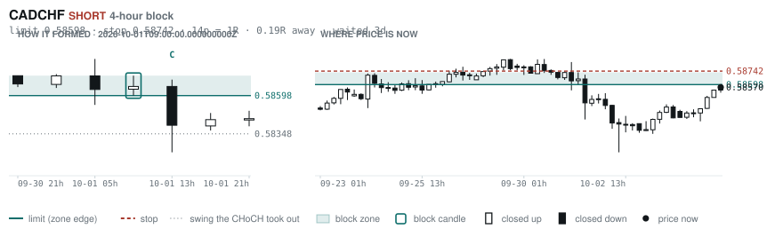
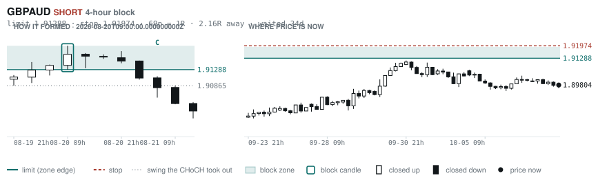

# Scanner Review — 2026-10-07 (evening)

Generated: 2026-10-07T02:31:40.463Z

```
## The clock

It is **21:00 Chicago** — a **DEAD** hour at 0.84x an average one, inside the Tokyo window.
An order placed now rests through **Tokyo, London and tomorrow's NY overlap** — about 16h of cover.
Next window: **London open** in 4h.

_Evening pass. Orders placed now get the longest cover of the day: Tokyo, London, and tomorrow's NY overlap. Place limits and stops here — whatever does not fill overnight is still live for the morning._

## Where the energy is

**Running hot:** EURCHF 1.31 · EURUSD 1.29 · EURCAD 1.26 · EURGBP 1.16
**Quiet:** CHFJPY 0.90 · USDJPY 0.89 · NZDJPY 0.88 · CADJPY 0.88 · GBPNZD 0.86

_ATR(14) over ATR(100). Above 1.15 is unusually active, and volatility persists — a pair already running covers 6.31 ATR over the next 20 bars against 3.67 for a quiet one. Good for about two days. It says nothing about direction: after a big bar price continued 47.7% of the time and reversed 52.3%. This picks the pair; the levels pick the side._

## Account

NAV **$1090.79**   unrealised $0.00   margin available $1090.79   0 open

_No open positions._

## Order blocks live right now

### Daily

| pair | dir | limit | stop | 1R | spread | away | fills | waited | window | reaches 1R / 2R |
|---|---|---|---|---|---|---|---|---|---|---|
| CADCHF | SHORT | **0.58649** | 0.58893 | 24p $2.94 | 10% | 0.4R | 94% | 3d | 0.83x ⚠ | 68% / 39% |
| EURCHF | SHORT | **0.94486** | 0.94900 | 41p $4.97 | 6% | 2.0R | 71% | 2d | 0.90x ⚠ | 68% / 39% |
| EURNZD | SHORT | **2.05054** | 2.06979 | 192p $10.83 | 4% | 2.5R | 71% | 222d | 1.06x | 75% / 53% |
| NZDCHF | LONG | **0.45428** | 0.44942 | 49p $5.85 | 8% | 2.8R | 71% | 216d | 1.03x | 75% / 53% |
| NZDCHF | LONG | **0.45968** | 0.45702 | 27p $3.20 | 14% | 3.0R | 71% | 62d | 1.03x | 75% / 53% |
| EURCHF | LONG | **0.91346** | 0.90937 | 41p $4.92 | 6% | 5.6R | 50% | 89d | 0.90x ⚠ | 75% / 53% |
| EURGBP | SHORT | **0.85929** | 0.86117 | 19p $2.50 | 7% | 5.9R | 50% | 4d | 0.85x ⚠ | 68% / 39% |
| AUDUSD | LONG | **0.65028** | 0.64297 | 73p $7.31 | 2% | 6.6R | 50% | 217d | 1.00x | 75% / 53% |

_Age is a quality signal, not staleness: a daily block filling after 60 days reaches 2R 58% of the time against 34% for one filling the same day. "Fills" comes from distance — 94% under 0.5R, 12% past 8R, which is why nothing past 8R is listed._

### 4-hour

| pair | dir | limit | stop | 1R | spread | away | fills | waited | window | reaches 1R / 2R |
|---|---|---|---|---|---|---|---|---|---|---|
| CADCHF | SHORT | **0.58598** | 0.58742 | 14p $1.73 | 17% | 0.2R | 87% | 3d | 0.83x ⚠ | 77% / 47% |
| USDCHF | SHORT | **0.83457** | 0.83753 | 30p $3.56 | 5% | 0.7R | 83% | 3d | 0.89x ⚠ | 77% / 47% |
| GBPAUD | SHORT | **1.91288** | 1.91974 | 69p $4.79 | 7% | 1.8R | 79% | 33d | 1.04x | 78% / 51% |
| NZDCAD | LONG | **0.79408** | 0.79222 | 19p $1.31 | **26%** | 2.4R | 66% | 130d | 0.99x ⚠ | 78% / 51% |
| CADCHF | LONG | **0.58335** | 0.58243 | 9p $1.11 | **27%** | 2.5R | 66% | 0d | 0.83x ⚠ | 70% / 46% |
| EURAUD | SHORT | **1.62130** | 1.62491 | 36p $2.52 | 11% | 2.6R | 66% | 3d | 1.08x | 77% / 47% |
| EURGBP | LONG | **0.83879** | 0.83526 | 35p $4.69 | 4% | 2.7R | 66% | 352d | 0.85x ⚠ | 78% / 51% |
| EURCAD | LONG | **1.59396** | 1.59218 | 18p $1.25 | **21%** | 2.7R | 66% | 110d | 0.80x ⚠ | 78% / 51% |
| AUDJPY | LONG | **109.748** | 109.460 | 29p $1.82 | 8% | 2.8R | 66% | 2d | 1.10x | 77% / 47% |
| AUDCAD | LONG | **0.98592** | 0.98382 | 21p $1.48 | 13% | 2.9R | 66% | 3d | 1.00x | 77% / 47% |
| CADJPY | SHORT | **112.364** | 112.617 | 25p $1.60 | 15% | 3.6R | 66% | 8d | 0.99x ⚠ | 78% / 51% |
| CADJPY | LONG | **109.188** | 108.671 | 52p $3.27 | 7% | 4.4R | 51% | 235d | 0.99x ⚠ | 78% / 51% |
| EURNZD | SHORT | **2.02676** | 2.03177 | 50p $2.81 | 15% | 4.9R | 51% | 130d | 1.06x | 78% / 51% |
| NZDJPY | LONG | **87.686** | 87.453 | 23p $1.47 | 17% | 5.6R | 51% | 223d | 1.09x | 78% / 51% |
| EURNZD | SHORT | **2.02030** | 2.02312 | 28p $1.58 | **27%** | 6.4R | 51% | 71d | 1.06x | 78% / 51% |
| EURCAD | LONG | **1.56944** | 1.56513 | 43p $3.03 | 9% | 6.8R | 51% | 146d | 0.80x ⚠ | 78% / 51% |
| NZDCHF | SHORT | **0.47538** | 0.47647 | 11p $1.31 | **36%** | 7.1R | 51% | 21d | 1.03x | 78% / 51% |
| EURNZD | LONG | **1.93742** | 1.92882 | 86p $4.84 | 9% | 7.6R | 51% | 306d | 1.06x | 78% / 51% |
| EURNZD | SHORT | **2.05666** | 2.06369 | 70p $3.95 | 11% | 7.7R | 51% | 223d | 1.06x | 78% / 51% |

_Same definition, roughly six times the frequency, split-validated clean (14 pairs fit +0.410R, 14 untouched +0.494R). **Read these net of cost:** an H4 stop is about a third of a daily one, so the same spread takes three times the share. Gross +0.452R against daily +0.413R, but net of one spread +0.231R against +0.303R. Real, and mostly rent._

### In reach, drawn

_6 blocks within 3R of the limit. Blocks further out are in the tables above but not worth a picture yet._

**CADCHF SHORT** · 4-hour · 0.19R away · waited 3d



**CADCHF SHORT** · daily · 0.45R away · waited 3d


**USDCHF SHORT** · 4-hour · 0.70R away · waited 3d


**GBPAUD SHORT** · 4-hour · 1.83R away · waited 33d



**EURCHF SHORT** · daily · 2.02R away · waited 2d


**NZDCAD LONG** · 4-hour · 2.37R away · waited 130d


_Hollow candle closed up, filled closed down. Left panel is the block forming — the ringed candle is the block, **C** is the change of character. Right panel is where price sits now against the zone. Full legend is inside each image._

## Scanner calls, last 1 day

| when | pair | dir | branch | entry | stop | target | outcome |
|---|---|---|---|---|---|---|---|
| 10-06T05:00 | EURCHF | SHORT | REV | 0.93526 | 0.94215 | 0.92672 | open -0.17R |
| 10-06T05:00 | GBPAUD | LONG | REV | 1.89867 | 1.88307 | 1.91701 | open +0.10R |
| 10-06T05:00 | EURNZD | LONG | REV | 2.00666 | 1.98893 | 2.03619 | open -0.24R |
| 10-06T05:00 | AUDUSD | LONG | REV | 0.69744 | 0.69037 | 0.72057 | open +0.07R |
| 10-06T05:00 | AUDCHF | LONG | WALL | 0.58018 | 0.57834 | 0.59203 | open +0.46R |
| 10-06T09:00 | CADCHF | LONG | REV | 0.58341 | 0.57890 | 0.59446 | open +0.51R |
| 10-06T09:00 | GBPJPY | SHORT | REV | 209.864 | 211.694 | 202.486 | open -0.13R |
| 10-06T09:00 | GBPCHF | LONG | REV | 1.10278 | 1.09275 | 1.12378 | open +0.13R |
| 10-06T09:00 | AUDJPY | SHORT | REV | 110.392 | 111.585 | 104.378 | open -0.15R |
| 10-06T09:00 | EURAUD | SHORT | REV | 1.61258 | 1.62327 | 1.59370 | open +0.08R |
| 10-06T09:00 | USDCHF | SHORT | REV | 0.83084 | 0.83973 | 0.81028 | open -0.19R |
| 10-06T09:00 | CADJPY | LONG | REV | 111.025 | 110.066 | 114.634 | open +0.45R |
| 10-06T09:00 | USDCAD | SHORT | REV | 1.42416 | 1.43286 | 1.35795 | open +0.31R |
| 10-06T13:00 | USDJPY | LONG | REV | 158.159 | 156.380 | 165.186 | open +0.15R |
| 10-06T13:00 | GBPCAD | SHORT | REV | 1.88745 | 1.89943 | 1.85129 | open +0.19R |
| 10-06T17:00 | GBPUSD | SHORT | REV | 1.32752 | 1.33766 | 1.30505 | open +0.13R |
| 10-06T21:00 | CADCHF | SHORT | REV | 0.58570 | 0.59020 | 0.57511 | open +0.00R |
| 10-06T21:00 | NZDCAD | SHORT | REV | 0.79848 | 0.80569 | 0.79015 | open +0.00R |
| 10-06T21:00 | NZDJPY | SHORT | REV | 88.996 | 89.797 | 85.690 | open +0.00R |
| 10-06T21:00 | EURAUD | SHORT | REV | 1.61174 | 1.62261 | 1.59370 | open +0.00R |
| 10-06T21:00 | GBPAUD | SHORT | REV | 1.90030 | 1.91343 | 1.85168 | open +0.00R |

## Running tally, last 30 days

3 resolved · 1 target / 2 stopped · **-0.6R** · -0.184R per call · 57 still open

```
