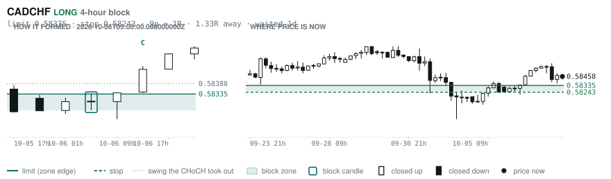

# Scanner Review — 2026-10-07 (evening)

Generated: 2026-10-07T23:03:38.303Z

```
## The clock

It is **18:00 Chicago** — a **DEAD** hour at 0.65x an average one.
An order placed now rests through **Tokyo, London and tomorrow's NY overlap** — about 16h of cover.
Next window: **Tokyo** in 1h.

_Evening pass. Orders placed now get the longest cover of the day: Tokyo, London, and tomorrow's NY overlap. Place limits and stops here — whatever does not fill overnight is still live for the morning._

## Where the energy is

**Running hot:** EURCHF 1.38 · EURUSD 1.30 · EURCAD 1.29 · USDCAD 1.17 · GBPCHF 1.17 · EURGBP 1.17
**Quiet:** NZDJPY 0.88 · AUDNZD 0.87 · NZDCAD 0.86 · USDJPY 0.85 · GBPNZD 0.83

_ATR(14) over ATR(100). Above 1.15 is unusually active, and volatility persists — a pair already running covers 6.31 ATR over the next 20 bars against 3.67 for a quiet one. Good for about two days. It says nothing about direction: after a big bar price continued 47.7% of the time and reversed 52.3%. This picks the pair; the levels pick the side._

## Account

NAV **$1058.07**   unrealised $0.00   margin available $1058.07   0 open

_No open positions._

## Order blocks live right now

### Daily

| pair | dir | limit | stop | 1R | spread | away | fills | waited | window | reaches 1R / 2R |
|---|---|---|---|---|---|---|---|---|---|---|
| CADCHF | SHORT | **0.58649** | 0.58893 | 24p $2.93 | 13% | 0.8R | 87% | 4d | 0.83x ⚠ | 68% / 39% |
| NZDCHF | LONG | **0.45428** | 0.44942 | 49p $5.83 | 9% | 2.5R | 71% | 217d | 1.03x | 75% / 53% |
| NZDCHF | LONG | **0.45968** | 0.45702 | 27p $3.19 | 16% | 2.6R | 71% | 63d | 1.03x | 75% / 53% |
| EURNZD | SHORT | **2.05054** | 2.06979 | 192p $10.78 | 5% | 2.6R | 71% | 223d | 1.06x | 75% / 53% |
| EURCHF | SHORT | **0.94486** | 0.94900 | 41p $4.96 | 6% | 2.8R | 71% | 3d | 0.90x ⚠ | 68% / 39% |
| EURCHF | LONG | **0.91346** | 0.90937 | 41p $4.91 | 6% | 4.8R | 50% | 90d | 0.90x ⚠ | 75% / 53% |
| AUDUSD | LONG | **0.65028** | 0.64297 | 73p $7.31 | 2% | 6.3R | 50% | 218d | 1.00x | 75% / 53% |
| EURGBP | SHORT | **0.85929** | 0.86117 | 19p $2.49 | 7% | 6.4R | 50% | 5d | 0.85x ⚠ | 68% / 39% |
| GBPJPY | LONG | **196.536** | 194.882 | 165p $10.46 | 2% | 7.5R | 50% | 299d | 1.03x | 75% / 53% |

_Age is a quality signal, not staleness: a daily block filling after 60 days reaches 2R 58% of the time against 34% for one filling the same day. "Fills" comes from distance — 94% under 0.5R, 12% past 8R, which is why nothing past 8R is listed._

### 4-hour

| pair | dir | limit | stop | 1R | spread | away | fills | waited | window | reaches 1R / 2R |
|---|---|---|---|---|---|---|---|---|---|---|
| USDCHF | SHORT | **0.83457** | 0.83753 | 30p $3.55 | 6% | 0.4R | 87% | 4d | 0.89x ⚠ | 77% / 47% |
| AUDJPY | LONG | **109.748** | 109.460 | 29p $1.82 | 8% | 1.1R | 79% | 2d | 1.10x | 77% / 47% |
| CADCHF | LONG | **0.58335** | 0.58243 | 9p $1.11 | **34%** | 1.3R | 79% | 1d | 0.83x ⚠ | 70% / 46% |
| GBPAUD | SHORT | **1.91288** | 1.91974 | 69p $4.78 | 8% | 2.2R | 66% | 34d | 1.04x | 78% / 51% |
| NZDCAD | LONG | **0.79408** | 0.79222 | 19p $1.30 | **29%** | 2.2R | 66% | 131d | 0.99x ⚠ | 78% / 51% |
| EURGBP | LONG | **0.83879** | 0.83526 | 35p $4.67 | 4% | 2.4R | 66% | 352d | 0.85x ⚠ | 78% / 51% |
| AUDCAD | LONG | **0.98592** | 0.98382 | 21p $1.47 | 16% | 3.1R | 66% | 3d | 1.00x | 77% / 47% |
| CADJPY | LONG | **109.188** | 108.671 | 52p $3.27 | 9% | 3.3R | 66% | 236d | 0.99x ⚠ | 78% / 51% |
| NZDJPY | LONG | **87.686** | 87.453 | 23p $1.48 | 18% | 3.4R | 66% | 224d | 1.09x | 78% / 51% |
| EURAUD | SHORT | **1.62130** | 1.62491 | 36p $2.51 | 9% | 3.6R | 66% | 3d | 1.08x | 77% / 47% |
| EURNZD | SHORT | **2.02676** | 2.03177 | 50p $2.80 | 19% | 5.4R | 51% | 131d | 1.06x | 78% / 51% |
| CADJPY | SHORT | **112.364** | 112.617 | 25p $1.60 | 18% | 5.8R | 51% | 8d | 0.99x ⚠ | 78% / 51% |
| EURCAD | LONG | **1.56944** | 1.56513 | 43p $3.02 | 9% | 6.2R | 51% | 147d | 0.80x ⚠ | 78% / 51% |
| EURNZD | LONG | **1.93742** | 1.92882 | 86p $4.82 | 11% | 7.2R | 51% | 307d | 1.06x | 78% / 51% |
| EURNZD | SHORT | **2.02030** | 2.02312 | 28p $1.58 | **34%** | 7.3R | 51% | 72d | 1.06x | 78% / 51% |
| GBPAUD | LONG | **1.86891** | 1.86511 | 38p $2.64 | 15% | 7.7R | 51% | 102d | 1.04x | 78% / 51% |

_Same definition, roughly six times the frequency, split-validated clean (14 pairs fit +0.410R, 14 untouched +0.494R). **Read these net of cost:** an H4 stop is about a third of a daily one, so the same spread takes three times the share. Gross +0.452R against daily +0.413R, but net of one spread +0.231R against +0.303R. Real, and mostly rent._

### In reach, drawn

_6 blocks within 3R of the limit. Blocks further out are in the tables above but not worth a picture yet._

**USDCHF SHORT** · 4-hour · 0.40R away · waited 4d


**CADCHF SHORT** · daily · 0.78R away · waited 4d


**AUDJPY LONG** · 4-hour · 1.07R away · waited 2d


**CADCHF LONG** · 4-hour · 1.33R away · waited 1d



**GBPAUD SHORT** · 4-hour · 2.16R away · waited 34d


**NZDCAD LONG** · 4-hour · 2.21R away · waited 131d


_Hollow candle closed up, filled closed down. Left panel is the block forming — the ringed candle is the block, **C** is the change of character. Right panel is where price sits now against the zone. Full legend is inside each image._

## Scanner calls, last 1 day

| when | pair | dir | branch | entry | stop | target | outcome |
|---|---|---|---|---|---|---|---|
| 10-07T01:00 | EURCHF | SHORT | REV | 0.93626 | 0.94241 | 0.92672 | open +0.52R |
| 10-07T01:00 | NZDUSD | SHORT | REV | 0.56057 | 0.56760 | 0.54188 | open +0.09R |
| 10-07T01:00 | GBPJPY | SHORT | REV | 209.902 | 211.574 | 202.486 | open +0.60R |
| 10-07T01:00 | USDJPY | LONG | REV | 158.426 | 157.125 | 160.539 | open -0.26R |
| 10-07T01:00 | AUDNZD | LONG | REV | 1.24330 | 1.23465 | 1.29274 | open +0.00R |
| 10-07T01:00 | AUDUSD | SHORT | REV | 0.69696 | 0.70299 | 0.66676 | open +0.13R |
| 10-07T01:00 | CHFJPY | SHORT | REV | 190.076 | 191.516 | 182.720 | open +0.28R |
| 10-07T01:00 | GBPAUD | LONG | REV | 1.90098 | 1.88989 | 1.94986 | open -0.27R |
| 10-07T05:00 | USDJPY | LONG | REV | 158.181 | 156.427 | 160.539 | open -0.05R |
| 10-07T05:00 | AUDCAD | LONG | REV | 0.99164 | 0.98534 | 1.00472 | open +0.14R |
| 10-07T05:00 | GBPCHF | SHORT | REV | 1.10318 | 1.11082 | 1.07332 | open +0.25R |
| 10-07T05:00 | CADJPY | LONG | REV | 111.233 | 110.261 | 114.634 | open -0.36R |
| 10-07T05:00 | EURJPY | LONG | REV | 177.130 | 175.052 | 183.868 | open -0.06R |
| 10-07T05:00 | CHFJPY | SHORT | REV | 189.852 | 191.687 | 182.720 | open +0.10R |
| 10-07T05:00 | AUDCHF | LONG | REV | 0.58099 | 0.57637 | 0.59203 | open -0.17R |
| 10-07T09:00 | GBPUSD | SHORT | WALL | 1.32030 | 1.33103 | 1.30505 | open -0.10R |
| 10-07T09:00 | EURNZD | LONG | REV | 1.99936 | 1.98373 | 2.03913 | open +0.02R |
| 10-07T09:00 | CADCHF | SHORT | REV | 0.58417 | 0.59026 | 0.57511 | open -0.07R |
| 10-07T09:00 | EURCAD | LONG | REV | 1.59452 | 1.58208 | 1.62445 | open +0.14R |
| 10-07T09:00 | AUDJPY | SHORT | WALL | 109.956 | 110.600 | 104.786 | open -0.15R |
| 10-07T09:00 | NZDCHF | LONG | REV | 0.46586 | 0.46239 | 0.47758 | open +0.19R |
| 10-07T09:00 | EURGBP | LONG | REV | 0.84630 | 0.84287 | 0.86717 | open +0.30R |
| 10-07T13:00 | NZDCHF | LONG | REV | 0.46656 | 0.46273 | 0.47758 | open -0.01R |
| 10-07T13:00 | EURGBP | LONG | REV | 0.84717 | 0.84225 | 0.86717 | open +0.03R |
| 10-07T13:00 | GBPCAD | SHORT | REV | 1.88343 | 1.89439 | 1.85129 | open -0.04R |
| 10-07T13:00 | USDCAD | SHORT | REV | 1.42560 | 1.43485 | 1.35795 | open -0.02R |
| 10-07T13:00 | AUDNZD | LONG | REV | 1.24376 | 1.23484 | 1.29274 | open -0.05R |
| 10-07T17:00 | NZDJPY | LONG | REV | 88.489 | 87.493 | 92.130 | open +0.00R |
| 10-07T17:00 | CADJPY | LONG | REV | 110.884 | 109.815 | 114.634 | open +0.00R |
| 10-07T17:00 | CHFJPY | LONG | REV | 189.677 | 188.034 | 194.306 | open +0.00R |
| 10-07T17:00 | NZDCAD | LONG | REV | 0.79819 | 0.79263 | 0.81534 | open +0.00R |
| 10-07T17:00 | GBPAUD | LONG | REV | 1.89804 | 1.88794 | 1.94986 | open +0.00R |
| 10-07T17:00 | EURCAD | LONG | REV | 1.59622 | 1.58378 | 1.62445 | open +0.00R |

## Running tally, last 30 days

2 resolved · 0 target / 2 stopped · **-2.0R** · -1.000R per call · 58 still open

```
