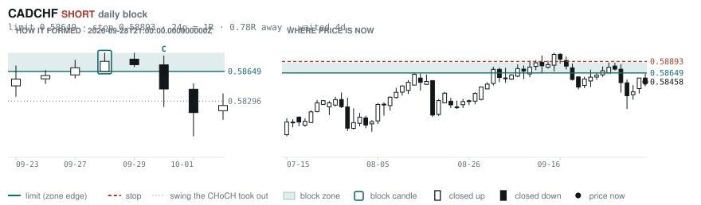
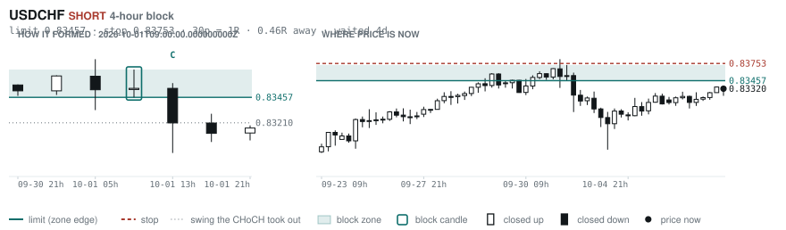
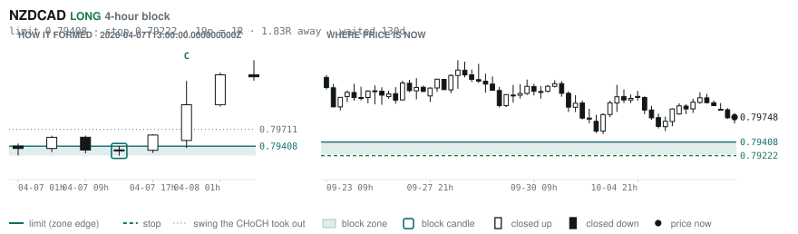
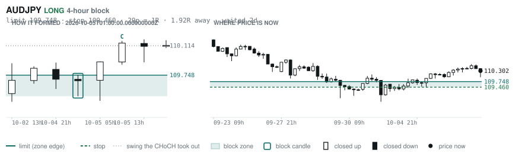
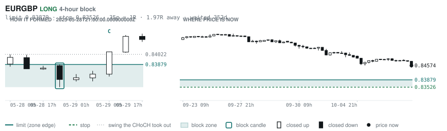
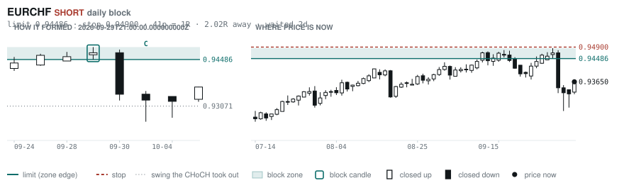

# Scanner Review — 2026-10-07 (morning)

Generated: 2026-10-07T11:03:41.649Z

```
## The clock

It is **06:00 Chicago** — a **normal** hour at 1.10x an average one.
An order placed now rests through **the NY overlap** — about 5h of cover.
Next window: **NY overlap** in 1h.

_Morning pass. The NY overlap is the single best window of the day but it is the only one left before the afternoon goes dead, so this is the adjustment pass: the morning-skewed pairs, and anything that filled overnight._

## Where the energy is

**Running hot:** EURCHF 1.36 · EURUSD 1.34 · EURCAD 1.33 · EURGBP 1.25 · EURJPY 1.18 · EURAUD 1.15
**Quiet:** AUDCAD 0.89 · USDJPY 0.89 · NZDCAD 0.88 · GBPNZD 0.86

_ATR(14) over ATR(100). Above 1.15 is unusually active, and volatility persists — a pair already running covers 6.31 ATR over the next 20 bars against 3.67 for a quiet one. Good for about two days. It says nothing about direction: after a big bar price continued 47.7% of the time and reversed 52.3%. This picks the pair; the levels pick the side._

## Account

NAV **$1058.07**   unrealised $0.00   margin available $1058.07   0 open

_No open positions._

## Order blocks live right now

### Daily

| pair | dir | limit | stop | 1R | spread | away | fills | waited | window | reaches 1R / 2R |
|---|---|---|---|---|---|---|---|---|---|---|
| CADCHF | SHORT | **0.58649** | 0.58893 | 24p $2.94 | 9% | 0.4R | 94% | 3d | 1.56x | 68% / 39% |
| EURCHF | SHORT | **0.94486** | 0.94900 | 41p $4.97 | 5% | 2.0R | 71% | 2d | 1.53x | 68% / 39% |
| EURNZD | SHORT | **2.05054** | 2.06979 | 192p $10.83 | 3% | 2.5R | 71% | 222d | 1.27x | 75% / 53% |
| NZDCHF | LONG | **0.45428** | 0.44942 | 49p $5.85 | 7% | 2.8R | 71% | 216d | 1.27x | 75% / 53% |
| NZDCHF | LONG | **0.45968** | 0.45702 | 27p $3.20 | 14% | 3.0R | 71% | 62d | 1.27x | 75% / 53% |
| EURCHF | LONG | **0.91346** | 0.90937 | 41p $4.92 | 5% | 5.6R | 50% | 89d | 1.53x | 75% / 53% |
| EURGBP | SHORT | **0.85929** | 0.86117 | 19p $2.50 | 7% | 5.9R | 50% | 4d | 1.50x | 68% / 39% |
| AUDUSD | LONG | **0.65028** | 0.64297 | 73p $7.31 | 2% | 6.6R | 50% | 217d | 1.44x | 75% / 53% |

_Age is a quality signal, not staleness: a daily block filling after 60 days reaches 2R 58% of the time against 34% for one filling the same day. "Fills" comes from distance — 94% under 0.5R, 12% past 8R, which is why nothing past 8R is listed._

### 4-hour

| pair | dir | limit | stop | 1R | spread | away | fills | waited | window | reaches 1R / 2R |
|---|---|---|---|---|---|---|---|---|---|---|
| USDCHF | SHORT | **0.83457** | 0.83753 | 30p $3.56 | 5% | 0.5R | 87% | 4d | 1.54x | 77% / 47% |
| NZDCAD | LONG | **0.79408** | 0.79222 | 19p $1.31 | **23%** | 1.8R | 79% | 130d | 1.33x | 78% / 51% |
| AUDJPY | LONG | **109.748** | 109.460 | 29p $1.82 | 8% | 1.9R | 79% | 2d | 1.32x | 77% / 47% |
| EURGBP | LONG | **0.83879** | 0.83526 | 35p $4.69 | 4% | 2.0R | 79% | 352d | 1.50x | 78% / 51% |
| GBPAUD | SHORT | **1.91288** | 1.91974 | 69p $4.79 | 8% | 2.1R | 66% | 33d | 1.34x | 78% / 51% |
| AUDCAD | LONG | **0.98592** | 0.98382 | 21p $1.48 | 12% | 2.7R | 66% | 3d | 1.42x | 77% / 47% |
| CADCHF | LONG | **0.58335** | 0.58243 | 9p $1.11 | **26%** | 2.8R | 66% | 1d | 1.56x | 70% / 46% |
| CADJPY | LONG | **109.188** | 108.671 | 52p $3.27 | 7% | 4.0R | 66% | 236d | 1.44x | 78% / 51% |
| EURAUD | SHORT | **1.62130** | 1.62491 | 36p $2.52 | 10% | 4.3R | 51% | 3d | 1.34x | 77% / 47% |
| NZDJPY | LONG | **87.686** | 87.453 | 23p $1.47 | 14% | 4.4R | 51% | 223d | 1.28x | 78% / 51% |
| CADJPY | SHORT | **112.364** | 112.617 | 25p $1.60 | 15% | 4.5R | 51% | 8d | 1.44x | 78% / 51% |
| EURCAD | LONG | **1.56944** | 1.56513 | 43p $3.03 | 7% | 5.3R | 51% | 147d | 1.59x | 78% / 51% |
| EURNZD | SHORT | **2.02676** | 2.03177 | 50p $2.81 | 13% | 6.0R | 51% | 130d | 1.27x | 78% / 51% |
| EURNZD | LONG | **1.93742** | 1.92882 | 86p $4.84 | 8% | 6.9R | 51% | 306d | 1.27x | 78% / 51% |
| NZDCHF | SHORT | **0.47538** | 0.47647 | 11p $1.31 | **33%** | 7.5R | 51% | 21d | 1.27x | 78% / 51% |
| GBPAUD | LONG | **1.86891** | 1.86511 | 38p $2.65 | 14% | 7.9R | 51% | 102d | 1.34x | 78% / 51% |

_Same definition, roughly six times the frequency, split-validated clean (14 pairs fit +0.410R, 14 untouched +0.494R). **Read these net of cost:** an H4 stop is about a third of a daily one, so the same spread takes three times the share. Gross +0.452R against daily +0.413R, but net of one spread +0.231R against +0.303R. Real, and mostly rent._

### In reach, drawn

_6 blocks within 3R of the limit. Blocks further out are in the tables above but not worth a picture yet._

**CADCHF SHORT** · daily · 0.45R away · waited 3d



**USDCHF SHORT** · 4-hour · 0.46R away · waited 4d



**NZDCAD LONG** · 4-hour · 1.83R away · waited 130d



**AUDJPY LONG** · 4-hour · 1.92R away · waited 2d



**EURGBP LONG** · 4-hour · 1.97R away · waited 352d



**EURCHF SHORT** · daily · 2.02R away · waited 2d



_Hollow candle closed up, filled closed down. Left panel is the block forming — the ringed candle is the block, **C** is the change of character. Right panel is where price sits now against the zone. Full legend is inside each image._

## Scanner calls, last 1 day

| when | pair | dir | branch | entry | stop | target | outcome |
|---|---|---|---|---|---|---|---|
| 10-06T13:00 | USDJPY | LONG | REV | 158.159 | 156.380 | 165.186 | open +0.01R |
| 10-06T13:00 | GBPCAD | SHORT | REV | 1.88745 | 1.89943 | 1.85129 | open +0.38R |
| 10-06T17:00 | GBPUSD | SHORT | REV | 1.32752 | 1.33766 | 1.30505 | open +0.34R |
| 10-06T21:00 | CADCHF | SHORT | REV | 0.58570 | 0.59020 | 0.57511 | open -0.04R |
| 10-06T21:00 | NZDCAD | SHORT | REV | 0.79848 | 0.80569 | 0.79015 | open +0.14R |
| 10-06T21:00 | NZDJPY | SHORT | REV | 88.996 | 89.797 | 85.690 | open +0.36R |
| 10-06T21:00 | EURAUD | SHORT | REV | 1.61174 | 1.62261 | 1.59370 | open +0.54R |
| 10-06T21:00 | GBPAUD | SHORT | REV | 1.90030 | 1.91343 | 1.85168 | open +0.11R |
| 10-07T01:00 | EURCHF | SHORT | REV | 0.93626 | 0.94241 | 0.92672 | open +0.53R |
| 10-07T01:00 | NZDUSD | SHORT | REV | 0.56057 | 0.56760 | 0.54188 | open -0.03R |
| 10-07T01:00 | GBPJPY | SHORT | REV | 209.902 | 211.574 | 202.486 | open +0.28R |
| 10-07T01:00 | USDJPY | LONG | REV | 158.426 | 157.125 | 160.539 | open -0.19R |
| 10-07T01:00 | AUDNZD | LONG | REV | 1.24330 | 1.23465 | 1.29274 | open +0.02R |
| 10-07T01:00 | AUDUSD | SHORT | REV | 0.69696 | 0.70299 | 0.66676 | open -0.06R |
| 10-07T01:00 | CHFJPY | SHORT | REV | 190.076 | 191.516 | 182.720 | open +0.16R |
| 10-07T01:00 | GBPAUD | LONG | REV | 1.90098 | 1.88989 | 1.94986 | open -0.20R |
| 10-07T05:00 | USDJPY | LONG | REV | 158.181 | 156.427 | 160.539 | open +0.00R |
| 10-07T05:00 | AUDCAD | LONG | REV | 0.99164 | 0.98534 | 1.00472 | open +0.00R |
| 10-07T05:00 | GBPCHF | SHORT | REV | 1.10318 | 1.11082 | 1.07332 | open +0.00R |
| 10-07T05:00 | CADJPY | LONG | REV | 111.233 | 110.261 | 114.634 | open +0.00R |
| 10-07T05:00 | EURJPY | LONG | REV | 177.130 | 175.052 | 183.868 | open +0.00R |
| 10-07T05:00 | CHFJPY | SHORT | REV | 189.852 | 191.687 | 182.720 | open +0.00R |
| 10-07T05:00 | AUDCHF | LONG | REV | 0.58099 | 0.57637 | 0.59203 | open +0.00R |

```
