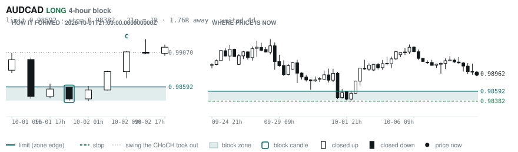
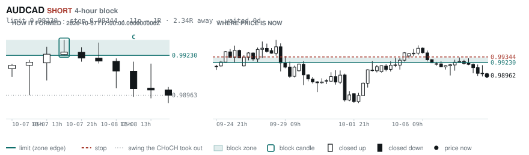

# Scanner Review — 2026-10-08 (evening)

Generated: 2026-10-08T23:03:32.739Z

```
## The clock

It is **18:00 Chicago** — a **DEAD** hour at 0.65x an average one.
An order placed now rests through **Tokyo, London and tomorrow's NY overlap** — about 16h of cover.
Next window: **Tokyo** in 1h.

_Evening pass. Orders placed now get the longest cover of the day: Tokyo, London, and tomorrow's NY overlap. Place limits and stops here — whatever does not fill overnight is still live for the morning._

## Where the energy is

**Running hot:** EURUSD 1.25 · EURCHF 1.23 · USDCAD 1.19 · EURCAD 1.17
**Quiet:** AUDCAD 0.90 · USDJPY 0.85 · EURNZD 0.85 · NZDCAD 0.84 · AUDNZD 0.84 · GBPNZD 0.79

_ATR(14) over ATR(100). Above 1.15 is unusually active, and volatility persists — a pair already running covers 6.31 ATR over the next 20 bars against 3.67 for a quiet one. Good for about two days. It says nothing about direction: after a big bar price continued 47.7% of the time and reversed 52.3%. This picks the pair; the levels pick the side._

## Account

NAV **$1136.48**   unrealised $78.41   margin available $73.55   2 open

| pair | units | now | P/L | stop | distance | news lean |
|---|---|---|---|---|---|---|
| USDCHF | -26500 | 0.83153 | $46.84 | 0.83610 | 46p | 🟢 1 tailwind |
| USDCHF | -8931 | 0.83153 | $31.57 | 0.83610 | 46p | 🟢 1 tailwind |

**What the system reads on each position**

- **USDCHF** SHORT — last CONTINUATION SHORT 390h ago at 0.82209 — system stop 0.82763, target **0.79478** (Grade C); 367p to that target from here

## What is coming, and which way it leans

**USDCHF SHORT**
- 🟢 10-09T14:00 USD — Michigan Consumer Sentiment Prel  (fc 47.6 vs prev 48.1)

_Lean is read from forecast vs previous — which way consensus leans, not what will print._

## Order blocks live right now

### Daily

| pair | dir | limit | stop | 1R | spread | away | fills | waited | window | reaches 1R / 2R |
|---|---|---|---|---|---|---|---|---|---|---|
| CADCHF | SHORT | **0.58649** | 0.58893 | 24p $2.94 | 11% | 0.7R | 87% | 5d | 0.83x ⚠ | 68% / 39% |
| NZDCHF | LONG | **0.45968** | 0.45702 | 27p $3.20 | 15% | 2.4R | 71% | 64d | 1.03x | 75% / 53% |
| NZDCHF | LONG | **0.45428** | 0.44942 | 49p $5.85 | 8% | 2.4R | 71% | 218d | 1.03x | 75% / 53% |
| EURNZD | SHORT | **2.05054** | 2.06979 | 192p $10.79 | 4% | 2.6R | 71% | 224d | 1.06x | 75% / 53% |
| EURCHF | SHORT | **0.94486** | 0.94900 | 41p $4.97 | 6% | 3.0R | 71% | 4d | 0.90x ⚠ | 68% / 39% |
| EURCHF | LONG | **0.91346** | 0.90937 | 41p $4.92 | 6% | 4.6R | 50% | 91d | 0.90x ⚠ | 75% / 53% |
| AUDUSD | LONG | **0.65028** | 0.64297 | 73p $7.31 | 2% | 6.2R | 50% | 219d | 1.00x | 75% / 53% |
| EURGBP | SHORT | **0.85929** | 0.86117 | 19p $2.49 | 9% | 6.3R | 50% | 6d | 0.85x ⚠ | 68% / 39% |
| GBPJPY | LONG | **196.536** | 194.882 | 165p $10.48 | 2% | 7.5R | 50% | 300d | 1.03x | 75% / 53% |

_Age is a quality signal, not staleness: a daily block filling after 60 days reaches 2R 58% of the time against 34% for one filling the same day. "Fills" comes from distance — 94% under 0.5R, 12% past 8R, which is why nothing past 8R is listed._

### 4-hour

| pair | dir | limit | stop | 1R | spread | away | fills | waited | window | reaches 1R / 2R |
|---|---|---|---|---|---|---|---|---|---|---|
| CADCHF | LONG | **0.58335** | 0.58243 | 9p $1.11 | **29%** | 1.6R | 79% | 2d | 0.83x ⚠ | 77% / 47% |
| NZDCAD | LONG | **0.79408** | 0.79222 | 19p $1.31 | **26%** | 1.7R | 79% | 132d | 0.99x ⚠ | 78% / 51% |
| GBPAUD | SHORT | **1.91288** | 1.91974 | 69p $4.78 | 10% | 1.7R | 79% | 35d | 1.04x | 78% / 51% |
| AUDCAD | LONG | **0.98592** | 0.98382 | 21p $1.48 | 15% | 1.8R | 79% | 4d | 1.00x | 77% / 47% |
| AUDCAD | SHORT | **0.99230** | 0.99344 | 11p $0.80 | **27%** | 2.3R | 66% | 0d | 1.00x | 70% / 46% |
| EURGBP | LONG | **0.83879** | 0.83526 | 35p $4.67 | 5% | 2.4R | 66% | 353d | 0.85x ⚠ | 78% / 51% |
| EURAUD | SHORT | **1.62130** | 1.62491 | 36p $2.51 | 12% | 2.8R | 66% | 4d | 1.08x | 77% / 47% |
| NZDJPY | LONG | **87.686** | 87.453 | 23p $1.48 | 16% | 3.4R | 66% | 225d | 1.09x | 78% / 51% |
| CADJPY | LONG | **109.188** | 108.671 | 52p $3.27 | 8% | 3.6R | 66% | 237d | 0.99x ⚠ | 78% / 51% |
| EURNZD | SHORT | **2.02676** | 2.03177 | 50p $2.80 | 17% | 5.2R | 51% | 132d | 1.06x | 78% / 51% |
| CADJPY | SHORT | **112.364** | 112.617 | 25p $1.60 | 15% | 5.3R | 51% | 9d | 0.99x ⚠ | 78% / 51% |
| EURCAD | LONG | **1.56944** | 1.56513 | 43p $3.03 | 9% | 5.8R | 51% | 148d | 0.80x ⚠ | 78% / 51% |
| EURNZD | SHORT | **2.02030** | 2.02312 | 28p $1.58 | **30%** | 7.0R | 51% | 73d | 1.06x | 78% / 51% |
| AUDCAD | LONG | **0.98104** | 0.97983 | 12p $0.85 | **26%** | 7.1R | 51% | 34d | 1.00x | 78% / 51% |
| EURNZD | LONG | **1.93742** | 1.92882 | 86p $4.82 | 10% | 7.3R | 51% | 308d | 1.06x | 78% / 51% |
| EURNZD | SHORT | **2.05666** | 2.06369 | 70p $3.94 | 12% | 8.0R | 51% | 225d | 1.06x | 78% / 51% |

_Same definition, roughly six times the frequency, split-validated clean (14 pairs fit +0.410R, 14 untouched +0.494R). **Read these net of cost:** an H4 stop is about a third of a daily one, so the same spread takes three times the share. Gross +0.452R against daily +0.413R, but net of one spread +0.231R against +0.303R. Real, and mostly rent._

### In reach, drawn

_6 blocks within 3R of the limit. Blocks further out are in the tables above but not worth a picture yet._

**CADCHF SHORT** · daily · 0.69R away · waited 5d


**CADCHF LONG** · 4-hour · 1.57R away · waited 2d


**NZDCAD LONG** · 4-hour · 1.66R away · waited 132d


**GBPAUD SHORT** · 4-hour · 1.70R away · waited 35d


**AUDCAD LONG** · 4-hour · 1.76R away · waited 4d



**AUDCAD SHORT** · 4-hour · 2.34R away · waited 0d



_Hollow candle closed up, filled closed down. Left panel is the block forming — the ringed candle is the block, **C** is the change of character. Right panel is where price sits now against the zone. Full legend is inside each image._

## Scanner calls, last 1 day

| when | pair | dir | branch | entry | stop | target | outcome |
|---|---|---|---|---|---|---|---|
| 10-08T01:00 | USDJPY | LONG | REV | 158.232 | 156.439 | 160.539 | open -0.18R |
| 10-08T01:00 | GBPJPY | LONG | REV | 209.022 | 206.418 | 215.468 | open -0.05R |
| 10-08T01:00 | USDCAD | SHORT | REV | 1.42626 | 1.43443 | 1.35795 | open +0.46R |
| 10-08T01:00 | NZDUSD | SHORT | REV | 0.56042 | 0.56670 | 0.54188 | open +0.00R |
| 10-08T05:00 | AUDCAD | LONG | REV | 0.99125 | 0.98541 | 1.00472 | open -0.28R |
| 10-08T05:00 | GBPAUD | SHORT | REV | 1.89756 | 1.90904 | 1.85168 | open -0.32R |
| 10-08T05:00 | GBPCHF | SHORT | REV | 1.10027 | 1.10832 | 1.06748 | open -0.00R |
| 10-08T05:00 | AUDNZD | LONG | REV | 1.24338 | 1.23494 | 1.29274 | open -0.21R |
| 10-08T05:00 | EURAUD | SHORT | REV | 1.60927 | 1.62000 | 1.59370 | open -0.18R |
| 10-08T05:00 | CHFJPY | SHORT | REV | 189.768 | 191.193 | 182.720 | open -0.06R |
| 10-08T09:00 | AUDCAD | LONG | REV | 0.99007 | 0.98267 | 1.00472 | open -0.06R |
| 10-08T09:00 | CADCHF | SHORT | REV | 0.58472 | 0.58879 | 0.56885 | open -0.02R |
| 10-08T09:00 | AUDCHF | LONG | REV | 0.57894 | 0.57453 | 0.59203 | open -0.05R |
| 10-08T09:00 | GBPCAD | SHORT | REV | 1.88280 | 1.89139 | 1.85129 | open +0.13R |
| 10-08T13:00 | NZDUSD | SHORT | REV | 0.55976 | 0.56744 | 0.54188 | open -0.08R |
| 10-08T13:00 | GBPUSD | SHORT | REV | 1.32138 | 1.33519 | 1.30505 | open -0.12R |
| 10-08T13:00 | CADJPY | SHORT | REV | 110.965 | 112.278 | 107.746 | open -0.05R |
| 10-08T13:00 | USDJPY | SHORT | REV | 158.007 | 159.382 | 153.713 | open +0.08R |
| 10-08T13:00 | USDCAD | SHORT | REV | 1.42422 | 1.43483 | 1.35795 | open +0.16R |
| 10-08T13:00 | CHFJPY | SHORT | REV | 189.726 | 191.692 | 182.720 | open -0.07R |
| 10-08T17:00 | NZDJPY | LONG | REV | 88.490 | 87.479 | 92.130 | open +0.00R |
| 10-08T17:00 | NZDCAD | LONG | REV | 0.79716 | 0.79157 | 0.81534 | open +0.00R |
| 10-08T17:00 | USDCAD | SHORT | REV | 1.42248 | 1.43468 | 1.35795 | open +0.00R |
| 10-08T13:00 | EURUSD | SHORT | REV | 1.11956 | 1.12810 | 1.06680 | open -0.18R |

## Running tally, last 30 days

1 resolved · 0 target / 1 stopped · **-1.0R** · -1.000R per call · 59 still open

```
