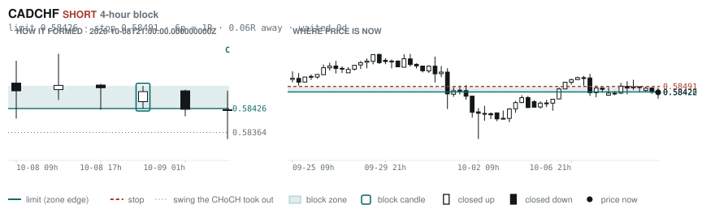
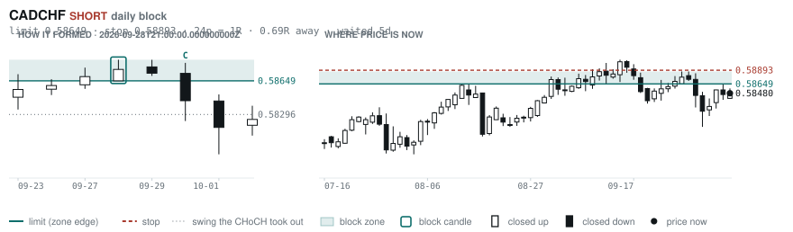
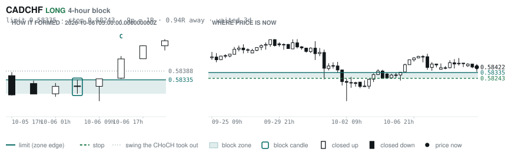
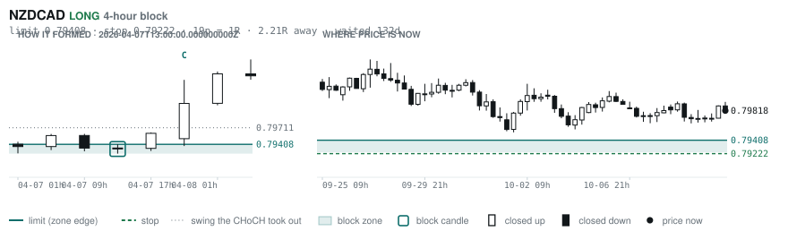
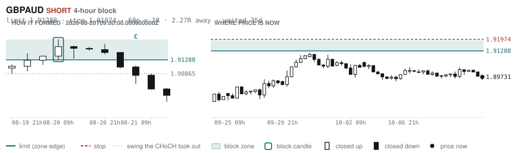
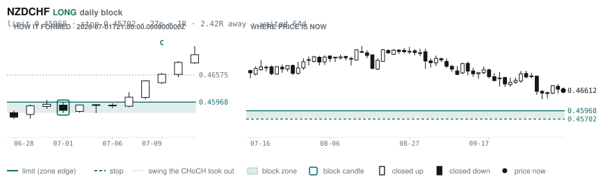

# Scanner Review — 2026-10-09 (morning)

Generated: 2026-10-09T11:03:36.973Z

```
## The clock

It is **06:00 Chicago** — a **normal** hour at 1.10x an average one.
An order placed now rests through **the NY overlap** — about 5h of cover.
Next window: **NY overlap** in 1h.

_Morning pass. The NY overlap is the single best window of the day but it is the only one left before the afternoon goes dead, so this is the adjustment pass: the morning-skewed pairs, and anything that filled overnight._

## Where the energy is

**Running hot:** EURUSD 1.15
**Quiet:** AUDCAD 0.86 · USDJPY 0.84 · EURNZD 0.84 · AUDNZD 0.83 · NZDCAD 0.83 · GBPNZD 0.82

_ATR(14) over ATR(100). Above 1.15 is unusually active, and volatility persists — a pair already running covers 6.31 ATR over the next 20 bars against 3.67 for a quiet one. Good for about two days. It says nothing about direction: after a big bar price continued 47.7% of the time and reversed 52.3%. This picks the pair; the levels pick the side._

## Account

NAV **$1158.27**   unrealised $100.20   margin available $95.34   2 open

| pair | units | now | P/L | stop | distance | news lean |
|---|---|---|---|---|---|---|
| USDCHF | -26500 | 0.83104 | $63.45 | 0.83610 | 51p | 🟢 1 tailwind |
| USDCHF | -8931 | 0.83104 | $37.18 | 0.83610 | 51p | 🟢 1 tailwind |

**What the system reads on each position**

- **USDCHF** SHORT — last CONTINUATION SHORT 402h ago at 0.82209 — system stop 0.82763, target **0.79478** (Grade C); 363p to that target from here

## What is coming, and which way it leans

**USDCHF SHORT**
- 🟢 10-09T14:00 USD — Michigan Consumer Sentiment Prel  (fc 47.6 vs prev 48.1)

_Lean is read from forecast vs previous — which way consensus leans, not what will print._

## Order blocks live right now

### Daily

| pair | dir | limit | stop | 1R | spread | away | fills | waited | window | reaches 1R / 2R |
|---|---|---|---|---|---|---|---|---|---|---|
| CADCHF | SHORT | **0.58649** | 0.58893 | 24p $2.94 | 9% | 0.7R | 87% | 5d | 1.56x | 68% / 39% |
| NZDCHF | LONG | **0.45968** | 0.45702 | 27p $3.20 | 12% | 2.4R | 71% | 64d | 1.27x | 75% / 53% |
| NZDCHF | LONG | **0.45428** | 0.44942 | 49p $5.85 | 7% | 2.4R | 71% | 218d | 1.27x | 75% / 53% |
| EURNZD | SHORT | **2.05054** | 2.06979 | 192p $10.79 | 3% | 2.6R | 71% | 224d | 1.27x | 75% / 53% |
| EURCHF | SHORT | **0.94486** | 0.94900 | 41p $4.97 | 5% | 3.0R | 71% | 4d | 1.53x | 68% / 39% |
| EURCHF | LONG | **0.91346** | 0.90937 | 41p $4.92 | 5% | 4.6R | 50% | 91d | 1.53x | 75% / 53% |
| AUDUSD | LONG | **0.65028** | 0.64297 | 73p $7.31 | 2% | 6.2R | 50% | 219d | 1.44x | 75% / 53% |
| EURGBP | SHORT | **0.85929** | 0.86117 | 19p $2.49 | 7% | 6.3R | 50% | 6d | 1.50x | 68% / 39% |
| GBPJPY | LONG | **196.536** | 194.882 | 165p $10.48 | 2% | 7.5R | 50% | 300d | 1.37x | 75% / 53% |

_Age is a quality signal, not staleness: a daily block filling after 60 days reaches 2R 58% of the time against 34% for one filling the same day. "Fills" comes from distance — 94% under 0.5R, 12% past 8R, which is why nothing past 8R is listed._

### 4-hour

| pair | dir | limit | stop | 1R | spread | away | fills | waited | window | reaches 1R / 2R |
|---|---|---|---|---|---|---|---|---|---|---|
| CADCHF | SHORT | **0.58426** | 0.58491 | 6p $0.78 | **35%** | 0.1R | 87% | 0d | 1.56x | 70% / 46% |
| CADCHF | LONG | **0.58335** | 0.58243 | 9p $1.11 | **25%** | 0.9R | 83% | 3d | 1.56x | 77% / 47% |
| NZDCAD | LONG | **0.79408** | 0.79222 | 19p $1.31 | **24%** | 2.2R | 66% | 132d | 1.33x | 78% / 51% |
| GBPAUD | SHORT | **1.91288** | 1.91974 | 69p $4.78 | 8% | 2.3R | 66% | 35d | 1.34x | 78% / 51% |
| EURGBP | LONG | **0.83879** | 0.83526 | 35p $4.67 | 4% | 2.5R | 66% | 354d | 1.50x | 78% / 51% |
| AUDCAD | LONG | **0.98592** | 0.98382 | 21p $1.48 | 13% | 3.2R | 66% | 5d | 1.42x | 77% / 47% |
| EURAUD | SHORT | **1.62130** | 1.62491 | 36p $2.51 | 11% | 3.7R | 66% | 5d | 1.34x | 77% / 47% |
| CADJPY | LONG | **109.188** | 108.671 | 52p $3.27 | 7% | 3.7R | 66% | 238d | 1.44x | 78% / 51% |
| NZDJPY | LONG | **87.686** | 87.453 | 23p $1.48 | 15% | 4.3R | 51% | 225d | 1.28x | 78% / 51% |
| CADJPY | SHORT | **112.364** | 112.617 | 25p $1.60 | 14% | 4.9R | 51% | 10d | 1.44x | 78% / 51% |
| EURNZD | SHORT | **2.02676** | 2.03177 | 50p $2.80 | 13% | 5.4R | 51% | 132d | 1.27x | 78% / 51% |
| EURCAD | LONG | **1.56944** | 1.56513 | 43p $3.03 | 9% | 6.2R | 51% | 149d | 1.59x | 78% / 51% |
| EURNZD | LONG | **1.93742** | 1.92882 | 86p $4.82 | 8% | 7.2R | 51% | 308d | 1.27x | 78% / 51% |
| EURNZD | SHORT | **2.02030** | 2.02312 | 28p $1.58 | **23%** | 7.3R | 51% | 73d | 1.27x | 78% / 51% |
| GBPAUD | LONG | **1.86891** | 1.86511 | 38p $2.64 | 14% | 7.5R | 51% | 104d | 1.34x | 78% / 51% |

_Same definition, roughly six times the frequency, split-validated clean (14 pairs fit +0.410R, 14 untouched +0.494R). **Read these net of cost:** an H4 stop is about a third of a daily one, so the same spread takes three times the share. Gross +0.452R against daily +0.413R, but net of one spread +0.231R against +0.303R. Real, and mostly rent._

### In reach, drawn

_6 blocks within 3R of the limit. Blocks further out are in the tables above but not worth a picture yet._

**CADCHF SHORT** · 4-hour · 0.06R away · waited 0d



**CADCHF SHORT** · daily · 0.69R away · waited 5d



**CADCHF LONG** · 4-hour · 0.94R away · waited 3d



**NZDCAD LONG** · 4-hour · 2.21R away · waited 132d



**GBPAUD SHORT** · 4-hour · 2.27R away · waited 35d



**NZDCHF LONG** · daily · 2.42R away · waited 64d



_Hollow candle closed up, filled closed down. Left panel is the block forming — the ringed candle is the block, **C** is the change of character. Right panel is where price sits now against the zone. Full legend is inside each image._

## Scanner calls, last 1 day

| when | pair | dir | branch | entry | stop | target | outcome |
|---|---|---|---|---|---|---|---|
| 10-08T13:00 | NZDUSD | SHORT | REV | 0.55976 | 0.56744 | 0.54188 | open -0.16R |
| 10-08T13:00 | GBPUSD | SHORT | REV | 1.32138 | 1.33519 | 1.30505 | open -0.17R |
| 10-08T13:00 | CADJPY | SHORT | REV | 110.965 | 112.278 | 107.746 | open -0.12R |
| 10-08T13:00 | USDJPY | SHORT | REV | 158.007 | 159.382 | 153.713 | open -0.06R |
| 10-08T13:00 | USDCAD | SHORT | REV | 1.42422 | 1.43483 | 1.35795 | open +0.14R |
| 10-08T13:00 | CHFJPY | SHORT | REV | 189.726 | 191.692 | 182.720 | open -0.25R |
| 10-08T17:00 | NZDJPY | LONG | REV | 88.490 | 87.479 | 92.130 | open +0.20R |
| 10-08T17:00 | NZDCAD | LONG | REV | 0.79716 | 0.79157 | 0.81534 | open +0.18R |
| 10-08T17:00 | USDCAD | SHORT | REV | 1.42248 | 1.43468 | 1.35795 | open -0.02R |
| 10-08T13:00 | EURUSD | SHORT | REV | 1.11956 | 1.12810 | 1.06680 | open -0.26R |
| 10-08T21:00 | NZDCAD | LONG | REV | 0.79712 | 0.79167 | 0.81534 | open +0.19R |
| 10-08T21:00 | AUDJPY | SHORT | REV | 110.070 | 111.089 | 104.786 | open -0.23R |
| 10-09T01:00 | AUDCAD | LONG | REV | 0.99180 | 0.98546 | 1.00472 | open +0.14R |
| 10-09T01:00 | NZDCHF | LONG | REV | 0.46672 | 0.46305 | 0.47758 | open -0.11R |
| 10-09T01:00 | CADJPY | LONG | REV | 111.248 | 110.243 | 114.634 | open -0.12R |
| 10-09T01:00 | EURCAD | LONG | REV | 1.59602 | 1.58485 | 1.62445 | open +0.00R |
| 10-09T01:00 | EURAUD | SHORT | REV | 1.60923 | 1.61941 | 1.59370 | open +0.14R |
| 10-09T05:00 | EURCHF | LONG | REV | 0.93242 | 0.92634 | 0.95992 | open +0.00R |
| 10-09T05:00 | GBPJPY | SHORT | REV | 209.280 | 211.283 | 202.486 | open +0.00R |
| 10-09T05:00 | NZDJPY | SHORT | REV | 88.696 | 89.708 | 85.690 | open +0.00R |
| 10-09T05:00 | EURJPY | SHORT | REV | 177.362 | 179.130 | 171.585 | open +0.00R |
| 10-09T05:00 | AUDNZD | LONG | REV | 1.24368 | 1.23524 | 1.26118 | open +0.00R |
| 10-09T05:00 | AUDJPY | SHORT | REV | 110.302 | 111.562 | 104.786 | open +0.00R |
| 10-09T05:00 | GBPCAD | SHORT | REV | 1.88334 | 1.89084 | 1.85129 | open +0.00R |

```
